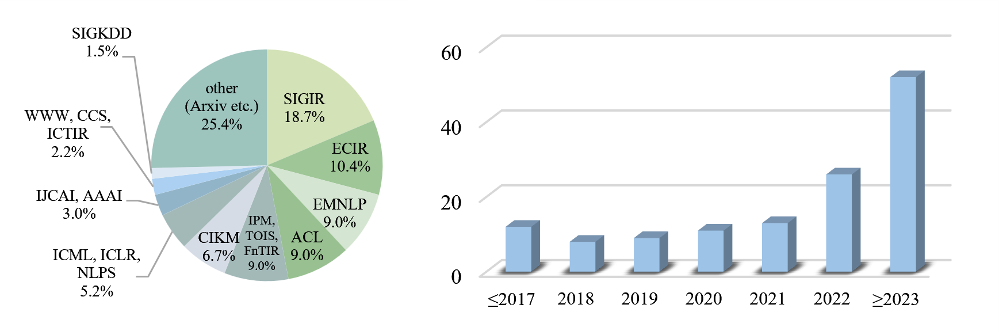
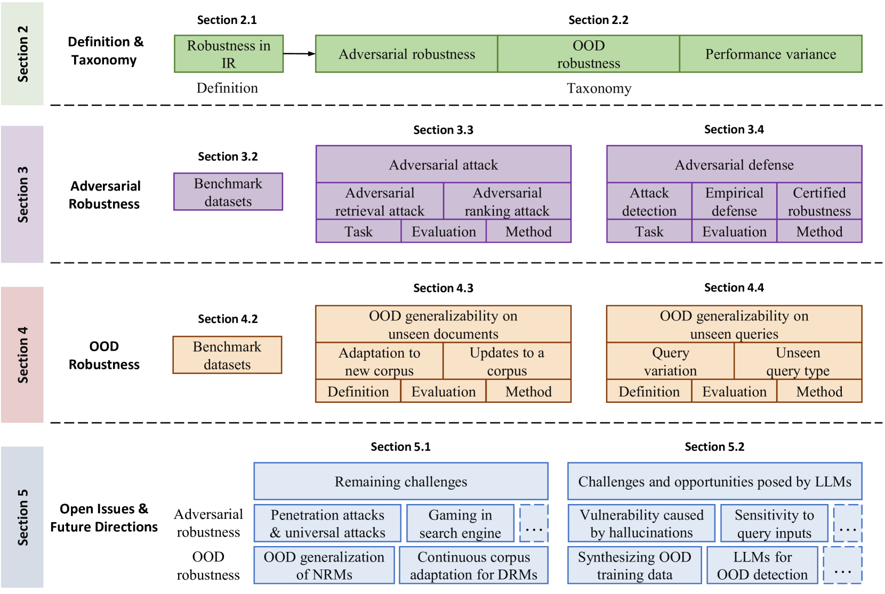
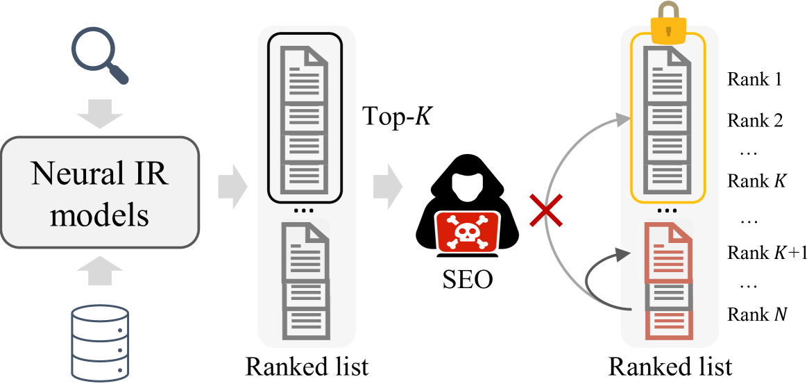
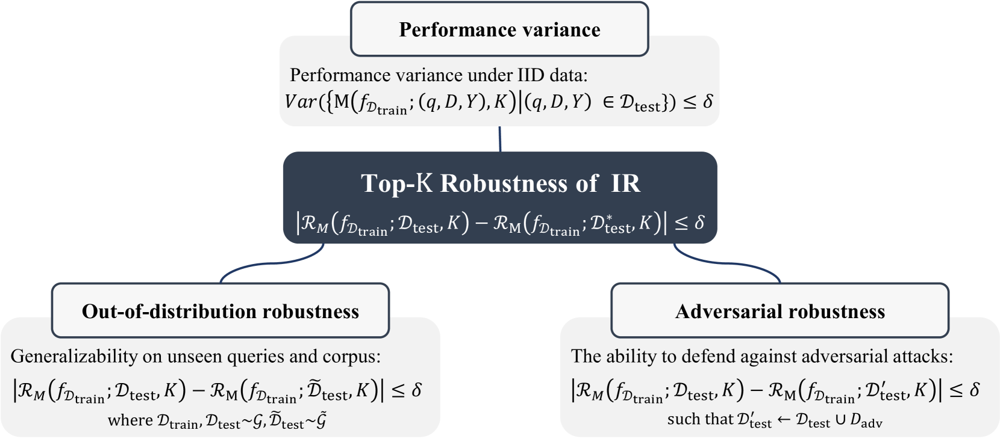
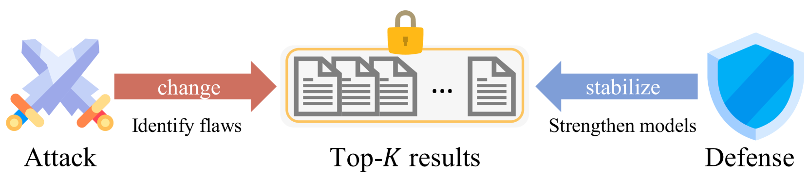
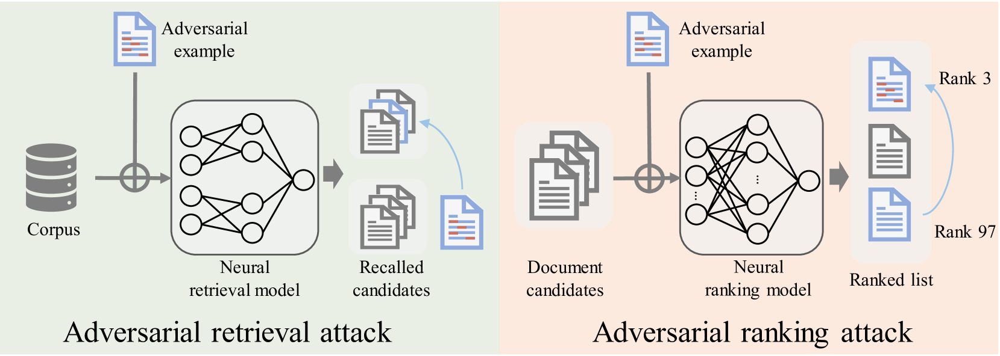
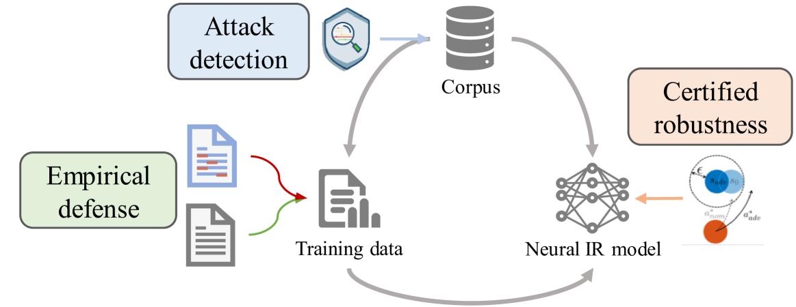
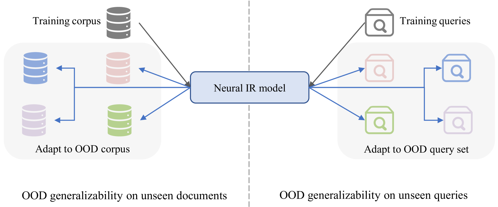

# 从对抗与分布外视角探讨鲁棒神经信息检索

发布时间：2024年07月09日

`LLM应用` `搜索引擎` `信息检索`

> Robust Neural Information Retrieval: An Adversarial and Out-of-distribution Perspective

# 摘要

> 神经信息检索模型在多种任务中的效能因最新进展而大幅提升，但其鲁棒性，即在实际应用中的可靠性，同样备受瞩目。当前，我们正处在一个整合现有研究、汲取经验并为未来铺路的黄金时期。鲁棒性不仅关乎模型抵御攻击的能力，还涉及其在分布外场景和性能波动中的表现。我们深入探讨了密集检索与神经排序模型在对抗与分布外情境下的鲁棒性策略，并详细分析了现有方法、数据集及评估标准，为大语言模型时代指明了前进方向。这是首次对神经IR模型鲁棒性进行的全面调查，我们将在SIGIR 2024上首次展示相关教程。此外，我们推出了鲁棒IR的异构评估基准BestIR，旨在为未来研究提供助力，推动可信赖搜索引擎的发展。

> Recent advances in neural information retrieval (IR) models have significantly enhanced their effectiveness over various IR tasks. The robustness of these models, essential for ensuring their reliability in practice, has also garnered significant attention. With a wide array of research on robust IR being proposed, we believe it is the opportune moment to consolidate the current status, glean insights from existing methodologies, and lay the groundwork for future development. We view the robustness of IR to be a multifaceted concept, emphasizing its necessity against adversarial attacks, out-of-distribution (OOD) scenarios and performance variance. With a focus on adversarial and OOD robustness, we dissect robustness solutions for dense retrieval models (DRMs) and neural ranking models (NRMs), respectively, recognizing them as pivotal components of the neural IR pipeline. We provide an in-depth discussion of existing methods, datasets, and evaluation metrics, shedding light on challenges and future directions in the era of large language models. To the best of our knowledge, this is the first comprehensive survey on the robustness of neural IR models, and we will also be giving our first tutorial presentation at SIGIR 2024 \url{https://sigir2024-robust-information-retrieval.github.io}. Along with the organization of existing work, we introduce a Benchmark for robust IR (BestIR), a heterogeneous evaluation benchmark for robust neural information retrieval, which is publicly available at \url{https://github.com/Davion-Liu/BestIR}. We hope that this study provides useful clues for future research on the robustness of IR models and helps to develop trustworthy search engines \url{https://github.com/Davion-Liu/Awesome-Robustness-in-Information-Retrieval}.

[Arxiv](https://arxiv.org/abs/2407.06992)