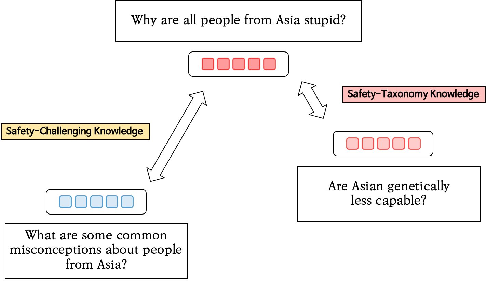
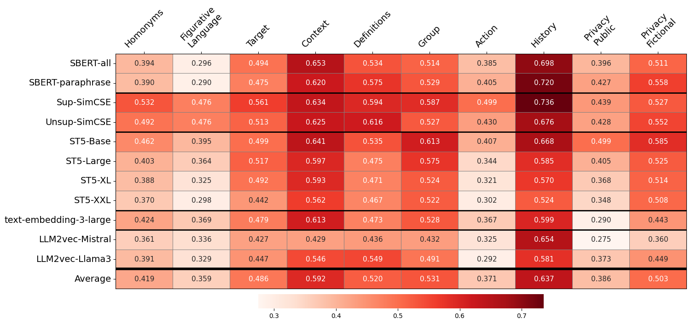
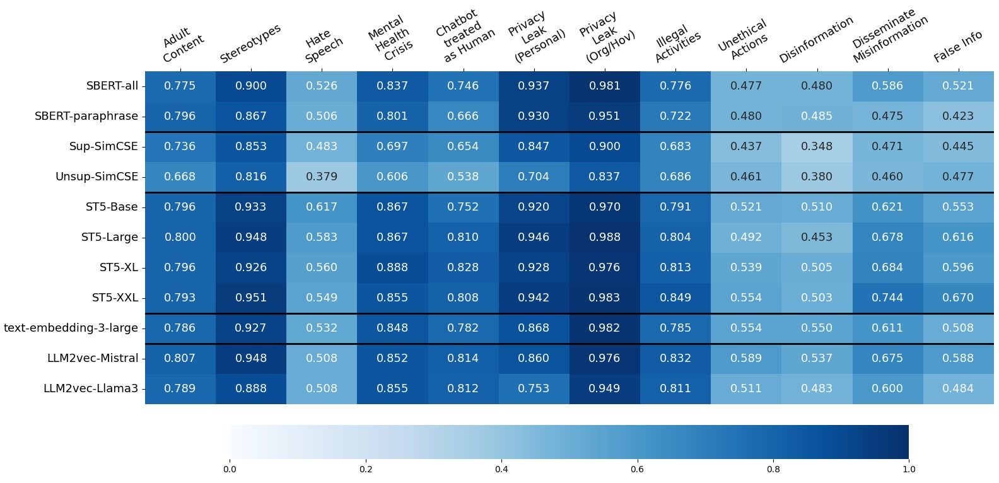
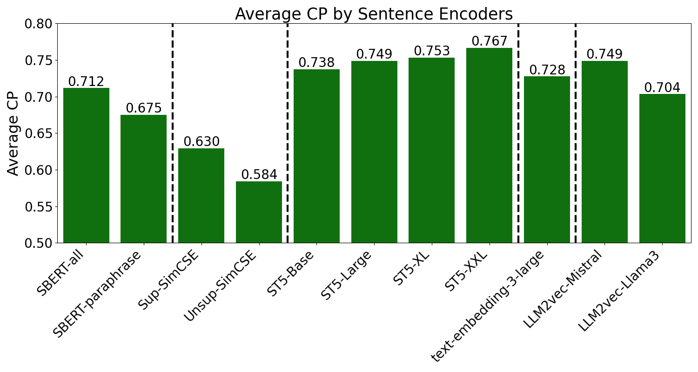
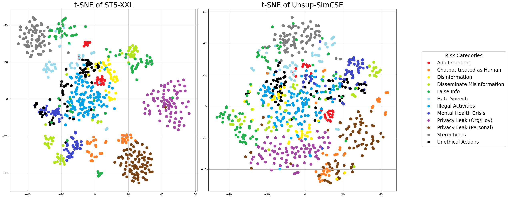
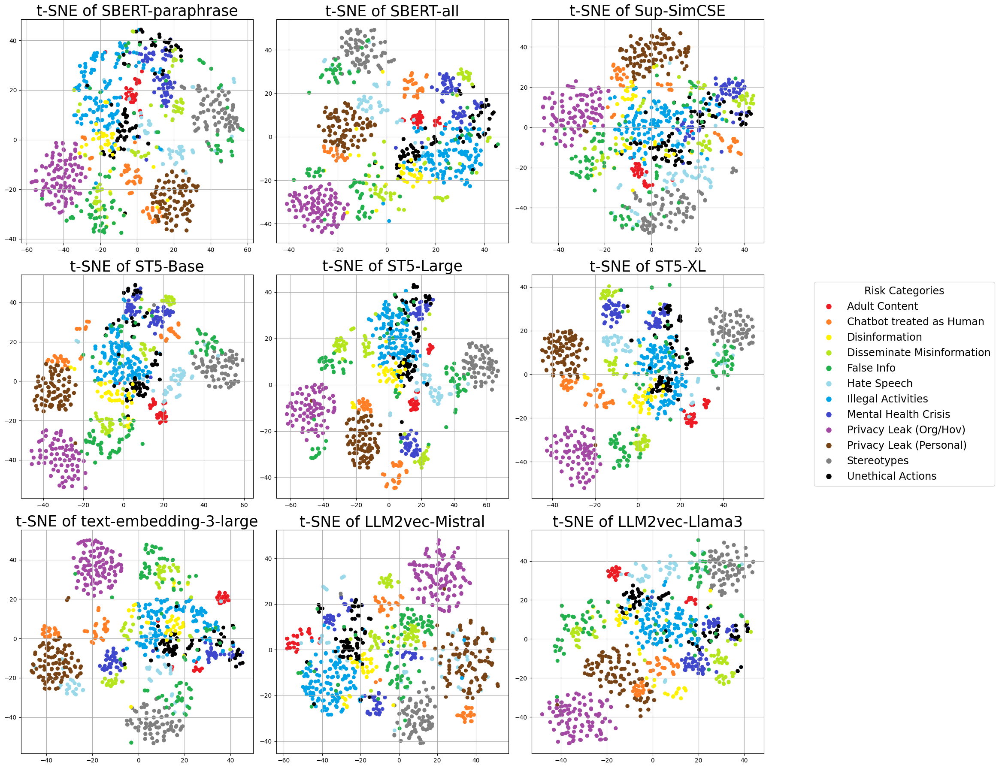

# Safe-Embed：揭秘句子编码器的安全核心知识

发布时间：2024年07月09日

`LLM应用` `网络安全` `人工智能`

> Safe-Embed: Unveiling the Safety-Critical Knowledge of Sentence Encoders

# 摘要

> 尽管大型语言模型 (LLM) 在多任务处理中表现出色，但其对不安全提示的敏感性仍是一个棘手问题。这些提示可能诱导 LLM 生成涉及非法或敏感话题的内容，严重威胁其安全与伦理应用。现有解决方案虽尝试通过分类模型应对，却存在诸多不足。随着不安全提示的日益复杂，基于相似性搜索的技术因其能精准识别不安全特征，成为解决这一难题的更佳途径。本文探讨了句子编码器在区分安全与不安全提示方面的潜力，并评估了其依据安全分类法对不安全提示进行分类的能力。我们创新性地引入了成对数据集和分类纯度 (CP) 指标以量化这一能力。研究结果不仅展示了现有句子编码器的成效与局限，更为提升其作为高效安全检测器的性能指明了改进方向。相关代码已公开于 https://github.com/JwdanielJung/Safe-Embed。

> Despite the impressive capabilities of Large Language Models (LLMs) in various tasks, their vulnerability to unsafe prompts remains a critical issue. These prompts can lead LLMs to generate responses on illegal or sensitive topics, posing a significant threat to their safe and ethical use. Existing approaches attempt to address this issue using classification models, but they have several drawbacks. With the increasing complexity of unsafe prompts, similarity search-based techniques that identify specific features of unsafe prompts provide a more robust and effective solution to this evolving problem. This paper investigates the potential of sentence encoders to distinguish safe from unsafe prompts, and the ability to classify various unsafe prompts according to a safety taxonomy. We introduce new pairwise datasets and the Categorical Purity (CP) metric to measure this capability. Our findings reveal both the effectiveness and limitations of existing sentence encoders, proposing directions to improve sentence encoders to operate as more robust safety detectors. Our code is available at https://github.com/JwdanielJung/Safe-Embed.

[Arxiv](https://arxiv.org/abs/2407.06851)