# SoftDedup：加速语言模型预训练的高效数据重加权方法

发布时间：2024年07月09日

`LLM理论` `人工智能` `数据处理`

> SoftDedup: an Efficient Data Reweighting Method for Speeding Up Language Model Pre-training

# 摘要

> 大型语言模型 (LLM) 常因预训练数据集中的重复数据而受限。传统方法侧重于简单地检测和移除重复，这不仅可能遗失重要信息，还忽视了重复程度的多变性。为此，我们创新性地提出了软去重策略，既保护数据完整性，又智能降低高频重复数据的采样权重。核心在于我们首创的“数据共性”指标，通过 n-gram 模型量化样本重复度。实证表明，此法大幅提升训练效率，减少至少 26% 的训练步骤，同时困惑度得分相当。更妙的是，同等训练下，下游任务的少样本准确率提升 1.77%。即便在严格去重的数据集上，性能依然提升，预示着其有望成为 LLM 预训练的新标准。

> The effectiveness of large language models (LLMs) is often hindered by duplicated data in their extensive pre-training datasets. Current approaches primarily focus on detecting and removing duplicates, which risks the loss of valuable information and neglects the varying degrees of duplication. To address this, we propose a soft deduplication method that maintains dataset integrity while selectively reducing the sampling weight of data with high commonness. Central to our approach is the concept of "data commonness", a metric we introduce to quantify the degree of duplication by measuring the occurrence probabilities of samples using an n-gram model. Empirical analysis shows that this method significantly improves training efficiency, achieving comparable perplexity scores with at least a 26% reduction in required training steps. Additionally, it enhances average few-shot downstream accuracy by 1.77% when trained for an equivalent duration. Importantly, this approach consistently improves performance, even on rigorously deduplicated datasets, indicating its potential to complement existing methods and become a standard pre-training process for LLMs.

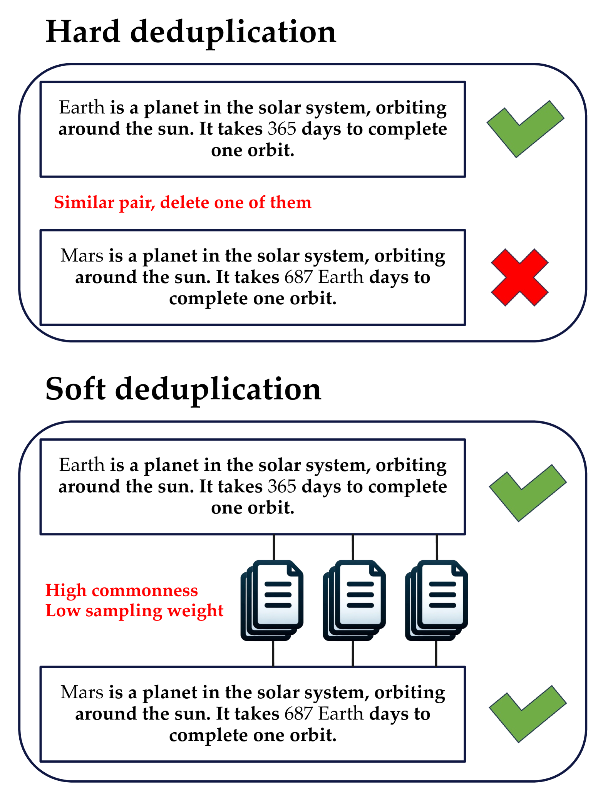

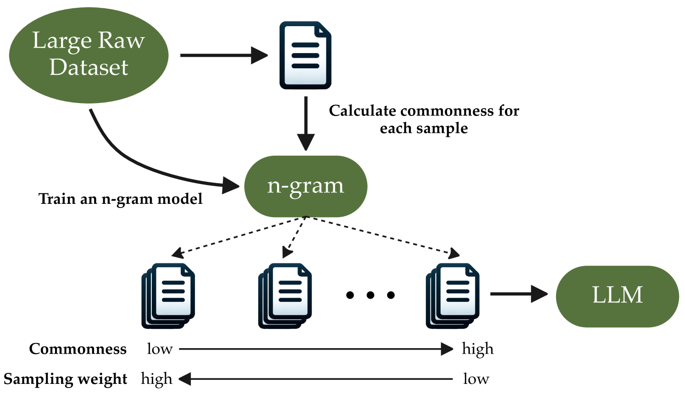

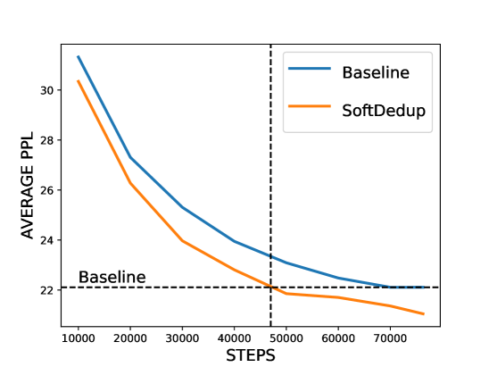

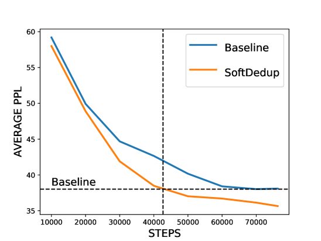

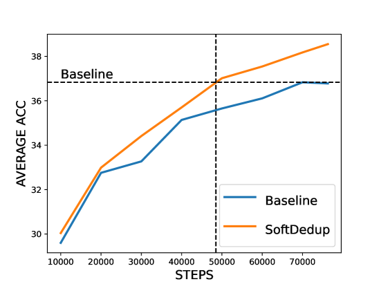

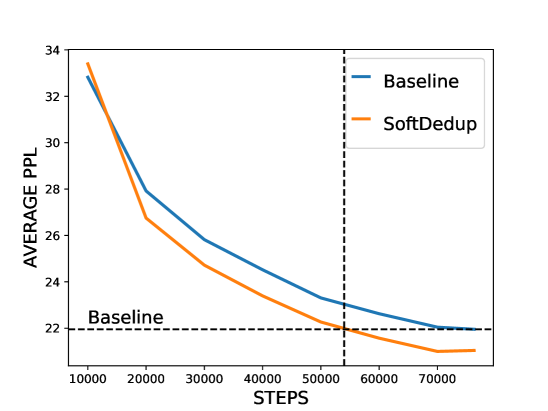

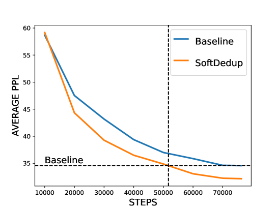

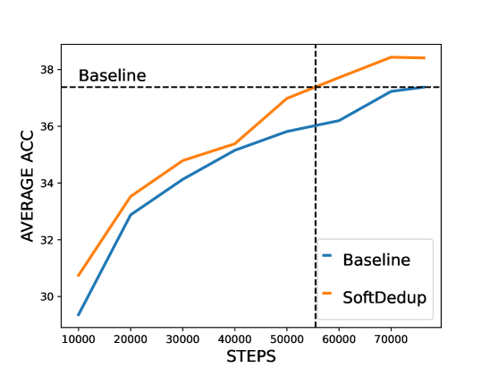

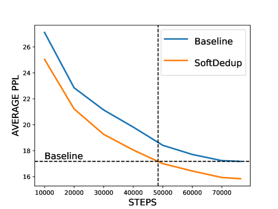

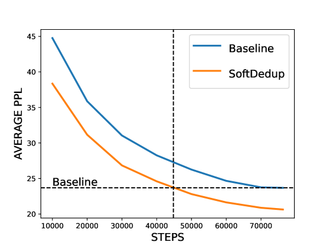

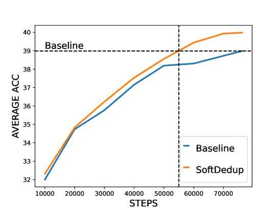

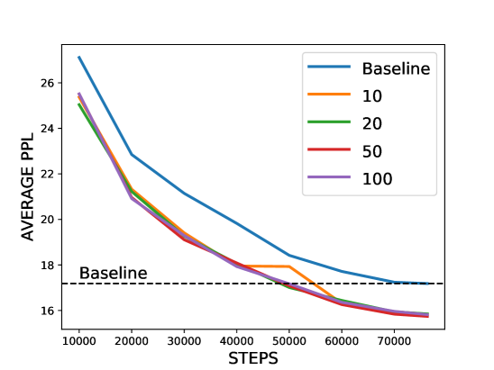

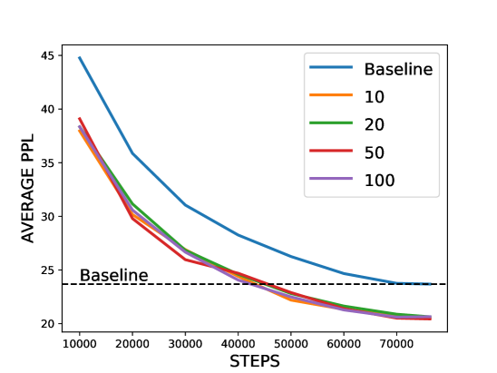

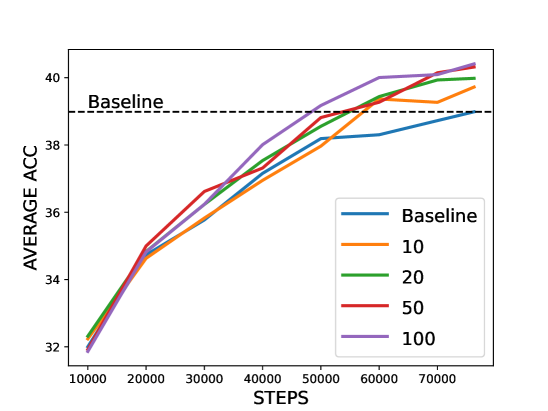

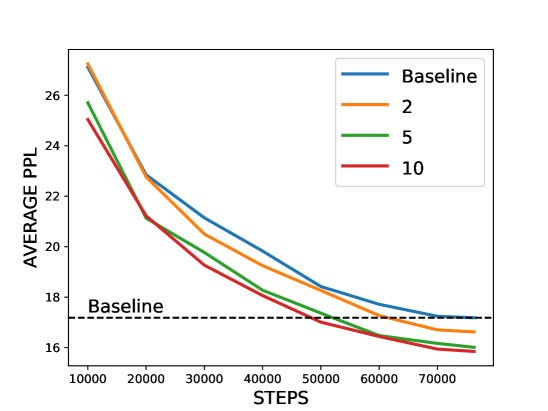

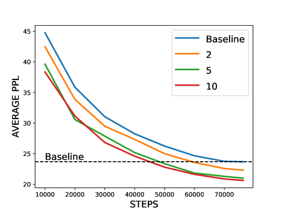

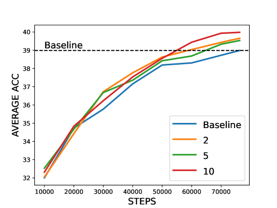

[Arxiv](https://arxiv.org/abs/2407.06654)