# TrackFormers：探索高亮度LHC时代基于Transformer的粒子跟踪技术

发布时间：2024年07月09日

`LLM应用` `高能物理` `机器学习`

> TrackFormers: In Search of Transformer-Based Particle Tracking for the High-Luminosity LHC Era

# 摘要

> 随着高能物理实验的每一次迭代，数据量激增，高亮度LHC升级亦是如此。这一趋势迫使数据处理流程的每个环节都需重新考量，尤其是粒子轨迹重建（跟踪）这一环节。机器学习辅助方案有望大幅提升效率，因为跟踪中最耗时的环节正是命中点与粒子或轨迹候选的匹配。本文即聚焦于此。我们借鉴大型语言模型的思路，探索了两种策略：预测轨迹中的下一个命中点，以及一次性预测整个事件的命中点。通过深入设计，我们测试了基于Transformer的三种模型和基于U-Net的一种模型，针对碰撞事件的命中点进行轨迹关联预测。评估过程中，我们从简单到复杂逐步推进，及时淘汰表现不佳的设计。实验结果详尽，涵盖预测准确性与计算效率。我们借助REDVID模拟框架及TrackML数据集的简化处理，构建了五个难度递增的数据集进行实验。结果表明，不同设计在预测准确性和计算性能上各有千秋，凸显了我们方法的高效性。尤为关键的是，实验证实了一次性编码器-分类器基于Transformer方案在跟踪任务中的实用性。

> High-Energy Physics experiments are facing a multi-fold data increase with every new iteration. This is certainly the case for the upcoming High-Luminosity LHC upgrade. Such increased data processing requirements forces revisions to almost every step of the data processing pipeline. One such step in need of an overhaul is the task of particle track reconstruction, a.k.a., tracking. A Machine Learning-assisted solution is expected to provide significant improvements, since the most time-consuming step in tracking is the assignment of hits to particles or track candidates. This is the topic of this paper.
  We take inspiration from large language models. As such, we consider two approaches: the prediction of the next word in a sentence (next hit point in a track), as well as the one-shot prediction of all hits within an event. In an extensive design effort, we have experimented with three models based on the Transformer architecture and one model based on the U-Net architecture, performing track association predictions for collision event hit points. In our evaluation, we consider a spectrum of simple to complex representations of the problem, eliminating designs with lower metrics early on. We report extensive results, covering both prediction accuracy (score) and computational performance. We have made use of the REDVID simulation framework, as well as reductions applied to the TrackML data set, to compose five data sets from simple to complex, for our experiments. The results highlight distinct advantages among different designs in terms of prediction accuracy and computational performance, demonstrating the efficiency of our methodology. Most importantly, the results show the viability of a one-shot encoder-classifier based Transformer solution as a practical approach for the task of tracking.

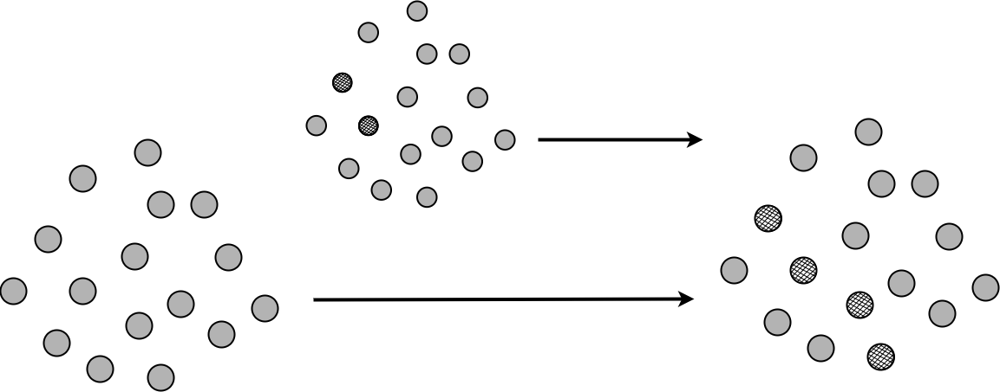

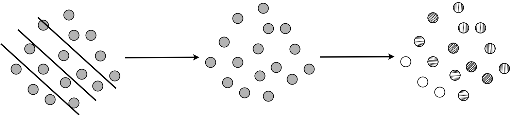

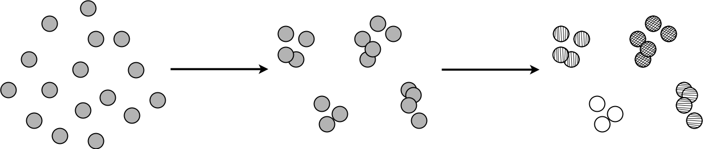

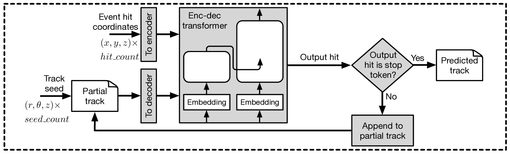

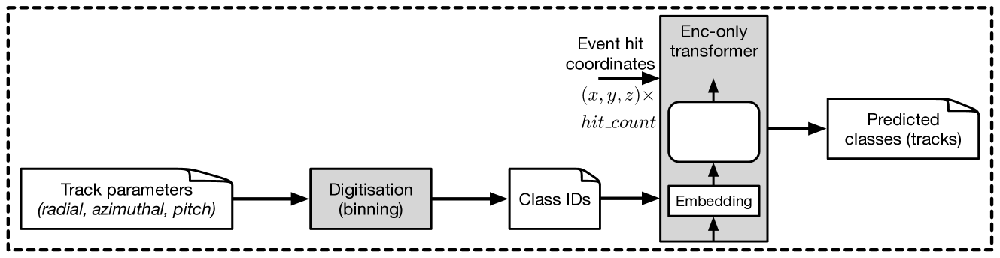

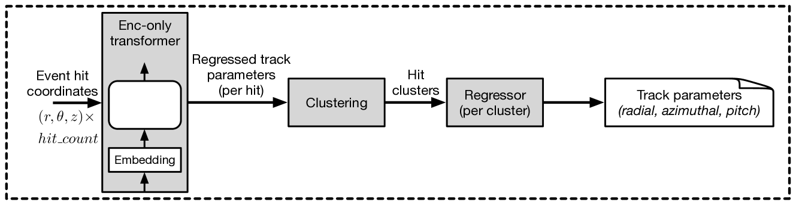

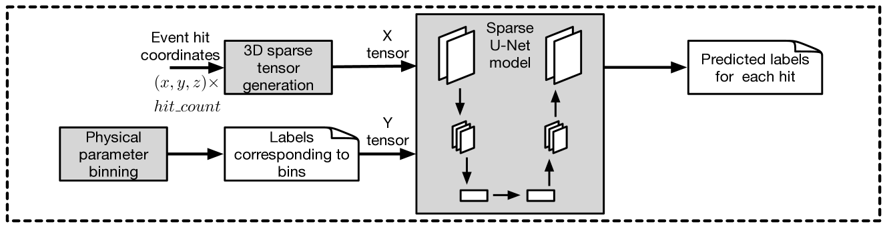

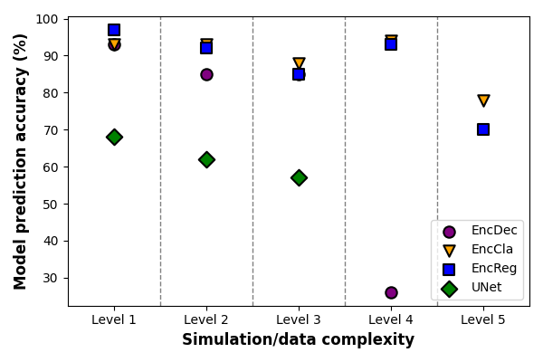

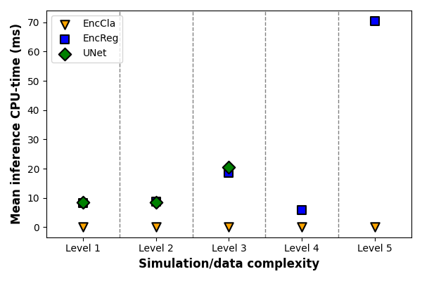

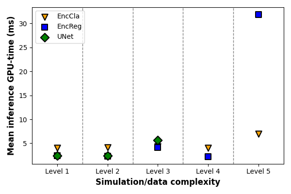

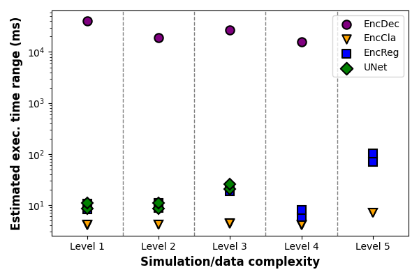

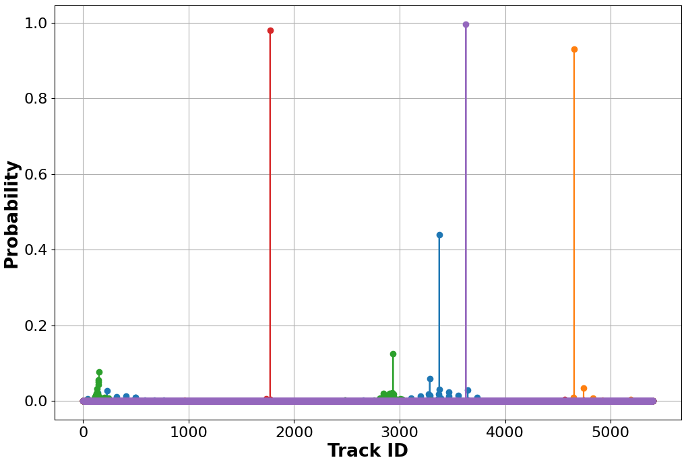

[Arxiv](https://arxiv.org/abs/2407.07179)