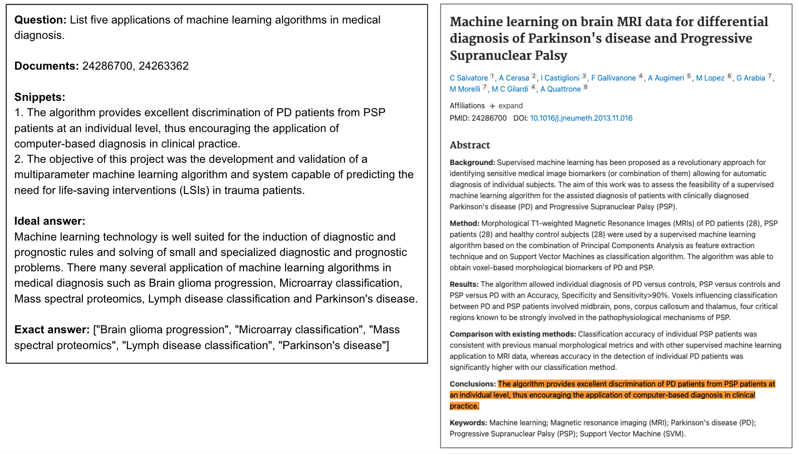
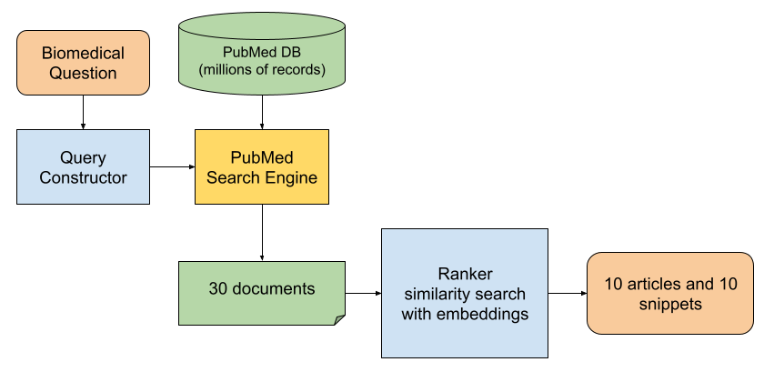
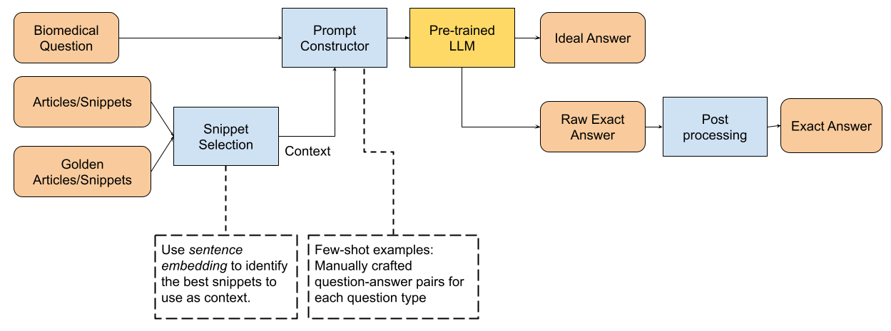

# 借助预训练的LLM和提示工程技术，我们能够高效解答生物医学领域的疑问。

发布时间：2024年07月09日

`LLM应用` `生物医学` `问答系统`

> Using Pretrained Large Language Model with Prompt Engineering to Answer Biomedical Questions

# 摘要

> 我们团队参与了 BioASQ 2024 的 Task12b 和 Synergy 任务，目标是打造一个能够从 PubMed 数据库中检索相关资料并生成精准答案的生物医学问答系统。我们设计了一个基于预训练 LLM 的两级检索与问答架构，特别注重提示工程和响应优化。通过构建含少量示例的上下文提示，并采用重采样和异常响应检测等技术，我们评估了 Mixtral、OpenAI GPT 和 Llama2 等多种 LLM 模型在此任务中的表现。最终，我们的系统在文档和片段检索、是/否问题、事实问题及列表问题等多个指标上均取得了优异成绩。

> Our team participated in the BioASQ 2024 Task12b and Synergy tasks to build a system that can answer biomedical questions by retrieving relevant articles and snippets from the PubMed database and generating exact and ideal answers. We propose a two-level information retrieval and question-answering system based on pre-trained large language models (LLM), focused on LLM prompt engineering and response post-processing. We construct prompts with in-context few-shot examples and utilize post-processing techniques like resampling and malformed response detection. We compare the performance of various pre-trained LLM models on this challenge, including Mixtral, OpenAI GPT and Llama2. Our best-performing system achieved 0.14 MAP score on document retrieval, 0.05 MAP score on snippet retrieval, 0.96 F1 score for yes/no questions, 0.38 MRR score for factoid questions and 0.50 F1 score for list questions in Task 12b.

[Arxiv](https://arxiv.org/abs/2407.06779)