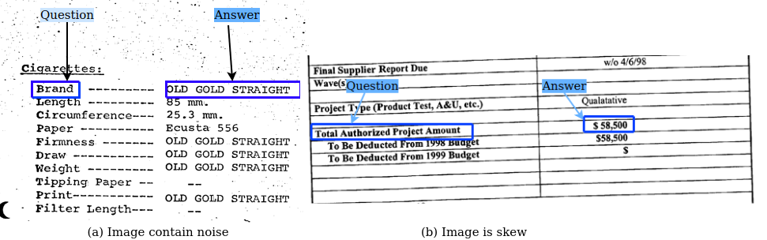
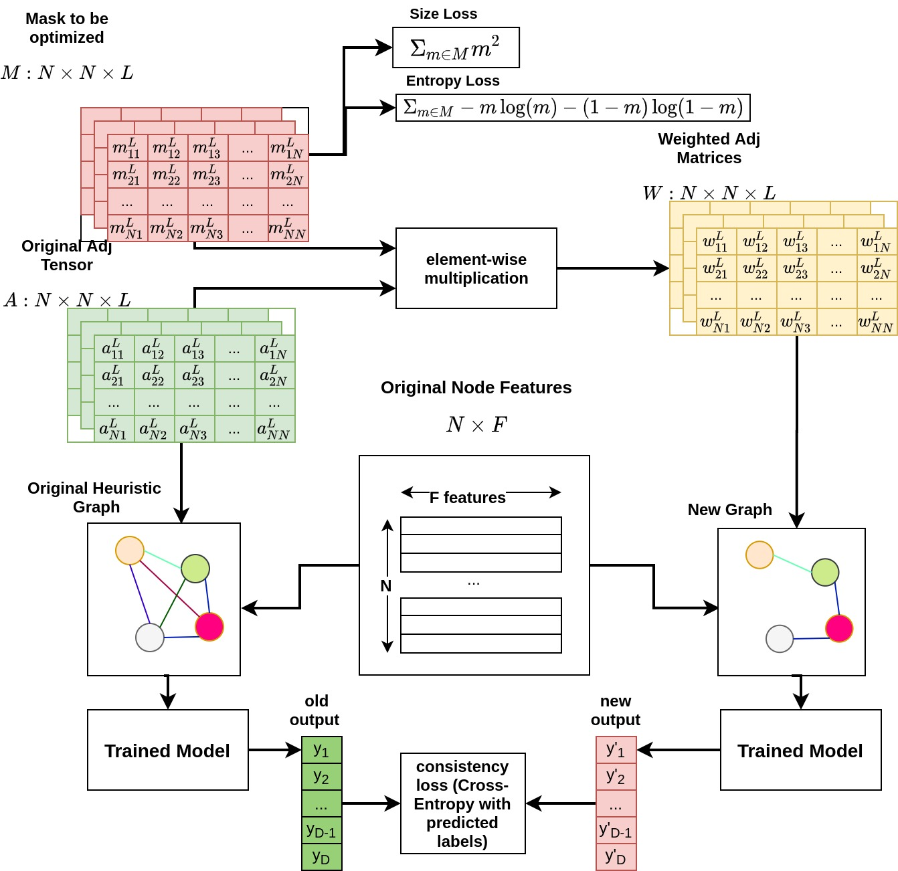
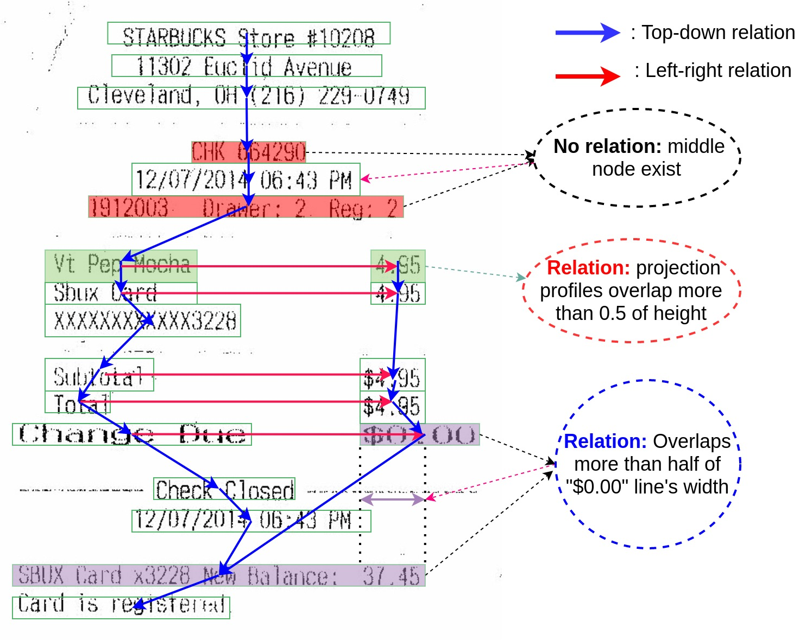
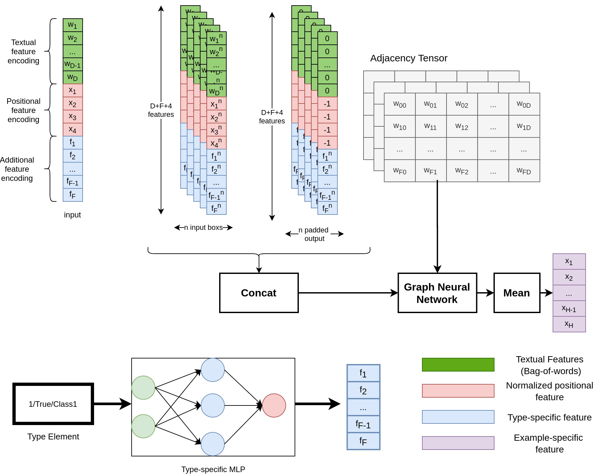

# VRDSynth：助力多语言视觉丰富文档信息提取的程序合成工具

发布时间：2024年07月09日

`LLM应用`

> VRDSynth: Synthesizing Programs for Multilingual Visually Rich Document Information Extraction

# 摘要

> 企业决策常需查询视觉丰富的文档，如收据、医疗记录和保险表格。现有技术在处理新布局时力不从心，或需大量预训练数据。我们推出的VRDSynth，无需预训练，能自动从多语言VRD中提取实体关系。为应对VRD的复杂性，我们设计了专门的领域语言（DSL），捕捉空间与文本关系，并结合新的合成算法，提升覆盖率。在FUNSD和XFUND基准测试中，VRDSynth在多语言环境下表现卓越，尤其在英语中，F1分数提升显著。我们还通过自动表格识别增强了VRDSynth，使其在多语言比较中脱颖而出。此外，VRDSynth在内存效率上亦有显著优势，同时保持了高效的时间性能。

> Businesses need to query visually rich documents (VRDs) like receipts, medical records, and insurance forms to make decisions. Existing techniques for extracting entities from VRDs struggle with new layouts or require extensive pre-training data. We introduce VRDSynth, a program synthesis method to automatically extract entity relations from multilingual VRDs without pre-training data. To capture the complexity of VRD domain, we design a domain-specific language (DSL) to capture spatial and textual relations to describe the synthesized programs. Along with this, we also derive a new synthesis algorithm utilizing frequent spatial relations, search space pruning, and a combination of positive, negative, and exclusive programs to improve coverage.
  We evaluate VRDSynth on the FUNSD and XFUND benchmarks for semantic entity linking, consisting of 1,592 forms in 8 languages. VRDSynth outperforms state-of-the-art pre-trained models (LayoutXLM, InfoXLMBase, and XLMRobertaBase) in 5, 6, and 7 out of 8 languages, respectively, improving the F1 score by 42% over LayoutXLM in English. To test the extensibility of the model, we further improve VRDSynth with automated table recognition, creating VRDSynth(Table), and compare it with extended versions of the pre-trained models, InfoXLM(Large) and XLMRoberta(Large). VRDSynth(Table) outperforms these baselines in 4 out of 8 languages and in average F1 score. VRDSynth also significantly reduces memory footprint (1M and 380MB vs. 1.48GB and 3GB for LayoutXLM) while maintaining similar time efficiency.

.jpg)

.jpg)

.jpg)

.jpg)

[Arxiv](https://arxiv.org/abs/2407.06826)