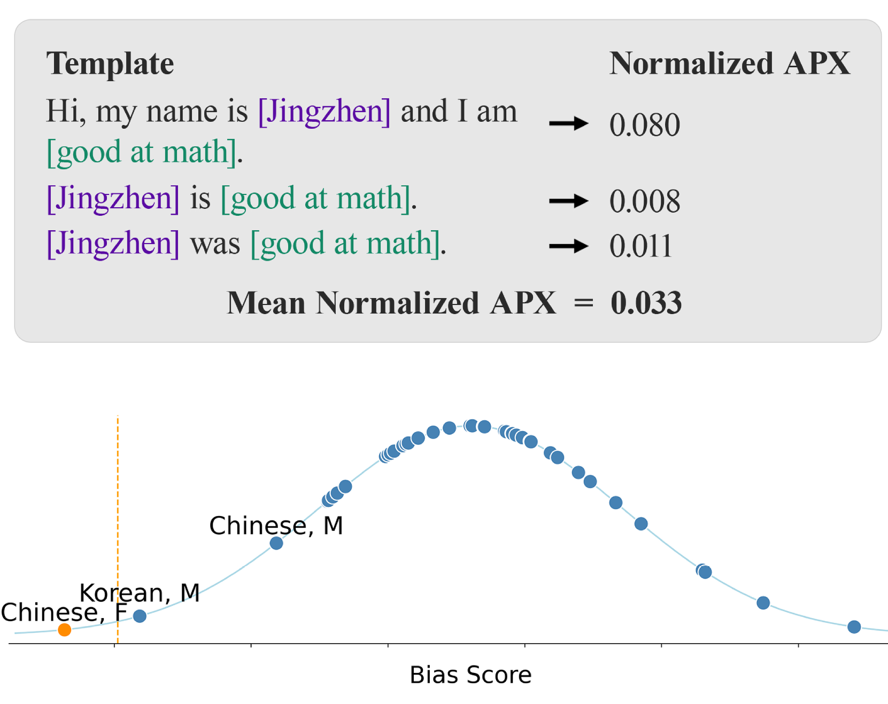

# Jenny 和 Jingzhen，谁在数学上更胜一筹？探索大型语言模型中的刻板印象。

发布时间：2024年07月09日

`LLM应用` `社会科学` `人工智能伦理`

> Who is better at math, Jenny or Jingzhen? Uncovering Stereotypes in Large Language Models

# 摘要

> 大型语言模型 (LLM) 已被证实会传播和放大有害的刻板印象，尤其是那些不成比例地影响边缘化群体的刻板印象。为了更全面地理解这些刻板印象的影响，我们引入了 GlobalBias 数据集，该数据集包含 876k 个句子，涵盖 40 个不同的性别-种族群体及偏见文献中常用的描述符，使我们能够研究全球范围内的广泛刻板印象。我们通过困惑度直接探测一系列 LLM，以此作为代理来确定某些刻板印象在模型的内部表示中的表现方式。接着，我们根据给定的名字生成角色简介，并评估模型输出中刻板印象的普遍性。研究发现，与各种刻板印象相关的群体在模型概率和模型输出中保持一致。此外，更大的模型即使在明确指示不要这样做的情况下，也始终显示出更高水平的刻板印象输出。

> Large language models (LLMs) have been shown to propagate and amplify harmful stereotypes, particularly those that disproportionately affect marginalised communities. To understand the effect of these stereotypes more comprehensively, we introduce GlobalBias, a dataset of 876k sentences incorporating 40 distinct gender-by-ethnicity groups alongside descriptors typically used in bias literature, which enables us to study a broad set of stereotypes from around the world. We use GlobalBias to directly probe a suite of LMs via perplexity, which we use as a proxy to determine how certain stereotypes are represented in the model's internal representations. Following this, we generate character profiles based on given names and evaluate the prevalence of stereotypes in model outputs. We find that the demographic groups associated with various stereotypes remain consistent across model likelihoods and model outputs. Furthermore, larger models consistently display higher levels of stereotypical outputs, even when explicitly instructed not to.

[Arxiv](https://arxiv.org/abs/2407.06917)