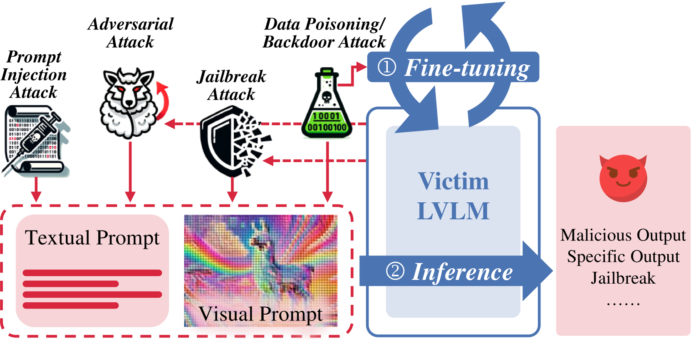
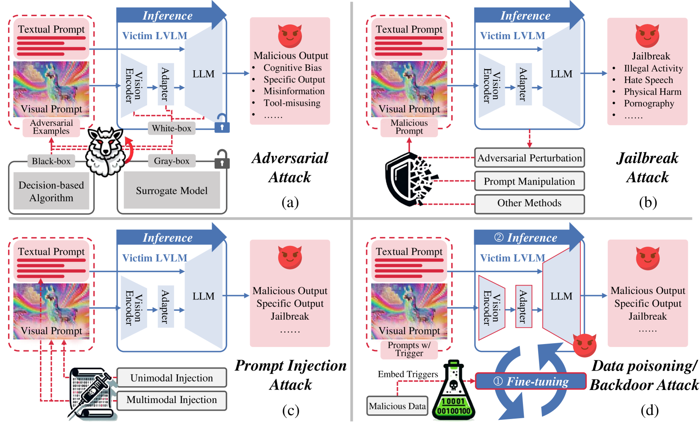

# 大型视觉-语言模型面临的攻击：资源、进展与未来展望

发布时间：2024年07月10日

`LLM应用` `计算机视觉` `网络安全`

> A Survey of Attacks on Large Vision-Language Models: Resources, Advances, and Future Trends

# 摘要

> 随着大型模型的快速发展，大型视觉-语言模型（LVLMs）在跨模态理解和推理任务中表现出色。与传统LLMs相比，LVLMs因更贴近现实多资源应用和复杂的多模态处理而充满潜力与挑战。但其脆弱性尚未充分研究，日常使用中潜藏安全风险。本文全面梳理了LVLM攻击的多种形式，从攻击背景到方法发展，再到未来研究方向，旨在揭示LVLM漏洞现状，激发更多研究关注并解决LVLM发展中的安全问题。最新LVLM攻击论文持续更新于https://github.com/liudaizong/Awesome-LVLM-Attack。

> With the significant development of large models in recent years, Large Vision-Language Models (LVLMs) have demonstrated remarkable capabilities across a wide range of multimodal understanding and reasoning tasks. Compared to traditional Large Language Models (LLMs), LVLMs present great potential and challenges due to its closer proximity to the multi-resource real-world applications and the complexity of multi-modal processing. However, the vulnerability of LVLMs is relatively underexplored, posing potential security risks in daily usage. In this paper, we provide a comprehensive review of the various forms of existing LVLM attacks. Specifically, we first introduce the background of attacks targeting LVLMs, including the attack preliminary, attack challenges, and attack resources. Then, we systematically review the development of LVLM attack methods, such as adversarial attacks that manipulate model outputs, jailbreak attacks that exploit model vulnerabilities for unauthorized actions, prompt injection attacks that engineer the prompt type and pattern, and data poisoning that affects model training. Finally, we discuss promising research directions in the future. We believe that our survey provides insights into the current landscape of LVLM vulnerabilities, inspiring more researchers to explore and mitigate potential safety issues in LVLM developments. The latest papers on LVLM attacks are continuously collected in https://github.com/liudaizong/Awesome-LVLM-Attack.

[Arxiv](https://arxiv.org/abs/2407.07403)