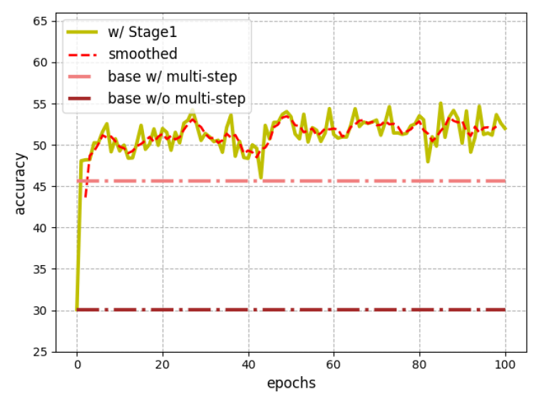
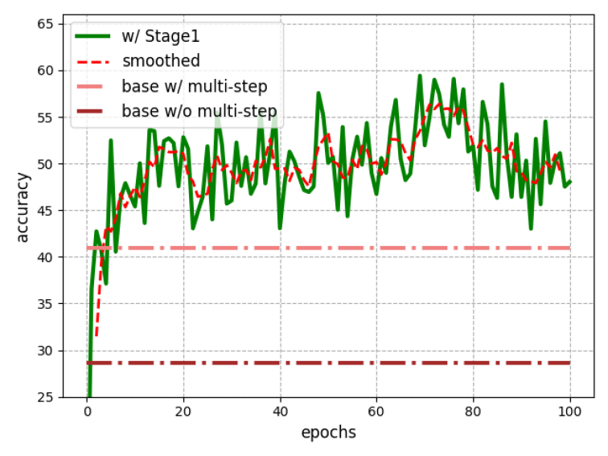
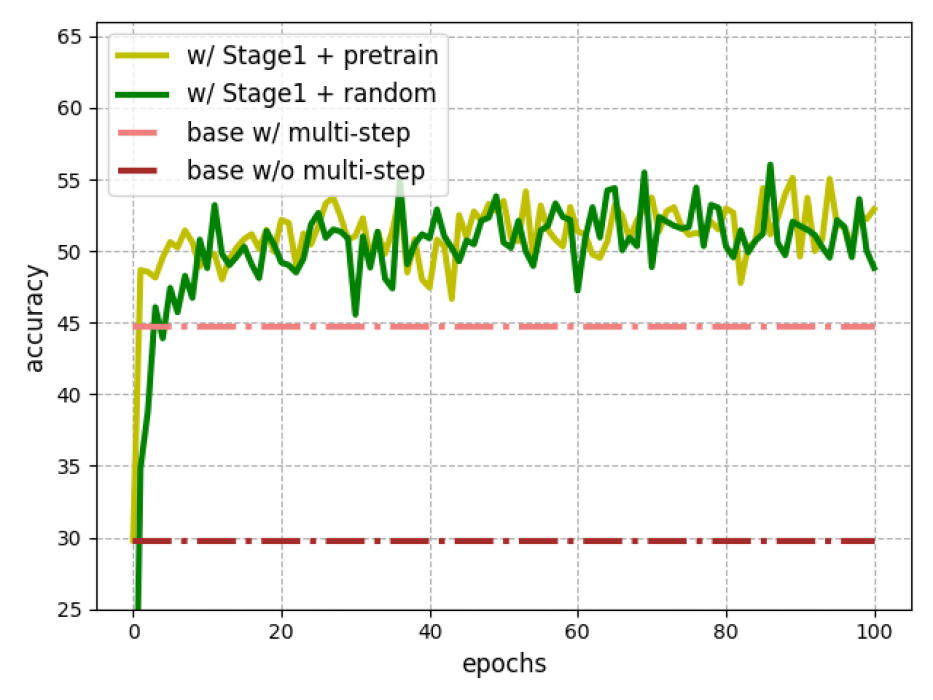
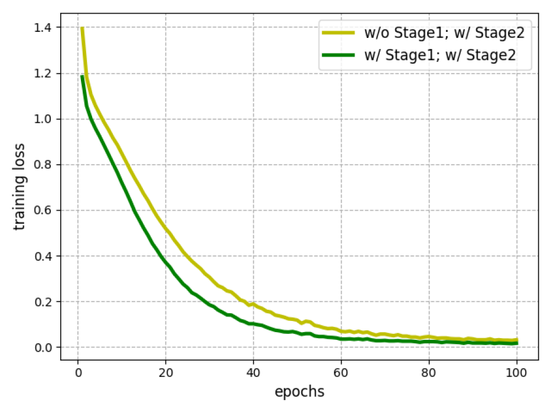

# AffectGPT：一个专为可解释多模态情感识别设计的数据集与框架

发布时间：2024年07月10日

`LLM应用` `情感识别` `人工智能`

> AffectGPT: Dataset and Framework for Explainable Multimodal Emotion Recognition

# 摘要

> 可解释的多模态情感识别（EMER）旨在实现可靠且准确的情感识别，但高昂的标注成本导致现有数据集（EMER-Fine）规模有限，难以进行有效的监督训练。为此，我们回顾并简化了数据集构建流程，采用开源模型替代闭源模型，成功构建了大规模粗略标注数据集EMER-Coarse。此外，我们提出了两阶段训练框架AffectGPT，第一阶段利用EMER-Coarse进行粗略映射学习，第二阶段结合EMER-Fine以更好地对齐人工检查结果。实验证明，我们的方法在EMER任务上表现出色。为推动后续研究，我们将公开代码和数据集，详情请访问：https://github.com/zeroQiaoba/AffectGPT。

> Explainable Multimodal Emotion Recognition (EMER) is an emerging task that aims to achieve reliable and accurate emotion recognition. However, due to the high annotation cost, the existing dataset (denoted as EMER-Fine) is small, making it difficult to perform supervised training. To reduce the annotation cost and expand the dataset size, this paper reviews the previous dataset construction process. Then, we simplify the annotation pipeline, avoid manual checks, and replace the closed-source models with open-source models. Finally, we build \textbf{EMER-Coarse}, a coarsely-labeled dataset containing large-scale samples. Besides the dataset, we propose a two-stage training framework \textbf{AffectGPT}. The first stage exploits EMER-Coarse to learn a coarse mapping between multimodal inputs and emotion-related descriptions; the second stage uses EMER-Fine to better align with manually-checked results. Experimental results demonstrate the effectiveness of our proposed method on the challenging EMER task. To facilitate further research, we will make the code and dataset available at: https://github.com/zeroQiaoba/AffectGPT.

[Arxiv](https://arxiv.org/abs/2407.07653)