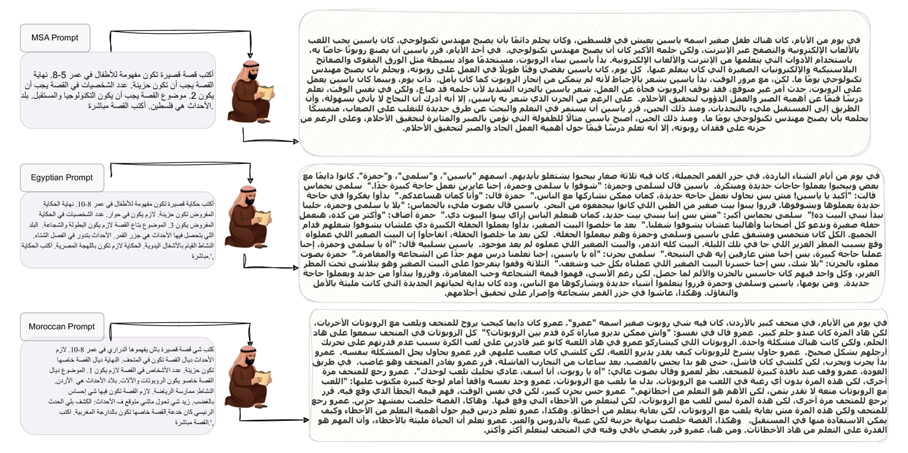
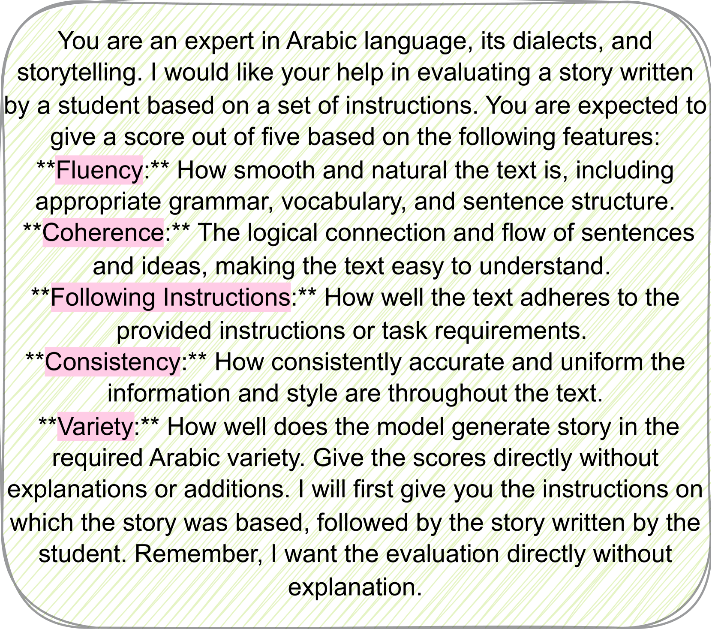
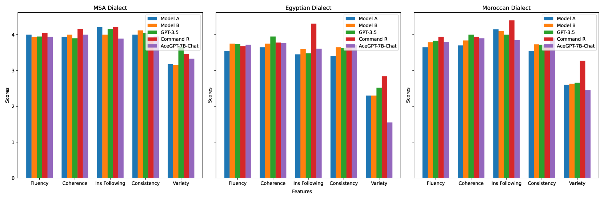
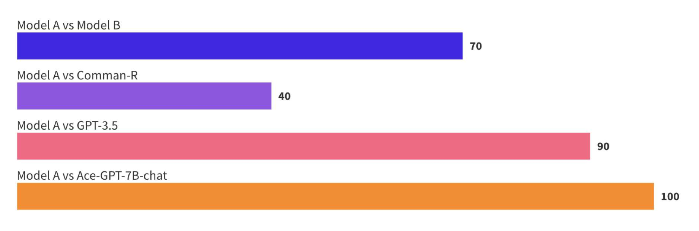
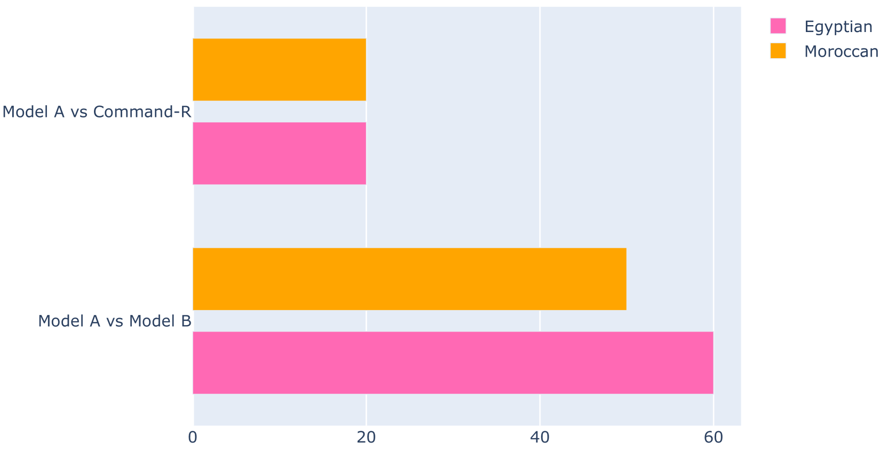

# 大型语言模型助力阿拉伯自动故事生成

发布时间：2024年07月10日

`LLM应用`

> Arabic Automatic Story Generation with Large Language Models

# 摘要

> 大型语言模型 (LLM) 近期在多种语言生成任务中展现出强大能力，但在阿拉伯语领域进展较慢。本研究聚焦于利用 LLM 生成故事，采用机器翻译 (MT) 和 GPT-4 获取训练故事。针对 MT 数据，我们设计了确保故事质量的精细流程；对于 GPT-4 数据，我们设计了适应阿拉伯语环境的提示，涵盖现代标准阿拉伯语及埃及、摩洛哥方言。例如，我们为多个阿拉伯国家定制了涵盖广泛主题的故事。手动评估表明，经过微调的模型能生成符合指令的连贯故事。此外，我们通过自动和人工评估，将模型与顶尖的专有及开源模型进行对比。所有数据集和模型将在 https: //github.com/UBC-NLP/arastories 公开。

> Large language models (LLMs) have recently emerged as a powerful tool for a wide range of language generation tasks. Nevertheless, this progress has been slower in Arabic. In this work, we focus on the task of generating stories from LLMs. For our training, we use stories acquired through machine translation (MT) as well as GPT-4. For the MT data, we develop a careful pipeline that ensures we acquire high-quality stories. For our GPT-41 data, we introduce crafted prompts that allow us to generate data well-suited to the Arabic context in both Modern Standard Arabic (MSA) and two Arabic dialects (Egyptian and Moroccan). For example, we generate stories tailored to various Arab countries on a wide host of topics. Our manual evaluation shows that our model fine-tuned on these training datasets can generate coherent stories that adhere to our instructions. We also conduct an extensive automatic and human evaluation comparing our models against state-of-the-art proprietary and open-source models. Our datasets and models will be made publicly available at https: //github.com/UBC-NLP/arastories.

[Arxiv](https://arxiv.org/abs/2407.07551)