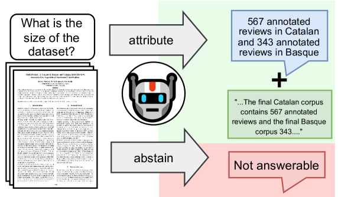
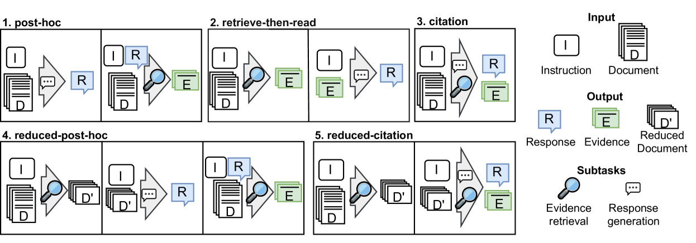
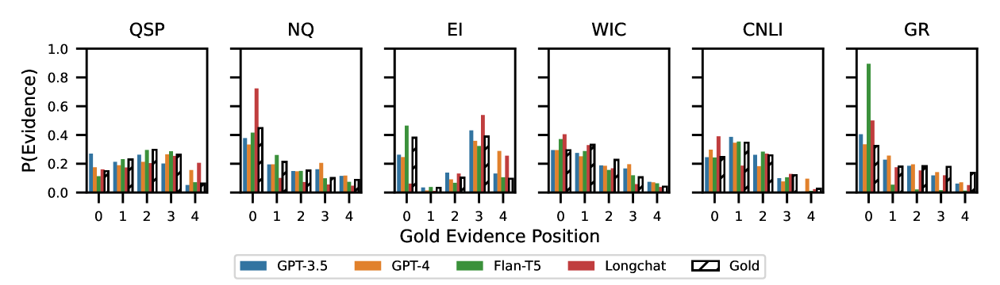
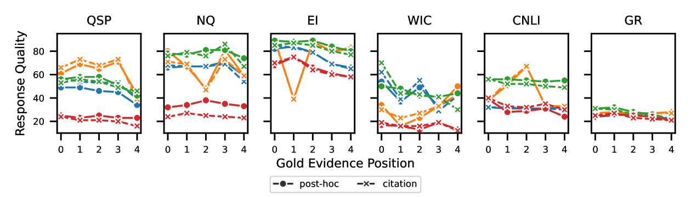
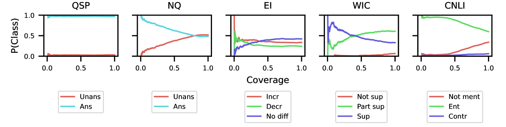
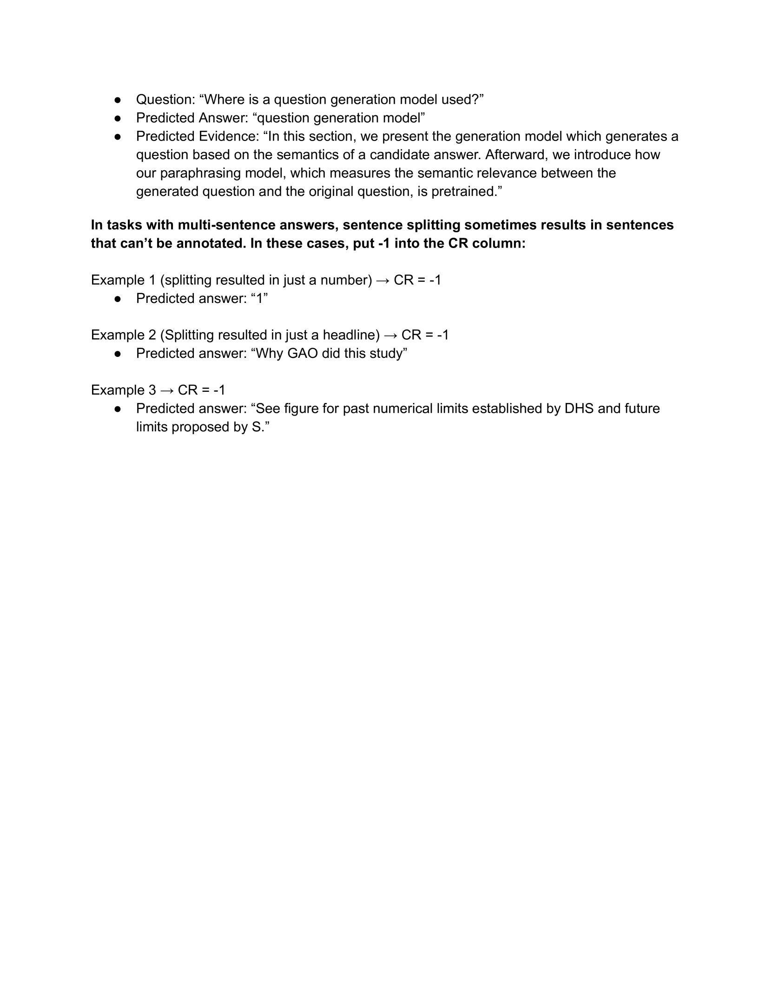

# 大型语言模型：长文档的得力助手还是选择放弃？

发布时间：2024年07月10日

`LLM应用` `文档处理` `人工智能`

> Attribute or Abstain: Large Language Models as Long Document Assistants

# 摘要

> 大型语言模型（LLM）虽能辅助长文档处理，但常产生不实信息。通过归因，即LLM提供支持其回答的证据，可增强其回答的可信度。然而，现有归因方法仅在RAG环境下评估，未考虑长文档场景，其中无需检索。为此，我们推出LAB基准，涵盖6项长文档任务，并测试4种不同规模LLM的归因方法，包括提示与微调。实验显示，“引用”策略（一步完成回答与证据提取）效果最佳。我们还探讨了归因中的“中间迷失”现象，未见其存在。此外，证据质量能预测简单回答的优劣，但对复杂回答则不然，因模型难以提供复杂声明的证据。我们公开了相关代码与数据，供后续深入研究。

> LLMs can help humans working with long documents, but are known to hallucinate. Attribution can increase trust in LLM responses: The LLM provides evidence that supports its response, which enhances verifiability. Existing approaches to attribution have only been evaluated in RAG settings, where the initial retrieval confounds LLM performance. This is crucially different from the long document setting, where retrieval is not needed, but could help. Thus, a long document specific evaluation of attribution is missing. To fill this gap, we present LAB, a benchmark of 6 diverse long document tasks with attribution, and experiment with different approaches to attribution on 4 LLMs of different sizes, both prompted and fine-tuned. We find that citation, i.e. response generation and evidence extraction in one step, mostly performs best. We investigate whether the ``Lost in the Middle'' phenomenon exists for attribution, but do not find this. We also find that evidence quality can predict response quality on datasets with simple responses, but not so for complex responses, as models struggle with providing evidence for complex claims. We release code and data for further investigation.

[Arxiv](https://arxiv.org/abs/2407.07799)