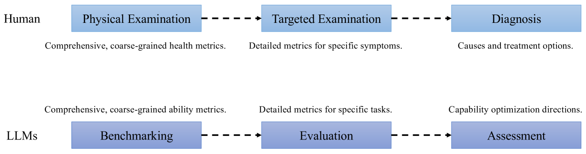
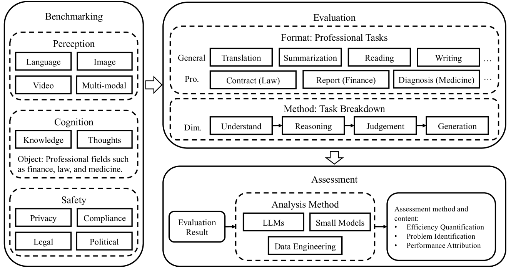

# 跳出基准测试框架，我们提出了一种评估大型语言模型的新范式。

发布时间：2024年07月10日

`LLM理论` `人工智能`

> Beyond Benchmarking: A New Paradigm for Evaluation and Assessment of Large Language Models

# 摘要

> 当前的 LLM 评估基准存在诸多问题，如内容限制、更新滞后和缺乏优化指导。为此，我们提出了一种全新的评估范式：基准测试-评估-评估。这一范式将 LLM 的评估环境从“考场”转变为“医院”，通过“体检”方式，以特定任务解决为核心，深入剖析并优化 LLM 中的问题。

> In current benchmarks for evaluating large language models (LLMs), there are issues such as evaluation content restriction, untimely updates, and lack of optimization guidance. In this paper, we propose a new paradigm for the measurement of LLMs: Benchmarking-Evaluation-Assessment. Our paradigm shifts the "location" of LLM evaluation from the "examination room" to the "hospital". Through conducting a "physical examination" on LLMs, it utilizes specific task-solving as the evaluation content, performs deep attribution of existing problems within LLMs, and provides recommendation for optimization.

[Arxiv](https://arxiv.org/abs/2407.07531)