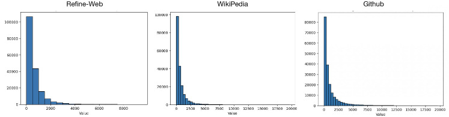
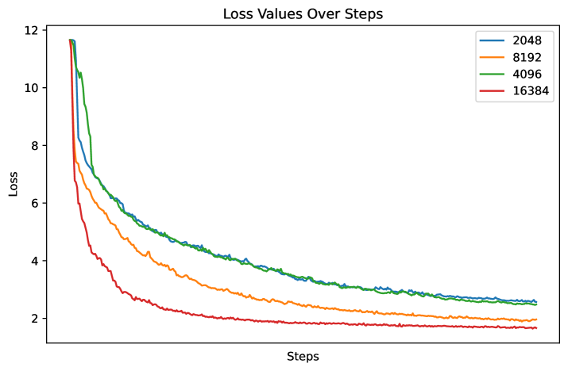

# 仅需 Bucket 预训练，一切尽在掌握

发布时间：2024年07月10日

`LLM理论` `机器学习`

> Bucket Pre-training is All You Need

# 摘要

> 大型语言模型在众多自然语言处理任务中表现卓越，但传统固定长度的预训练数据组合策略，通过文档的拼接和分割，可能引入噪声并限制模型对长距离依赖的捕捉。为此，我们首先提出了三个评估数据组合质量的指标：填充比、截断比和连接比。接着，我们提出了一种多桶数据组合方法，突破固定长度限制，提供更灵活高效的预训练途径。实验证明，该方法能显著提升预训练的效率和效果，不仅减少噪声、保留上下文，还加速了训练过程，为大型语言模型的预训练开辟了新的可能。

> Large language models (LLMs) have demonstrated exceptional performance across various natural language processing tasks. However, the conventional fixed-length data composition strategy for pretraining, which involves concatenating and splitting documents, can introduce noise and limit the model's ability to capture long-range dependencies. To address this, we first introduce three metrics for evaluating data composition quality: padding ratio, truncation ratio, and concatenation ratio. We further propose a multi-bucket data composition method that moves beyond the fixed-length paradigm, offering a more flexible and efficient approach to pretraining. Extensive experiments demonstrate that our proposed method could significantly improving both the efficiency and efficacy of LLMs pretraining. Our approach not only reduces noise and preserves context but also accelerates training, making it a promising solution for LLMs pretraining.

[Arxiv](https://arxiv.org/abs/2407.07495)