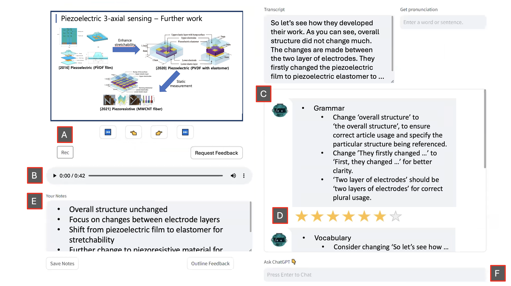

# CHOP：融合 ChatGPT 于 EFL 口语展示训练

发布时间：2024年07月10日

`LLM应用` `语言学习`

> CHOP: Integrating ChatGPT into EFL Oral Presentation Practice

# 摘要

> EFL 学生在进行口头报告时，常因资源匮乏和教师反馈效果有限而感到挑战。大型语言模型（LLM）通过实时反馈，为提升学生口头报告能力开辟了新途径。本文探讨了如何将 ChatGPT 有效融入 EFL 口头报告练习，提供定制化反馈。我们创新性地推出了 CHOP 平台——一个基于 ChatGPT 的互动学习工具，并通过对 13 名 EFL 学生的实证研究，评估了其效能。通过分析学生与 ChatGPT 的互动数据及专家对反馈质量的评价，我们揭示了 CHOP 平台的优缺点。同时，我们深入剖析了学习者的体验和关键设计要素。基于这些发现，我们为教育领域提出了未来发展方向和设计优化建议。

> English as a Foreign Language (EFL) students often struggle to deliver oral presentations due to a lack of reliable resources and the limited effectiveness of instructors' feedback. Large Language Model (LLM) can offer new possibilities to assist students' oral presentations with real-time feedback. This paper investigates how ChatGPT can be effectively integrated into EFL oral presentation practice to provide personalized feedback. We introduce a novel learning platform, CHOP (ChatGPT-based interactive platform for oral presentation practice), and evaluate its effectiveness with 13 EFL students. By collecting student-ChatGPT interaction data and expert assessments of the feedback quality, we identify the platform's strengths and weaknesses. We also analyze learners' perceptions and key design factors. Based on these insights, we suggest further development opportunities and design improvements for the education community.

[Arxiv](https://arxiv.org/abs/2407.07393)