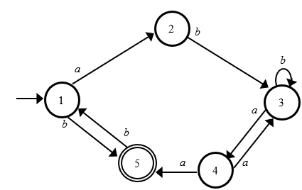
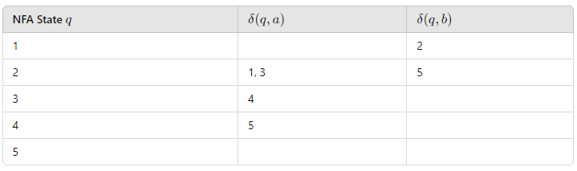

# ChatGPT 能否在计算理论课程中取得及格？

发布时间：2024年07月10日

`LLM应用` `计算机科学`

> Can ChatGPT Pass a Theory of Computing Course?

# 摘要

> 大型语言模型在处理数学问题，尤其是计算理论课程中的问题时，表现不佳。本文通过两个实验，探讨了 ChatGPT 在 ToC 课程中的表现。首先，我们测试了 ChatGPT 通过 ToC 考试的能力；其次，我们构建了一个 ToC 问题数据库，以便其他课程参考。实验结果显示，ChatGPT 能通过 ToC 考试，擅长处理选择题等基础题型，但在开放式证明题中常出现逻辑错误。

> Large Language Models (LLMs) have had considerable difficulty when prompted with mathematical questions, especially those within theory of computing (ToC) courses. In this paper, we detail two experiments regarding our own ToC course and the ChatGPT LLM. For the first, we evaluated ChatGPT's ability to pass our own ToC course's exams. For the second, we created a database of sample ToC questions and responses to accommodate other ToC offerings' choices for topics and structure. We scored each of ChatGPT's outputs on these questions. Overall, we determined that ChatGPT can pass our ToC course, and is adequate at understanding common formal definitions and answering "simple"-style questions, e.g., true/false and multiple choice. However, ChatGPT often makes nonsensical claims in open-ended responses, such as proofs.

[Arxiv](https://arxiv.org/abs/2407.07757)