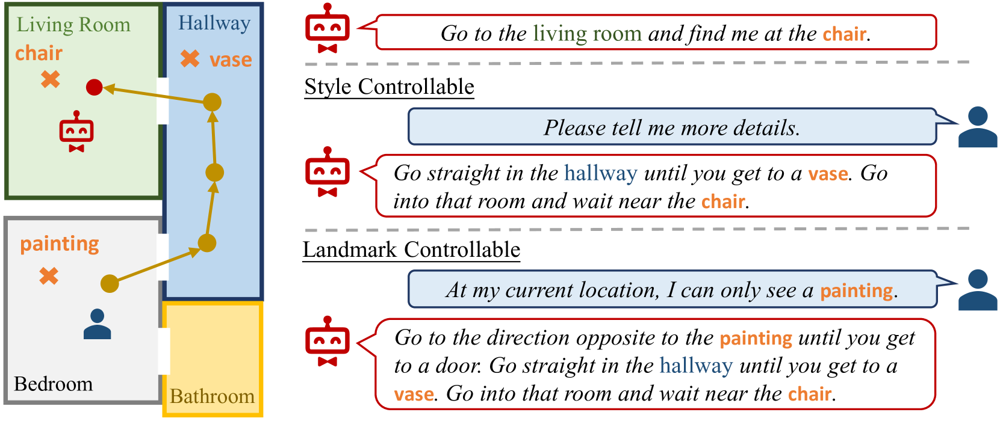
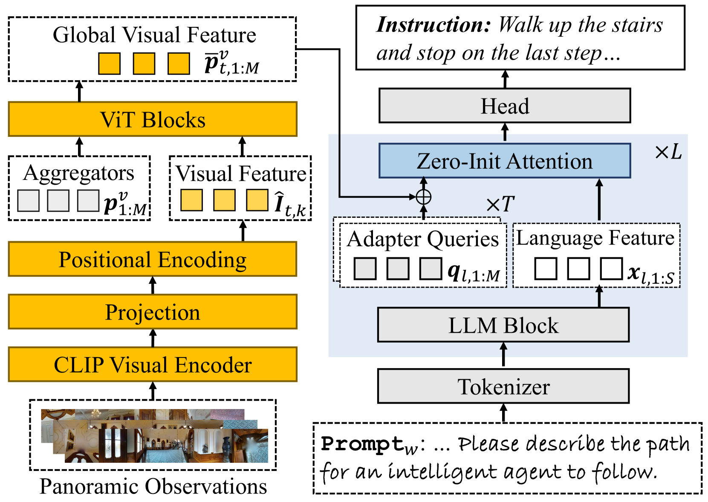
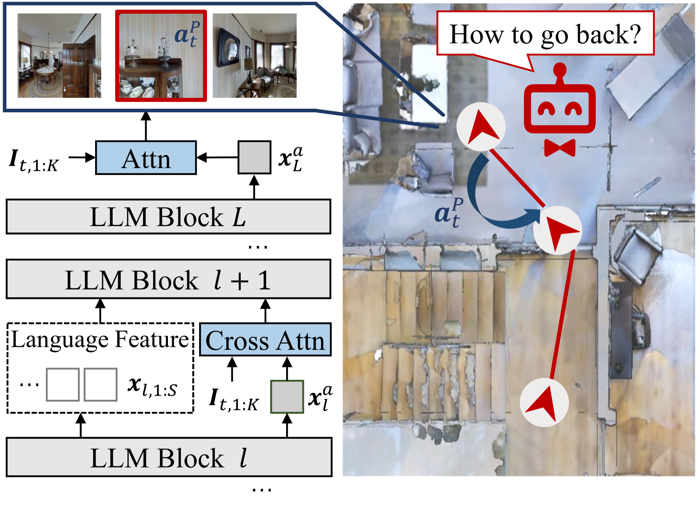
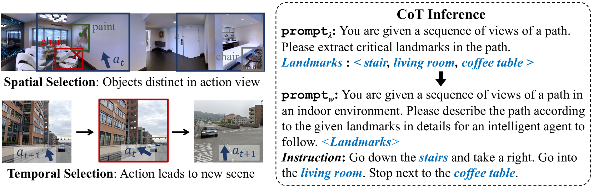
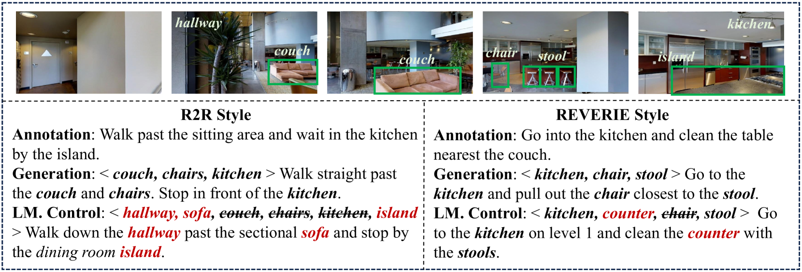
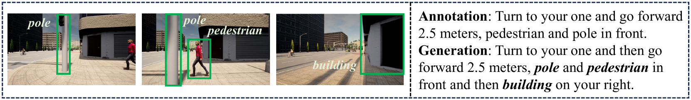
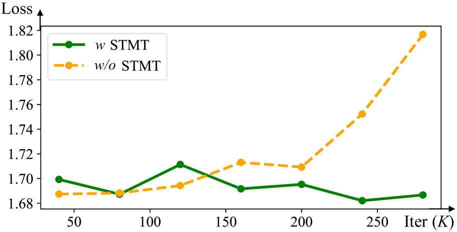
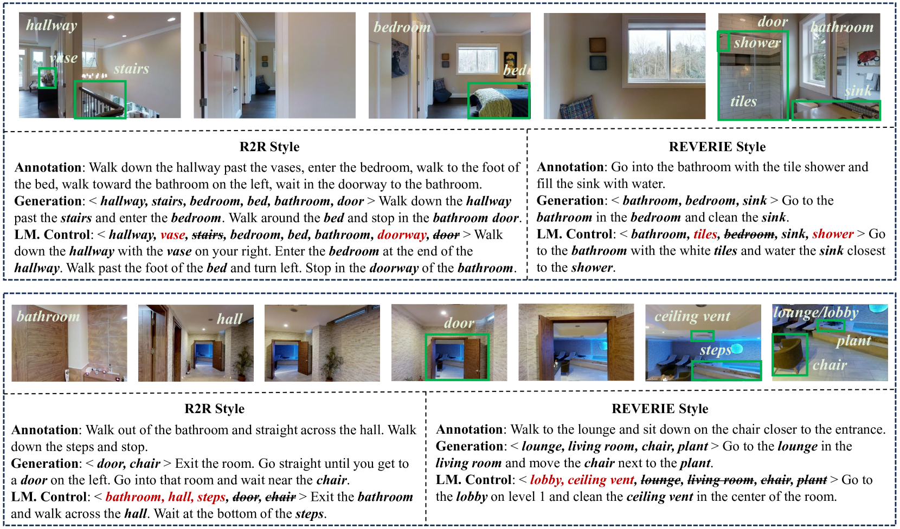
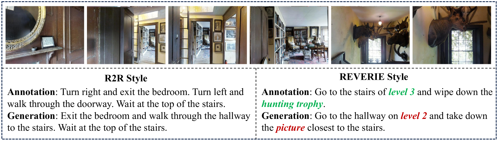

# 通过思维链提示实现可控的导航指令生成

发布时间：2024年07月10日

`LLM应用` `人工智能` `导航系统`

> Controllable Navigation Instruction Generation with Chain of Thought Prompting

# 摘要

> 指令生成是一个跨学科研究热点，应用广泛。传统模型受限于单一数据集的风格，且无法灵活控制生成内容。我们借助大型语言模型（LLM），创新推出C-Instructor，通过思维链提示实现风格与内容的双重可控。我们首创地标思维链（CoTL）机制，引导模型精准识别地标，生成详尽指令，提升易用性与操作灵活性。同时，我们设计空间拓扑建模任务，深化环境理解。最后，通过风格混合训练策略，C-Instructor在单一模型内实现多风格指令生成。实验证明，C-Instructor在文本质量、导航指导及用户体验等多方面超越现有技术。

> Instruction generation is a vital and multidisciplinary research area with broad applications. Existing instruction generation models are limited to generating instructions in a single style from a particular dataset, and the style and content of generated instructions cannot be controlled. Moreover, most existing instruction generation methods also disregard the spatial modeling of the navigation environment. Leveraging the capabilities of Large Language Models (LLMs), we propose C-Instructor, which utilizes the chain-of-thought-style prompt for style-controllable and content-controllable instruction generation. Firstly, we propose a Chain of Thought with Landmarks (CoTL) mechanism, which guides the LLM to identify key landmarks and then generate complete instructions. CoTL renders generated instructions more accessible to follow and offers greater controllability over the manipulation of landmark objects. Furthermore, we present a Spatial Topology Modeling Task to facilitate the understanding of the spatial structure of the environment. Finally, we introduce a Style-Mixed Training policy, harnessing the prior knowledge of LLMs to enable style control for instruction generation based on different prompts within a single model instance. Extensive experiments demonstrate that instructions generated by C-Instructor outperform those generated by previous methods in text metrics, navigation guidance evaluation, and user studies.

[Arxiv](https://arxiv.org/abs/2407.07433)