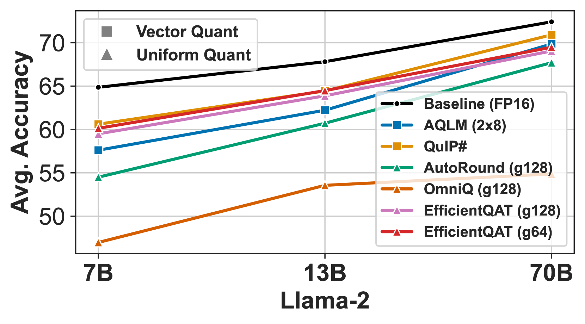
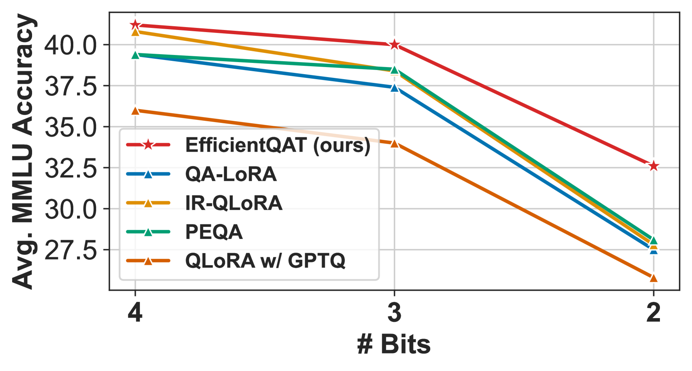
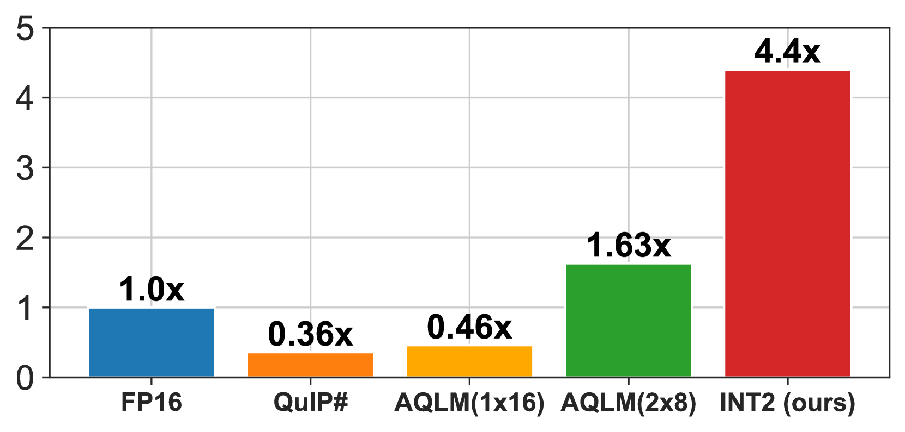
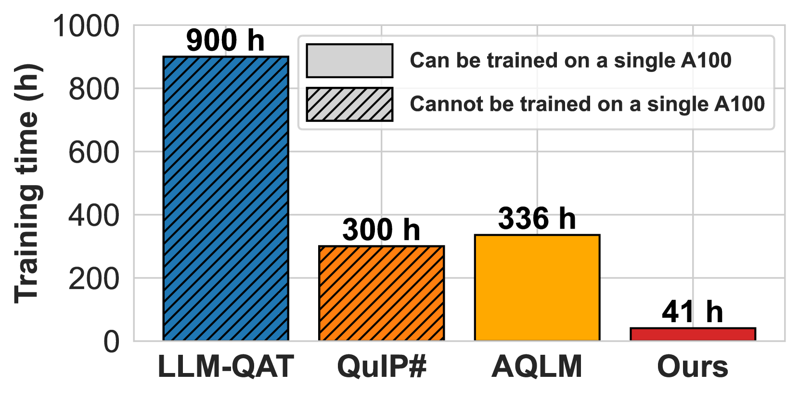
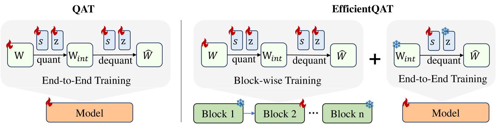
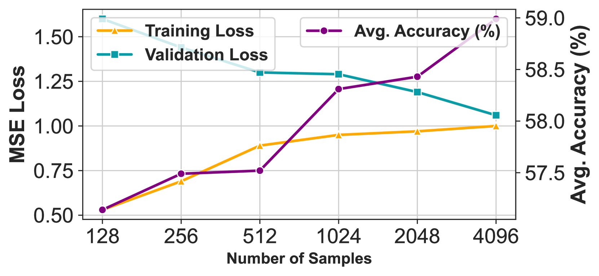

# EfficientQAT：为大型语言模型提供高效量化感知训练

发布时间：2024年07月10日

`LLM理论` `人工智能`

> EfficientQAT: Efficient Quantization-Aware Training for Large Language Models

# 摘要

> 大型语言模型（LLM）在现代自然语言处理和人工智能领域扮演着关键角色，但其庞大的内存需求成为一大挑战。为此，我们引入了高效量化感知训练（EfficientQAT），一种创新的量化技术，旨在压缩这些模型。EfficientQAT 通过两个连续阶段实现：首先是分块训练所有参数（Block-AP），然后是端到端训练量化参数（E2E-QP）。Block-AP 通过分块重建，逐一进行量化感知训练，避免了全模型训练的高成本。接着，E2E-QP 仅针对量化参数进行端到端训练，固定量化骨干并减少可训练参数，从而提升效率。实验结果显示，EfficientQAT 在多种模型上均超越了以往的量化方法，包括基础 LLM、指令调优 LLM 和多模态 LLM，参数规模从 7B 到 70B，量化比特数各异。例如，在单个 A100-80GB GPU 上，EfficientQAT 仅用 41 小时就完成了 2 比特 Llama-2-70B 模型的训练，精度损失控制在 3% 以内（69.48 vs. 72.41）。特别地，这个 INT2 量化的 70B 模型在内存需求减少的情况下（19.2GB vs. 24.2GB），相比 Llama-2-13B 模型，精度提升了 1.67（69.48 vs. 67.81）。相关代码已公开在 https://github.com/OpenGVLab/EfficientQAT。

> Large language models (LLMs) are integral to modern natural language processing and artificial intelligence. However, they face challenges in managing their significant memory requirements. Although quantization-aware training (QAT) offers a solution by reducing memory consumption through low-bit representations with minimal accuracy loss, it demands substantial training resources to optimize model weights and quantization parameters. To address this, we propose Efficient Quantization-Aware Training (EfficientQAT), a novel quantization technique for compressing LLMs. EfficientQAT involves two consecutive phases: Block-wise training of all parameters (Block-AP) and end-to-end training of quantization parameters (E2E-QP). Block-AP sequentially conducts quantization-aware training for all parameters in each transformer block with block-wise reconstruction, maintaining efficiency by avoiding training the entire LLM. Initialized with quantized model, E2E-QP then trains only quantization parameters (step sizes) end-to-end, enhancing efficiency with a fixed quantized backbone and reduced trainable parameter count. Extensive experiments demonstrate that EfficientQAT outperforms previous quantization methods across a range of models, including base LLMs, instruction-tuned LLMs, and multimodal LLMs, with scales from 7B to 70B parameters at various quantization bits. For instance, EfficientQAT obtains a 2-bit Llama-2-70B model on a single A100-80GB GPU in 41 hours, with less than 3\% accuracy degradation compared to the full precision (69.48 vs. 72.41). Notably, this INT2 quantized 70B model obtains a 1.67 accuracy gain over the Llama-2-13B model (69.48 vs. 67.81) while requiring less memory (19.2GB vs. 24.2GB). Code is available at https://github.com/OpenGVLab/EfficientQAT.

[Arxiv](https://arxiv.org/abs/2407.11062)