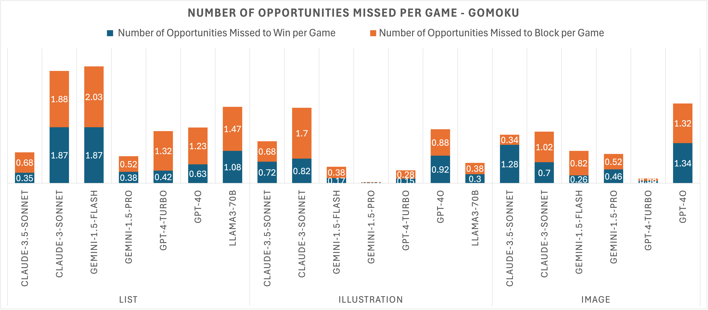
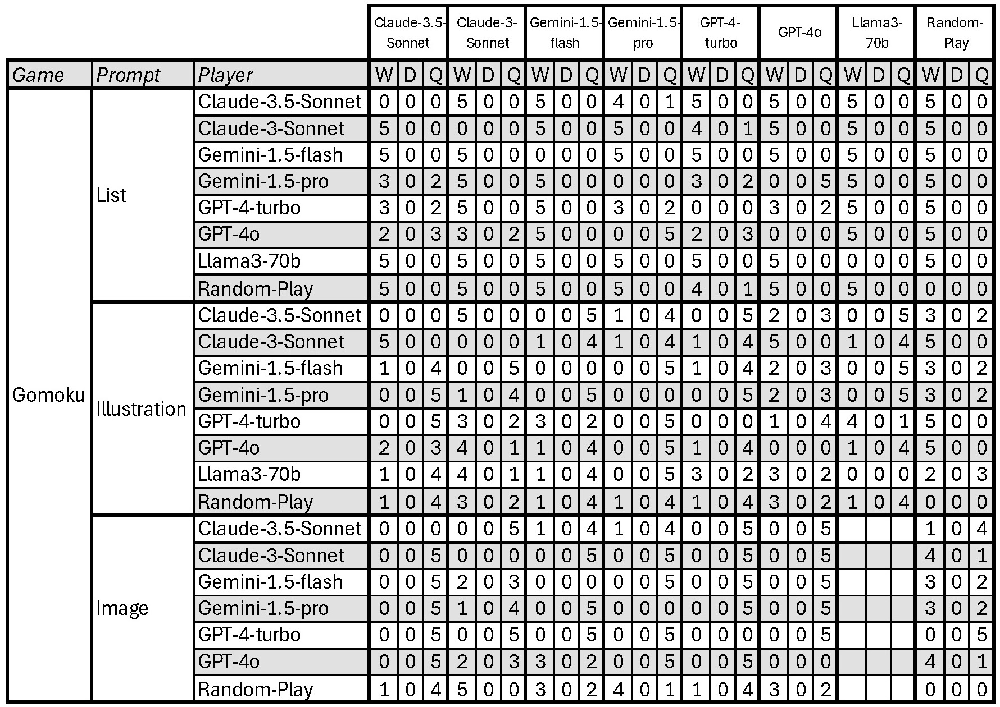

# 通过基于网格的游戏竞赛评估大型语言模型：打造一个可扩展的 LLM 基准与排行榜

发布时间：2024年07月10日

`LLM应用` `人工智能`

> Evaluating Large Language Models with Grid-Based Game Competitions: An Extensible LLM Benchmark and Leaderboard

# 摘要

> 我们为大型语言模型（LLM）创建了一个新颖且可扩展的基准，通过井字棋、四子棋和五子棋等网格游戏进行测试。开源的游戏模拟代码可在GitHub上获取，支持LLM竞争，并生成用于排行榜和分析的详细数据文件。我们展示了包括Anthropic、Google、OpenAI和Meta在内的领先LLM之间的游戏结果。总共模拟了2,310场比赛，涉及三种游戏和三种提示类型。结果显示LLM在不同游戏和提示类型中的表现差异显著，详细分析了胜率、淘汰率、错失机会和无效移动。排行榜和结果数据的详细信息已在GitHub上公开。这项研究加深了我们对LLM在未专门训练的游戏中能力的理解，评估了其规则理解和战略思维。在追求人工通用智能（AGI）的道路上，这项研究为探索LLM在复杂决策场景中的应用奠定了基础，揭示了其战略思维能力，并为未来研究提供了方向。

> We introduce a novel and extensible benchmark for large language models (LLMs) through grid-based games such as Tic-Tac-Toe, Connect-Four, and Gomoku. The open-source game simulation code, available on GitHub, allows LLMs to compete and generates detailed data files in JSON, CSV, TXT, and PNG formats for leaderboard rankings and further analysis. We present the results of games among leading LLMs, including Claude 3.5 Sonnet and Claude 3 Sonnet by Anthropic, Gemini 1.5 Pro and Gemini 1.5 Flash by Google, GPT-4 Turbo and GPT-4o by OpenAI, and Llama3-70B by Meta. We also encourage submissions of results from other LLMs. In total, we simulated 2,310 matches (5 sessions for each pair among 7 LLMs and a random player) across three types of games, using three distinct prompt types: list, illustration, and image. The results revealed significant variations in LLM performance across different games and prompt types, with analysis covering win and disqualification rates, missed opportunity analysis, and invalid move analysis. The details of the leaderboard and result matrix data are available as open-access data on GitHub. This study enhances our understanding of LLMs' capabilities in playing games they were not specifically trained for, helping to assess their rule comprehension and strategic thinking. On the path to Artificial General Intelligence (AGI), this study lays the groundwork for future exploration into their utility in complex decision-making scenarios, illuminating their strategic thinking abilities and offering directions for further inquiry into the limits of LLMs within game-based frameworks.

[Arxiv](https://arxiv.org/abs/2407.07796)