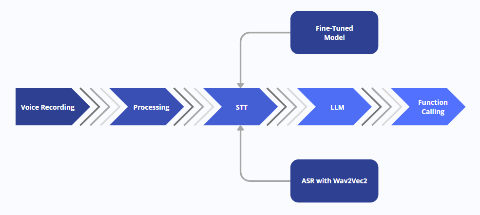
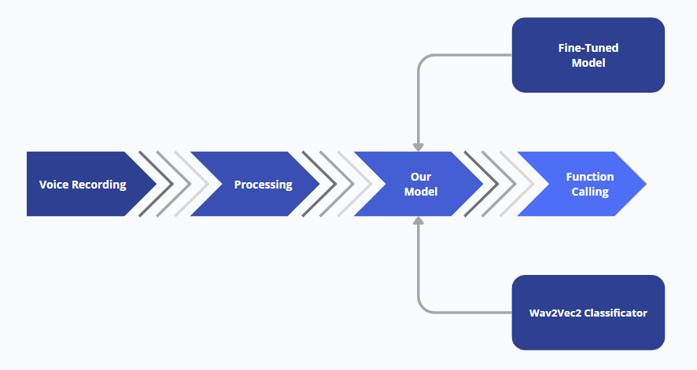
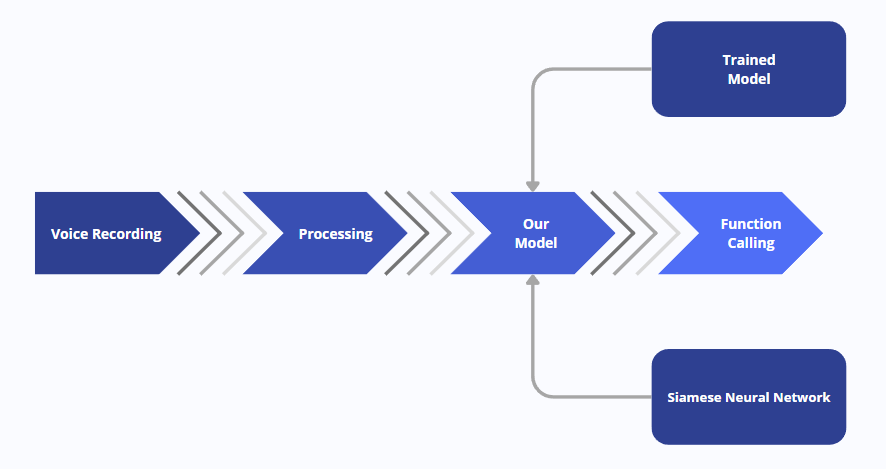

# 探索无人机语音控制：从语音识别到大型语言模型，再到直接分类与孪生网络的应用。

发布时间：2024年07月10日

`Agent` `无人机` `人机交互`

> Evaluating Voice Command Pipelines for Drone Control: From STT and LLM to Direct Classification and Siamese Networks

# 摘要

> 本文探讨了三种利用语音识别和深度学习技术控制Tello无人机的语音命令管道，旨在通过直观的语音控制提升人机交互体验。这些管道包括：传统STT结合LLM、直接语音到功能映射以及基于孪生神经网络的系统。我们基于推理时间、准确性、效率和灵活性对这些管道进行了详细评估，并提供了全面的方法论、数据集准备和评估指标，深入分析了各管道在不同应用场景中的优势和适用性。

> This paper presents the development and comparative evaluation of three voice command pipelines for controlling a Tello drone, using speech recognition and deep learning techniques. The aim is to enhance human-machine interaction by enabling intuitive voice control of drone actions. The pipelines developed include: (1) a traditional Speech-to-Text (STT) followed by a Large Language Model (LLM) approach, (2) a direct voice-to-function mapping model, and (3) a Siamese neural network-based system. Each pipeline was evaluated based on inference time, accuracy, efficiency, and flexibility. Detailed methodologies, dataset preparation, and evaluation metrics are provided, offering a comprehensive analysis of each pipeline's strengths and applicability across different scenarios.

[Arxiv](https://arxiv.org/abs/2407.08658)