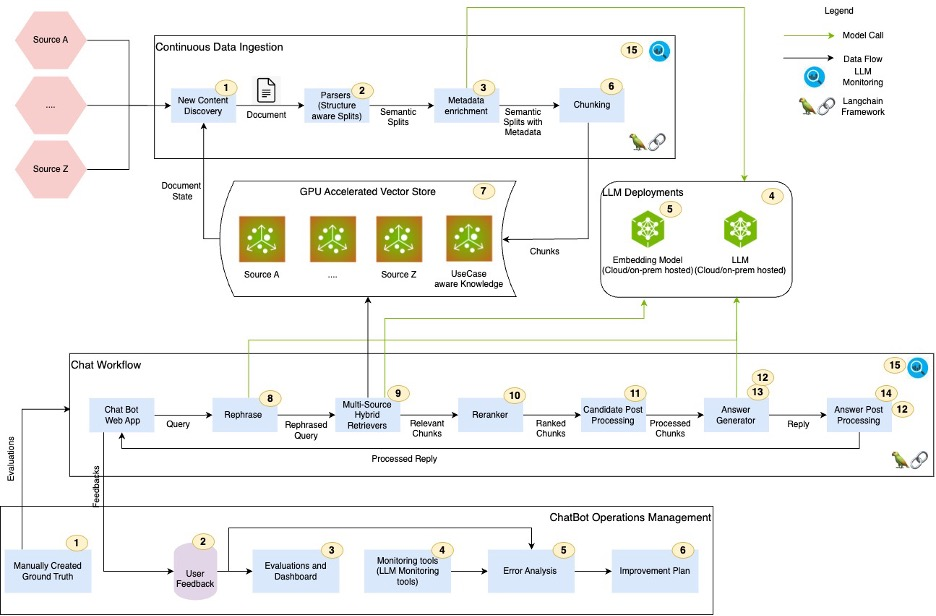
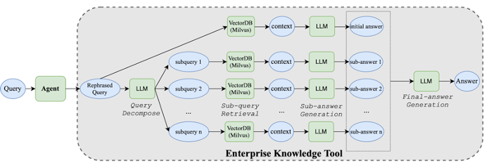
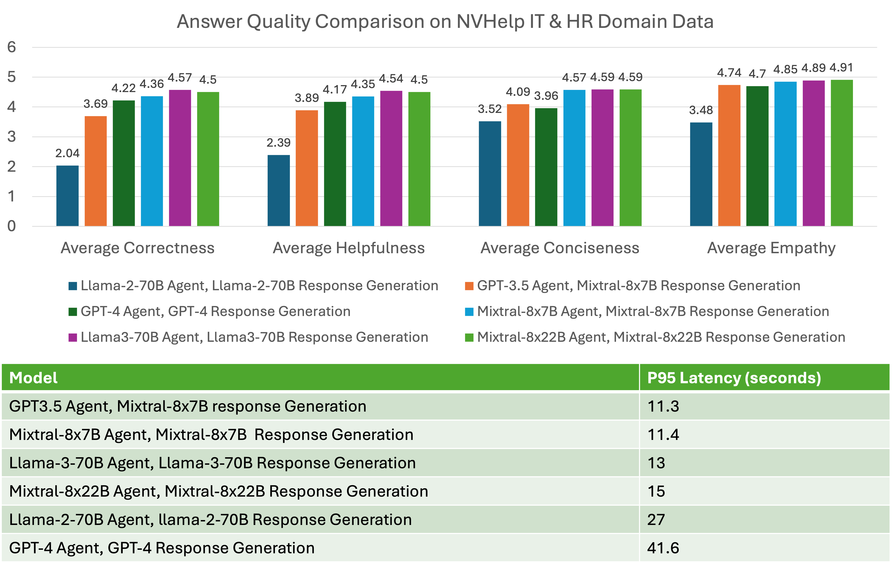
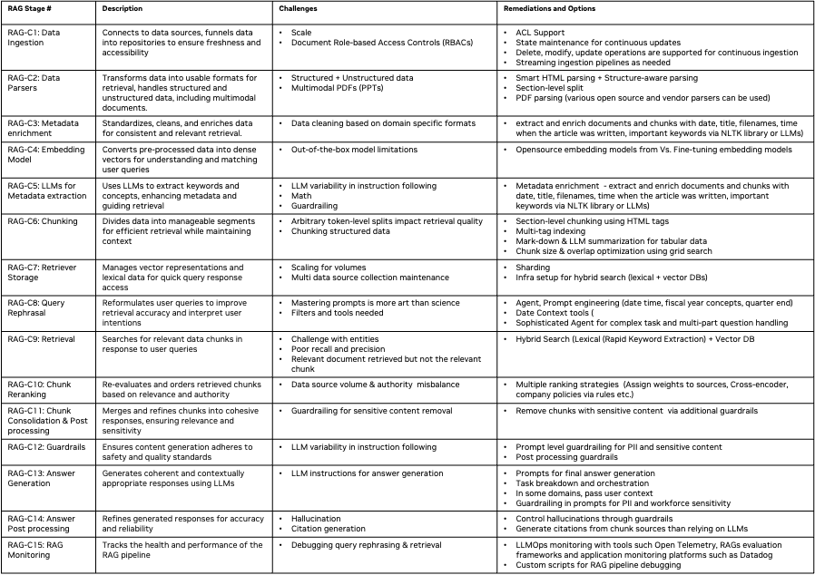
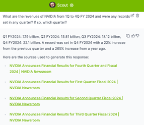
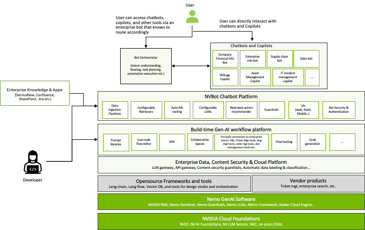

# 构建基于检索增强生成的聊天机器人要点解析

发布时间：2024年07月10日

`RAG` `人工智能`

> FACTS About Building Retrieval Augmented Generation-based Chatbots

# 摘要

> 生成式AI驱动的企业聊天机器人正成为提升员工效率的关键工具。构建这类机器人，关键在于运用RAG、LLMs及Langchain、Llamaindex等框架，但过程复杂，需精心设计RAG管道。这涉及嵌入与模型的微调、文档提取、查询重述、结果重排、提示设计、访问控制、简洁响应、引用添加、隐私保护及编排代理构建。我们基于NVIDIA三个聊天机器人的实践，提出了一套框架。主要贡献有三：一是FACTS框架的引入，二是十五个RAG控制点的展示，三是大型与小型LLMs在准确性与延迟上的实证对比。据我们所知，这是首篇全面探讨构建安全企业级聊天机器人要素与方案的论文。

> Enterprise chatbots, powered by generative AI, are emerging as key applications to enhance employee productivity. Retrieval Augmented Generation (RAG), Large Language Models (LLMs), and orchestration frameworks like Langchain and Llamaindex are crucial for building these chatbots. However, creating effective enterprise chatbots is challenging and requires meticulous RAG pipeline engineering. This includes fine-tuning embeddings and LLMs, extracting documents from vector databases, rephrasing queries, reranking results, designing prompts, honoring document access controls, providing concise responses, including references, safeguarding personal information, and building orchestration agents. We present a framework for building RAG-based chatbots based on our experience with three NVIDIA chatbots: for IT/HR benefits, financial earnings, and general content. Our contributions are three-fold: introducing the FACTS framework (Freshness, Architectures, Cost, Testing, Security), presenting fifteen RAG pipeline control points, and providing empirical results on accuracy-latency tradeoffs between large and small LLMs. To the best of our knowledge, this is the first paper of its kind that provides a holistic view of the factors as well as solutions for building secure enterprise-grade chatbots."

[Arxiv](https://arxiv.org/abs/2407.07858)