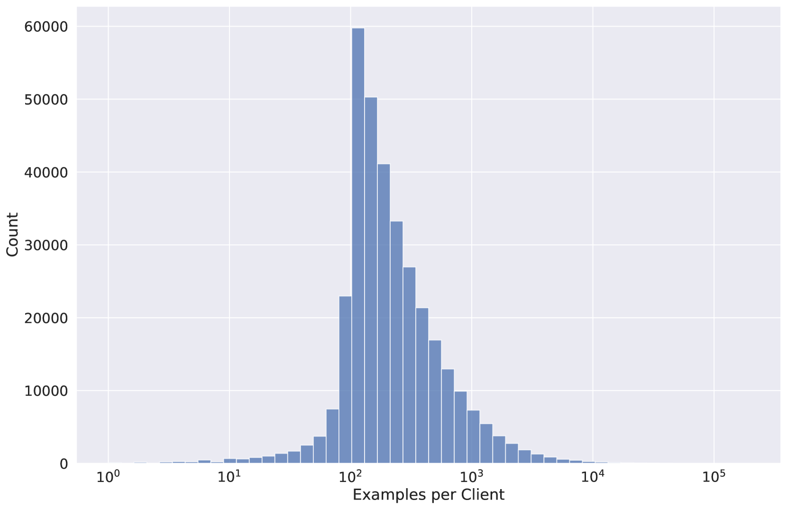
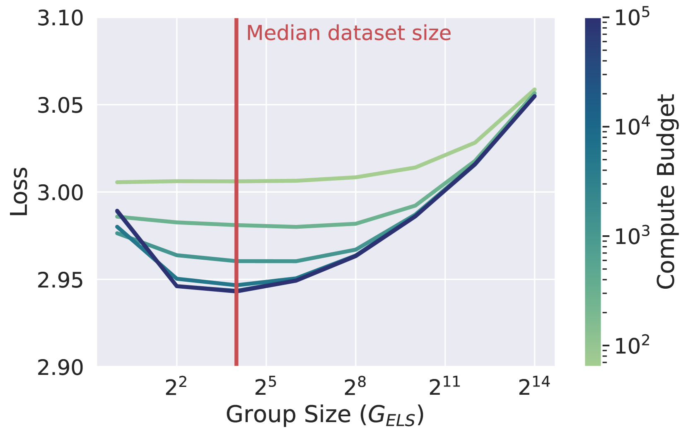
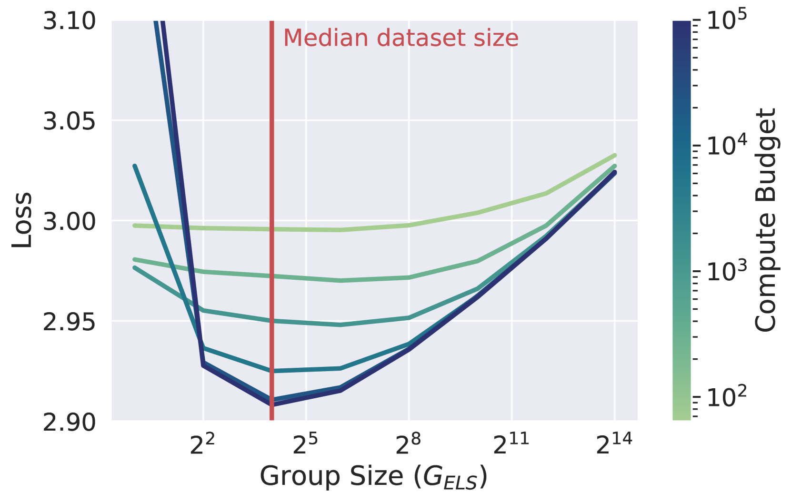

# 针对大型语言模型进行微调，同时确保用户级差分隐私。

发布时间：2024年07月10日

`LLM理论` `人工智能` `隐私保护`

> Fine-Tuning Large Language Models with User-Level Differential Privacy

# 摘要

> 我们探索了结合用户级差分隐私的实用且可扩展的 LLM 训练算法，旨在保护每位用户的所有贡献。我们分析了两种 DP-SGD 变体：示例级采样与梯度裁剪，以及用户级采样与梯度裁剪。我们创新地提出了用户级 DP 会计方法，为示例级采样提供了严格的隐私保障。实验表明，尽管在特定场景下示例级采样可能更优，但用户级采样在用户示例多样性高时表现更佳。通过在固定计算资源下的合成均值估计和 LLM 微调任务中验证，我们发现用户级采样在强隐私需求或高计算预算环境下显著占优。我们的研究重点在于与 LLM 兼容的训练算法，能够支持数亿参数的模型和数十万用户的规模。

> We investigate practical and scalable algorithms for training large language models (LLMs) with user-level differential privacy (DP) in order to provably safeguard all the examples contributed by each user. We study two variants of DP-SGD with: (1) example-level sampling (ELS) and per-example gradient clipping, and (2) user-level sampling (ULS) and per-user gradient clipping. We derive a novel user-level DP accountant that allows us to compute provably tight privacy guarantees for ELS. Using this, we show that while ELS can outperform ULS in specific settings, ULS generally yields better results when each user has a diverse collection of examples. We validate our findings through experiments in synthetic mean estimation and LLM fine-tuning tasks under fixed compute budgets. We find that ULS is significantly better in settings where either (1) strong privacy guarantees are required, or (2) the compute budget is large. Notably, our focus on LLM-compatible training algorithms allows us to scale to models with hundreds of millions of parameters and datasets with hundreds of thousands of users.

[Arxiv](https://arxiv.org/abs/2407.07737)