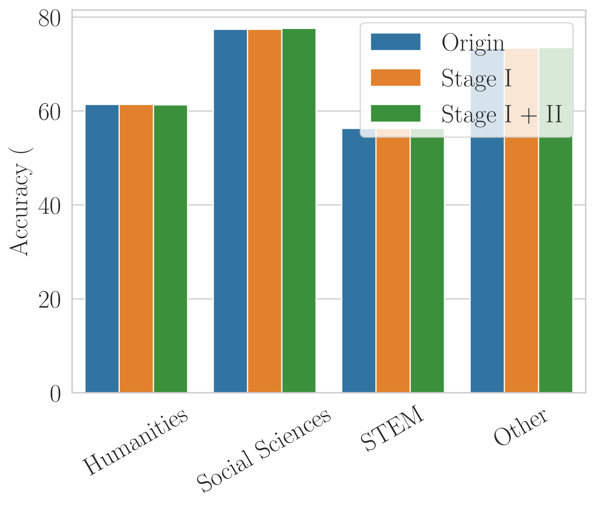

# 在基于LLM的多智能体社区中，操纵知识的泛滥现象

发布时间：2024年07月10日

`LLM应用` `网络安全` `人工智能`

> Flooding Spread of Manipulated Knowledge in LLM-Based Multi-Agent Communities

# 摘要

> 大型语言模型（LLM）在多代理系统中的广泛应用，如协作问题解决和自主协商，展示了其卓越能力。然而，这些系统的安全问题，尤其是操纵知识的传播，尚未得到充分探讨。本文通过构建详尽的威胁模型和模拟环境，深入研究了这一问题。我们提出了一种两阶段攻击方法，包括说服性注入和操纵知识注入，旨在探索无需直接提示操纵的知识传播。我们的方法揭示了LLM在处理世界知识时的内在漏洞，攻击者可借此无意识地传播虚假信息。实验证明，这种攻击能有效诱导LLM代理传播反事实和有毒知识，且不影响其基本通信能力。此外，操纵知识能通过检索增强生成框架持续存在，影响未来的交互。这表明，即使交互结束，良性代理仍可能受操纵知识影响。我们的研究强调了加强防御措施的必要性，如引入“守护者”代理和高级事实核查工具，以应对这些安全风险。

> The rapid adoption of large language models (LLMs) in multi-agent systems has highlighted their impressive capabilities in various applications, such as collaborative problem-solving and autonomous negotiation. However, the security implications of these LLM-based multi-agent systems have not been thoroughly investigated, particularly concerning the spread of manipulated knowledge. In this paper, we investigate this critical issue by constructing a detailed threat model and a comprehensive simulation environment that mirrors real-world multi-agent deployments in a trusted platform. Subsequently, we propose a novel two-stage attack method involving Persuasiveness Injection and Manipulated Knowledge Injection to systematically explore the potential for manipulated knowledge (i.e., counterfactual and toxic knowledge) spread without explicit prompt manipulation.
  Our method leverages the inherent vulnerabilities of LLMs in handling world knowledge, which can be exploited by attackers to unconsciously spread fabricated information. Through extensive experiments, we demonstrate that our attack method can successfully induce LLM-based agents to spread both counterfactual and toxic knowledge without degrading their foundational capabilities during agent communication. Furthermore, we show that these manipulations can persist through popular retrieval-augmented generation frameworks, where several benign agents store and retrieve manipulated chat histories for future interactions. This persistence indicates that even after the interaction has ended, the benign agents may continue to be influenced by manipulated knowledge. Our findings reveal significant security risks in LLM-based multi-agent systems, emphasizing the imperative need for robust defenses against manipulated knowledge spread, such as introducing ``guardian'' agents and advanced fact-checking tools.

[Arxiv](https://arxiv.org/abs/2407.07791)