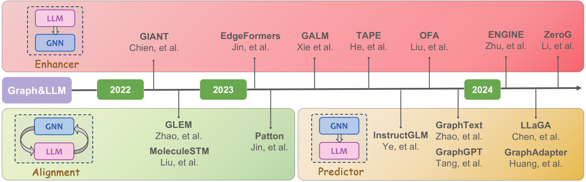
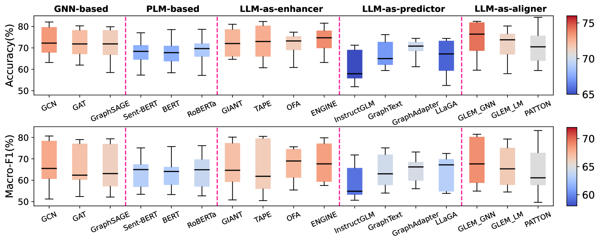
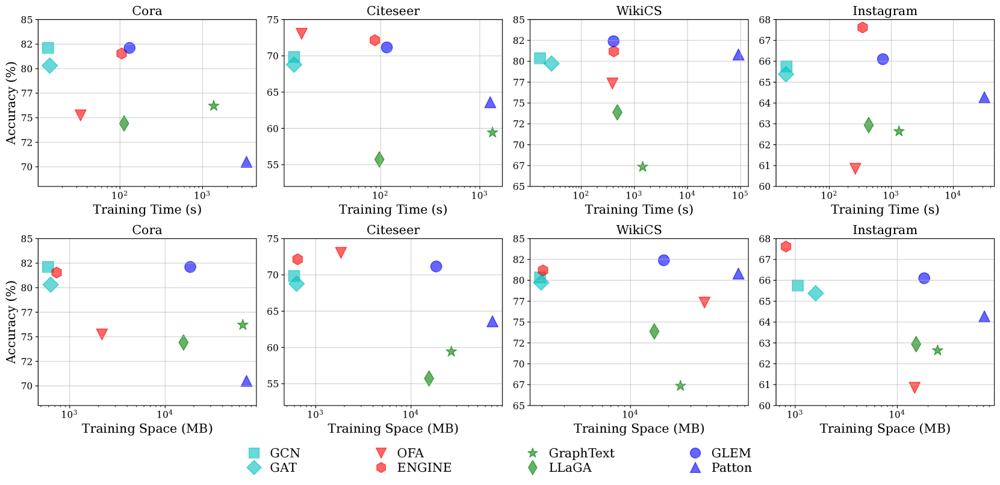

# GLBench：专为大型语言模型设计的图处理全面基准

发布时间：2024年07月10日

`LLM应用` `人工智能` `数据科学`

> GLBench: A Comprehensive Benchmark for Graph with Large Language Models

# 摘要

> 大型语言模型（LLM）的兴起，催生了与图表交互的新范式——GraphLLM。尽管GraphLLM技术日新月异，但因缺乏统一标准的测试平台，其发展现状仍显模糊。为此，我们推出了GLBench，这是首个针对GraphLLM方法在监督与零-shot环境下进行全面评估的基准。GLBench不仅公正地评测了各类GraphLLM技术，还涵盖了图神经网络等传统基线。通过在真实数据集上实施标准化实验，我们获得了重要洞察：在监督模式下，GraphLLM技术普遍超越传统方法，特别是作为增强器的LLM表现最为稳定；但作为预测器时，LLM则表现不佳，常引发输出失控问题。此外，我们发现GraphLLM尚无明确的规模效应规律。同时，结构与语义在零-shot迁移中扮演关键角色，我们提出的简易基线甚至能击败一些专为零-shot设计的复杂模型。GLBench的资源已公开于https://github.com/NineAbyss/GLBench。

> The emergence of large language models (LLMs) has revolutionized the way we interact with graphs, leading to a new paradigm called GraphLLM. Despite the rapid development of GraphLLM methods in recent years, the progress and understanding of this field remain unclear due to the lack of a benchmark with consistent experimental protocols. To bridge this gap, we introduce GLBench, the first comprehensive benchmark for evaluating GraphLLM methods in both supervised and zero-shot scenarios. GLBench provides a fair and thorough evaluation of different categories of GraphLLM methods, along with traditional baselines such as graph neural networks. Through extensive experiments on a collection of real-world datasets with consistent data processing and splitting strategies, we have uncovered several key findings. Firstly, GraphLLM methods outperform traditional baselines in supervised settings, with LLM-as-enhancers showing the most robust performance. However, using LLMs as predictors is less effective and often leads to uncontrollable output issues. We also notice that no clear scaling laws exist for current GraphLLM methods. In addition, both structures and semantics are crucial for effective zero-shot transfer, and our proposed simple baseline can even outperform several models tailored for zero-shot scenarios. The data and code of the benchmark can be found at https://github.com/NineAbyss/GLBench.

[Arxiv](https://arxiv.org/abs/2407.07457)