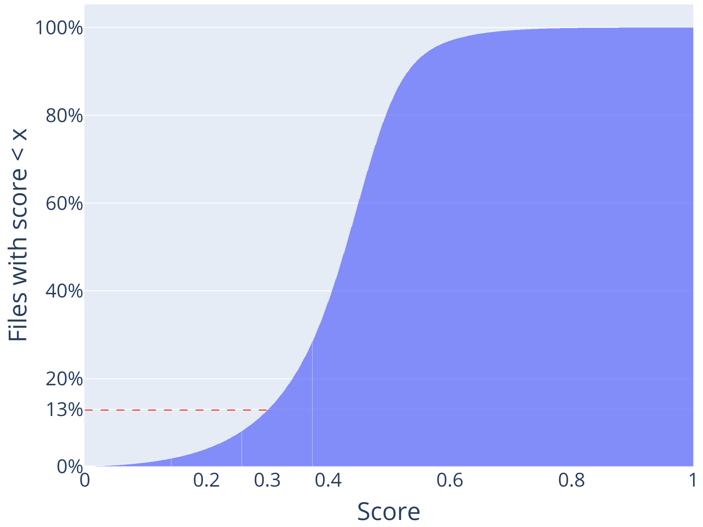

# HebDB：专为希伯来语语音处理设计的弱监督数据集

发布时间：2024年07月10日

`LLM应用` `语音处理`

> HebDB: a Weakly Supervised Dataset for Hebrew Speech Processing

# 摘要

> 我们推出了 HebDB，一个专为希伯来语口语处理设计的弱监督数据集，收录了约 2500 小时自然即兴的语音资料，涵盖多样化的说话者和话题。该数据集不仅提供原始音频，还包括预处理和过滤版本，旨在推动希伯来语口语处理技术的研究与开发。此外，我们构建了两个 ASR 基准系统：一是自监督模型，二是全监督模型，并在 HebDB 上对其性能进行了优化，与现有多语言 ASR 方案进行了对比。结果显示，在同等模型规模下，我们的方法性能更优。所有资源均已公开，访问地址为 https://pages.cs.huji.ac.il/adiyoss-lab/HebDB/。

> We present HebDB, a weakly supervised dataset for spoken language processing in the Hebrew language. HebDB offers roughly 2500 hours of natural and spontaneous speech recordings in the Hebrew language, consisting of a large variety of speakers and topics. We provide raw recordings together with a pre-processed, weakly supervised, and filtered version. The goal of HebDB is to further enhance research and development of spoken language processing tools for the Hebrew language. Hence, we additionally provide two baseline systems for Automatic Speech Recognition (ASR): (i) a self-supervised model; and (ii) a fully supervised model. We present the performance of these two methods optimized on HebDB and compare them to current multi-lingual ASR alternatives. Results suggest the proposed method reaches better results than the evaluated baselines considering similar model sizes. Dataset, code, and models are publicly available under https://pages.cs.huji.ac.il/adiyoss-lab/HebDB/.

[Arxiv](https://arxiv.org/abs/2407.07566)