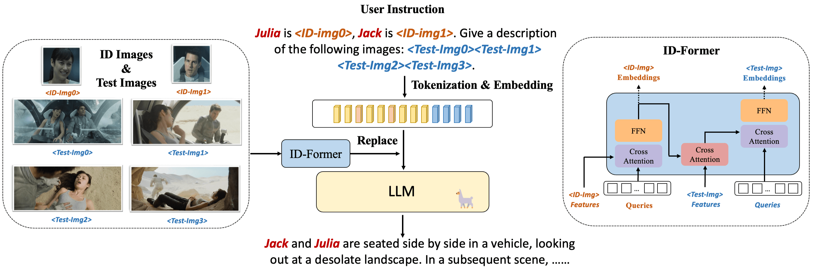

# IDA-VLM：借助 ID-Aware 大型视觉-语言模型，迈向电影深度理解

发布时间：2024年07月10日

`LLM应用` `人工智能`

> IDA-VLM: Towards Movie Understanding via ID-Aware Large Vision-Language Model

# 摘要

> 随着大型视觉-语言模型（LVLMs）的迅猛发展，一系列新兴能力得以展现。然而，这些模型目前仅限于分析单一情景的视觉内容，对于跨场景实例关联的能力尚未开发，这对理解复杂视觉内容如电影至关重要。为了深入电影理解，LVLMs需首先提升跨场景角色身份的记忆与识别能力。为此，我们提出ID参考的视觉指令调整，并创新开发了IDA-VLM模型。同时，我们引入了MM-ID基准，从匹配、定位、问答和字幕四个维度全面评估LVLMs的实例ID处理能力。研究揭示了现有模型在ID参考下识别与关联实例的不足。本文为未来AI系统处理多身份视觉输入奠定了基础，助力复杂视觉叙事如电影的深入理解。

> The rapid advancement of Large Vision-Language models (LVLMs) has demonstrated a spectrum of emergent capabilities. Nevertheless, current models only focus on the visual content of a single scenario, while their ability to associate instances across different scenes has not yet been explored, which is essential for understanding complex visual content, such as movies with multiple characters and intricate plots. Towards movie understanding, a critical initial step for LVLMs is to unleash the potential of character identities memory and recognition across multiple visual scenarios. To achieve the goal, we propose visual instruction tuning with ID reference and develop an ID-Aware Large Vision-Language Model, IDA-VLM. Furthermore, our research introduces a novel benchmark MM-ID, to examine LVLMs on instance IDs memory and recognition across four dimensions: matching, location, question-answering, and captioning. Our findings highlight the limitations of existing LVLMs in recognizing and associating instance identities with ID reference. This paper paves the way for future artificial intelligence systems to possess multi-identity visual inputs, thereby facilitating the comprehension of complex visual narratives like movies.

[Arxiv](https://arxiv.org/abs/2407.07577)