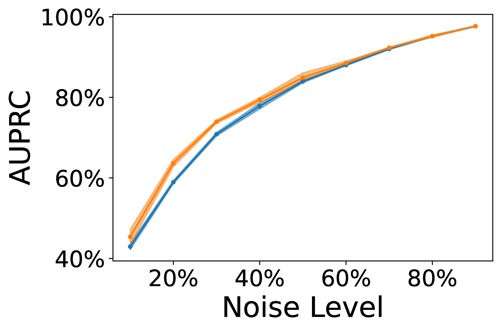
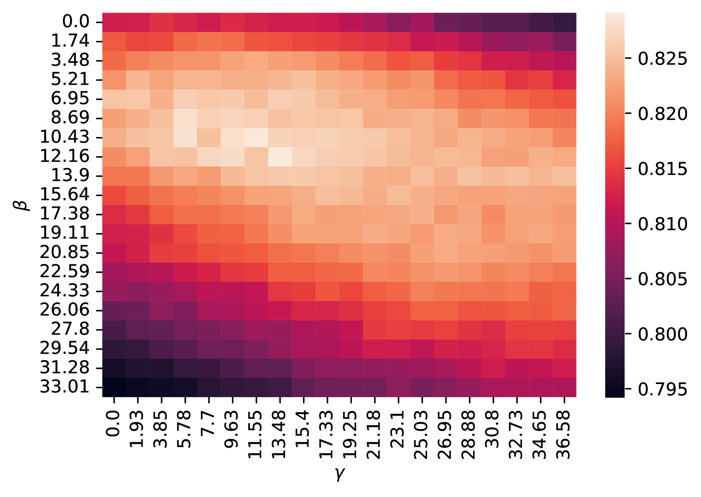
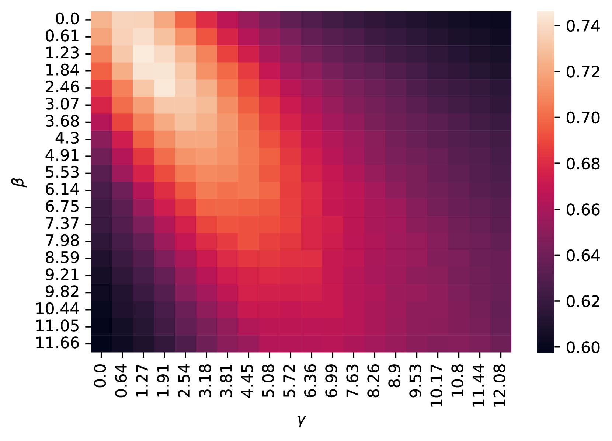

# LEMoN：通过多模态邻居技术检测标签错误

发布时间：2024年07月10日

`LLM应用` `计算机视觉`

> LEMoN: Label Error Detection using Multimodal Neighbors

# 摘要

> 为了提升视觉-语言模型的质量，我们需要高质量的图像-标题对数据集。然而，这些数据集往往含有从网络抓取的嘈杂数据和错误标签。为了确保下游模型的可靠性，关键在于识别并剔除这些带有错误标题的图像。在此研究中，我们引入了LEMoN方法，该方法能自动检测多模态数据集中的标签错误，通过利用预训练多模态模型中的潜在空间邻域信息。实验表明，LEMoN在标签错误检测上超越了传统方法，并且使用其过滤后的数据集进行训练，显著提升了下游任务的分类和标题生成性能。

> Large repositories of image-caption pairs are essential for the development of vision-language models. However, these datasets are often extracted from noisy data scraped from the web, and contain many mislabeled examples. In order to improve the reliability of downstream models, it is important to identify and filter images with incorrect captions. However, beyond filtering based on image-caption embedding similarity, no prior works have proposed other methods to filter noisy multimodal data, or concretely assessed the impact of noisy captioning data on downstream training. In this work, we propose LEMoN, a method to automatically identify label errors in multimodal datasets. Our method leverages the multimodal neighborhood of image-caption pairs in the latent space of contrastively pretrained multimodal models. We find that our method outperforms the baselines in label error identification, and that training on datasets filtered using our method improves downstream classification and captioning performance.

[Arxiv](https://arxiv.org/abs/2407.18941)