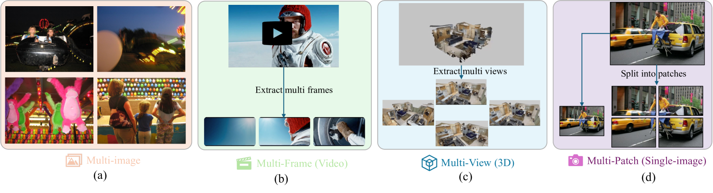
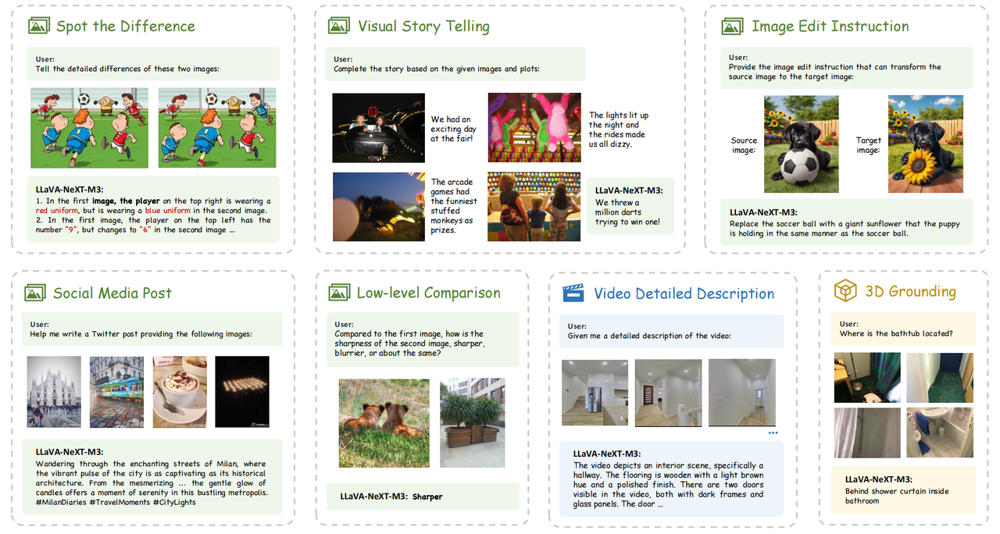
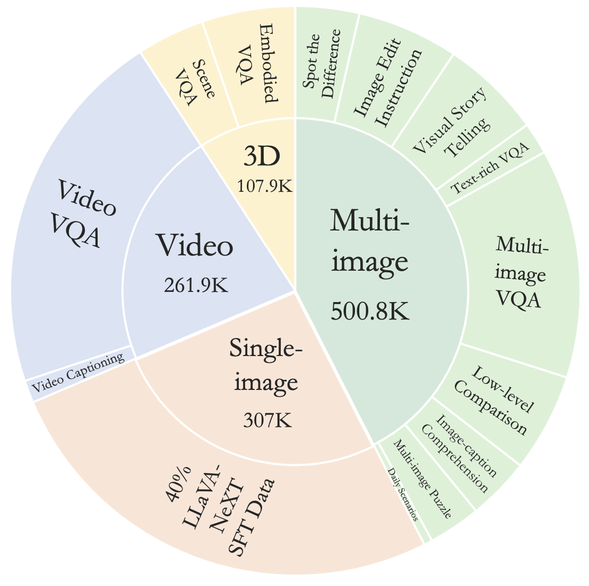
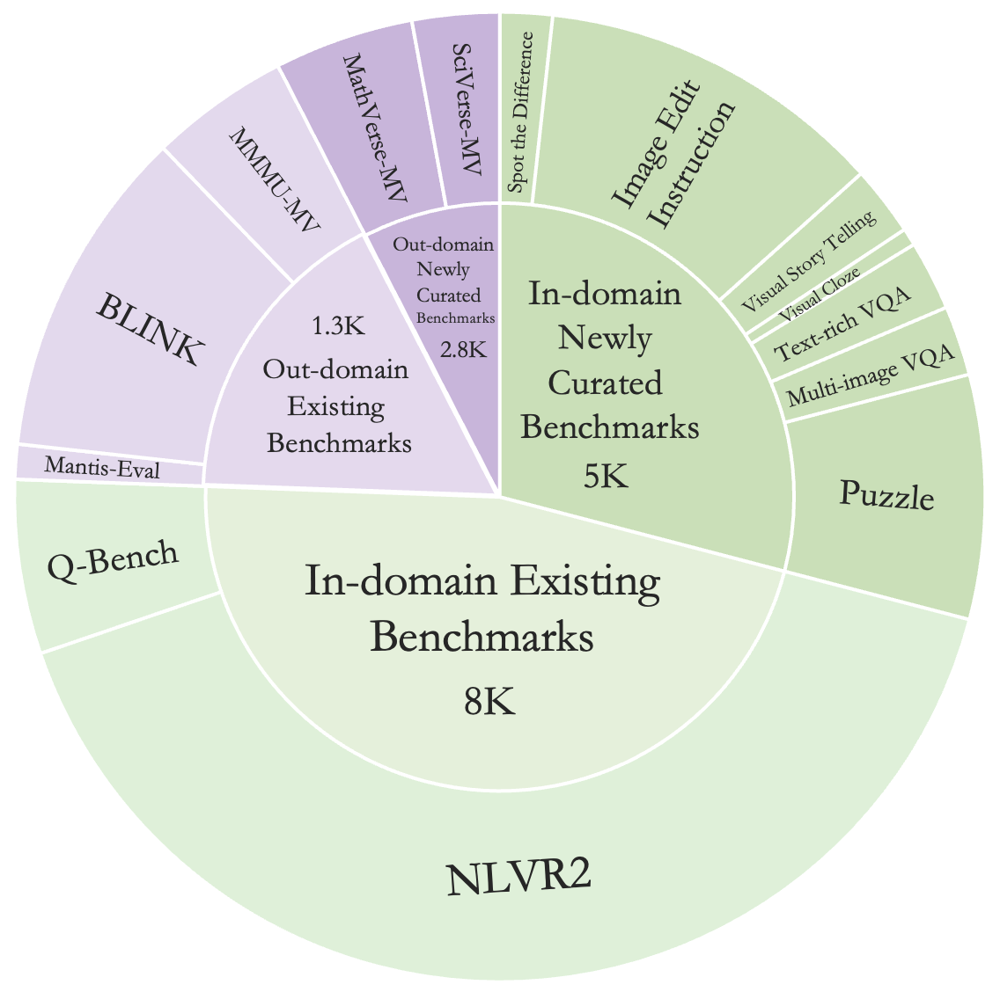

# LLaVA-NeXT-Interleave 技术旨在解决大规模多模态模型中的多图像、视频及3D内容处理问题。

发布时间：2024年07月10日

`LLM应用` `计算机视觉` `人工智能`

> LLaVA-NeXT-Interleave: Tackling Multi-image, Video, and 3D in Large Multimodal Models

# 摘要

> 视觉指令调优大幅提升了大型多模态模型（LMMs）的性能。尽管如此，现有LMMs多聚焦于单图像任务，对多图像场景的应用探索不足。此外，以往研究各自为政，难以实现跨场景能力的新突破。为此，我们推出了LLaVA-NeXT-Interleave，它全面应对LMMs中的多图像、视频、3D及单图像多补丁场景。我们采用交错数据格式作为通用模板，构建了包含1,177.6万样本的M4-Instruct数据集，横跨四大领域、14项任务及41个数据集。同时，我们精心打造了LLaVA-Interleave Bench，全面评估LMMs在多图像场景的表现。实验表明，LLaVA-NeXT-Interleave在多图像、视频和3D领域表现卓越，单图像任务性能亦保持领先。此外，该模型还展现出跨设置和模态的任务转移等新兴能力。代码已开放，详见https://github.com/LLaVA-VL/LLaVA-NeXT。

> Visual instruction tuning has made considerable strides in enhancing the capabilities of Large Multimodal Models (LMMs). However, existing open LMMs largely focus on single-image tasks, their applications to multi-image scenarios remains less explored. Additionally, prior LMM research separately tackles different scenarios, leaving it impossible to generalize cross scenarios with new emerging capabilities. To this end, we introduce LLaVA-NeXT-Interleave, which simultaneously tackles Multi-image, Multi-frame (video), Multi-view (3D), and Multi-patch (single-image) scenarios in LMMs. To enable these capabilities, we regard the interleaved data format as a general template and compile the M4-Instruct dataset with 1,177.6k samples, spanning 4 primary domains with 14 tasks and 41 datasets. We also curate the LLaVA-Interleave Bench to comprehensively evaluate the multi-image performance of LMMs. Through extensive experiments, LLaVA-NeXT-Interleave achieves leading results in multi-image, video, and 3D benchmarks, while maintaining the performance of single-image tasks. Besides, our model also exhibits several emerging capabilities, e.g., transferring tasks across different settings and modalities. Code is available at https://github.com/LLaVA-VL/LLaVA-NeXT

[Arxiv](https://arxiv.org/abs/2407.07895)