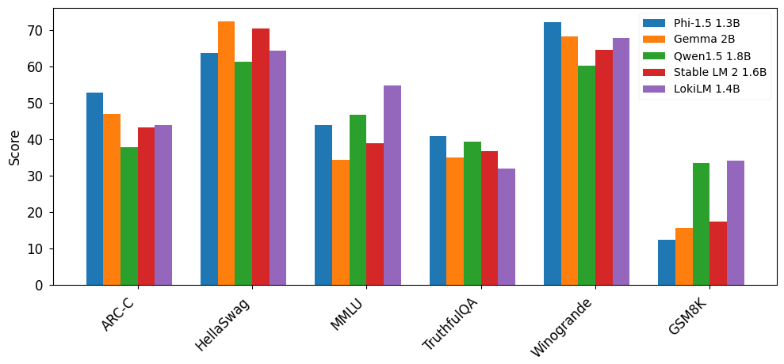

# LokiLM 技术报告

发布时间：2024年07月10日

`LLM理论` `人工智能`

> LokiLM: Technical Report

# 摘要

> 我们推出的 LokiLM，一个 1.4B 参数的 LLM，经过 500B 令牌的训练，在自然语言推理任务中表现卓越，成为参数 1.5B 以下的佼佼者。通过多教师知识蒸馏和精选训练数据，LokiLM 的基准成绩可与更大规模的模型媲美。我们通过一系列措施，确保了开发过程中避免基准污染和过拟合。然而，LokiLM 在产生幻觉和 TruthfulQA 测试中表现不佳，因此我们决定暂不公开发布。

> In this work, we introduce LokiLM, a 1.4B parameter large language model trained on 500B tokens. Our model performs strongly in natural language reasoning tasks and achieves state-of-the-art performance among models with 1.5B parameters or less. LokiLM is trained using multi-teacher knowledge distillation and high-quality training data to achieve benchmark results competitive with larger models trained on significantly more tokens. We support these findings by introducing steps to avoid benchmark contamination and overfitting throughout our development process. Despite its promising performance, LokiLM exhibits a concerning amount of hallucinations and scores poorly on the TruthfulQA benchmark, so we do not release the model publicly.

[Arxiv](https://arxiv.org/abs/2407.07370)