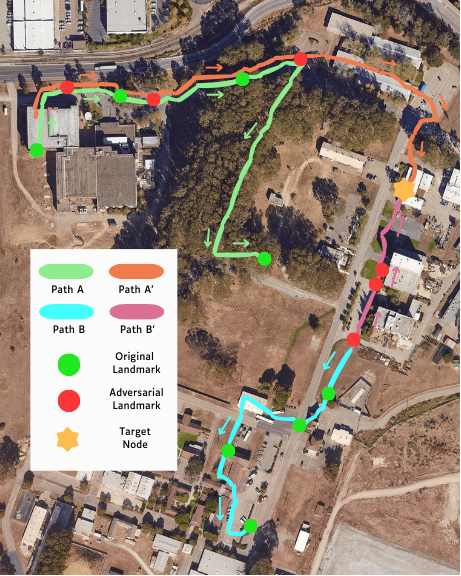

# 恶意路径操纵：利用视觉-语言导航系统的表示漏洞

发布时间：2024年07月10日

`LLM应用` `机器人` `计算机视觉`

> Malicious Path Manipulations via Exploitation of Representation Vulnerabilities of Vision-Language Navigation Systems

# 摘要

> 借助大型语言模型在命令理解和多模态视觉-语言转换器的零-shot识别方面的强大能力，视觉语言导航（VLN）已成为解决机器人导航自然语言接口挑战的有效途径。然而，这些模型因底层嵌入空间缺乏语义意义而显得脆弱。我们利用一种新型的基于梯度的优化技术，展示了如何微妙地调整图像，使其在视觉-语言模型中与完全不同的图像和文本相匹配。基于此，我们设计了算法，仅需少量图像的对抗性修改，就能引导机器人按照特定路径执行多地标命令。实验表明，通过最新的VLN系统，机器人可被诱导至完全不同的路线。此外，我们还开发了一种高效算法，通过识别对抗性修改图像对高斯噪声的高度敏感性，来可靠地检测这些恶意篡改。

> Building on the unprecedented capabilities of large language models for command understanding and zero-shot recognition of multi-modal vision-language transformers, visual language navigation (VLN) has emerged as an effective way to address multiple fundamental challenges toward a natural language interface to robot navigation. However, such vision-language models are inherently vulnerable due to the lack of semantic meaning of the underlying embedding space. Using a recently developed gradient based optimization procedure, we demonstrate that images can be modified imperceptibly to match the representation of totally different images and unrelated texts for a vision-language model. Building on this, we develop algorithms that can adversarially modify a minimal number of images so that the robot will follow a route of choice for commands that require a number of landmarks. We demonstrate that experimentally using a recently proposed VLN system; for a given navigation command, a robot can be made to follow drastically different routes. We also develop an efficient algorithm to detect such malicious modifications reliably based on the fact that the adversarially modified images have much higher sensitivity to added Gaussian noise than the original images.

[Arxiv](https://arxiv.org/abs/2407.07392)