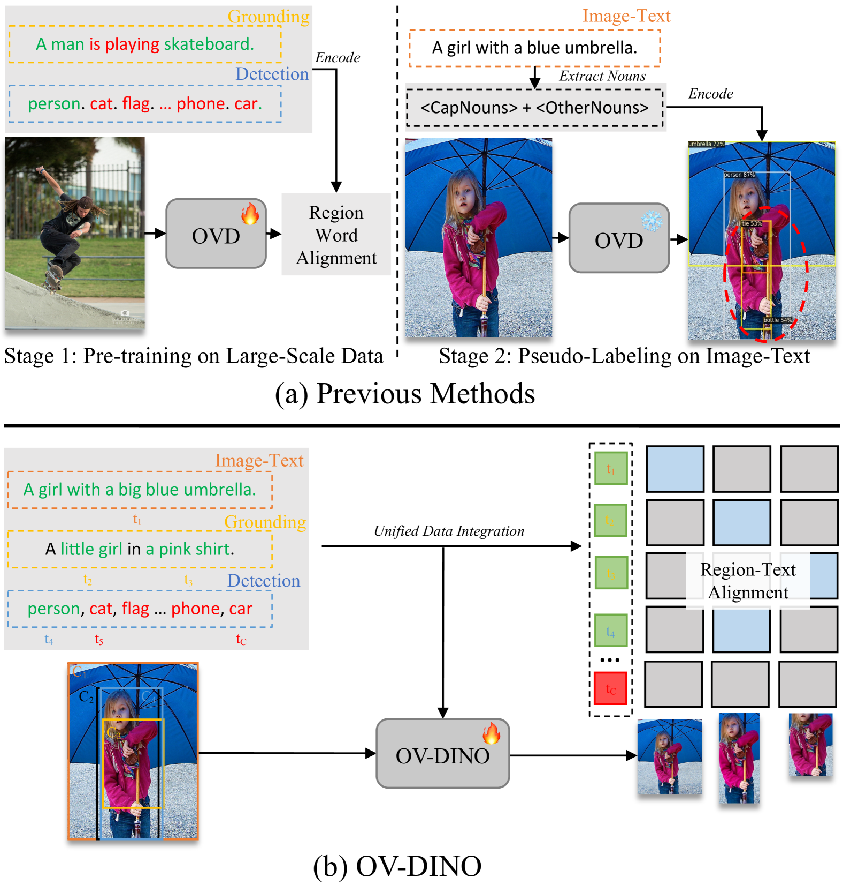
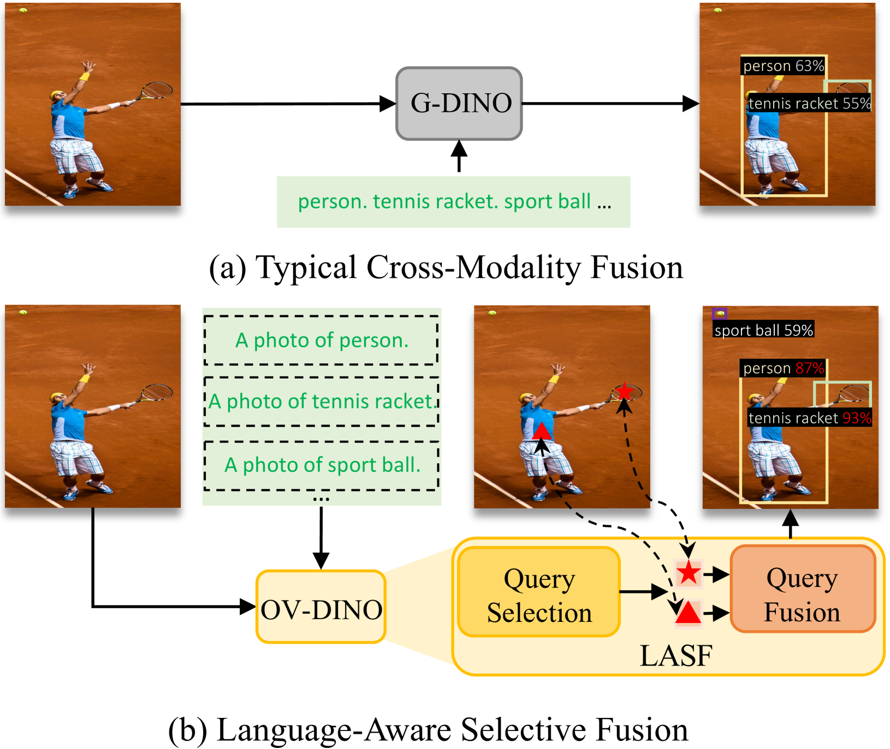
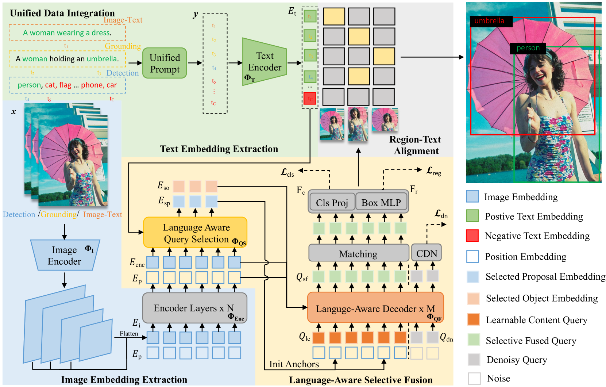
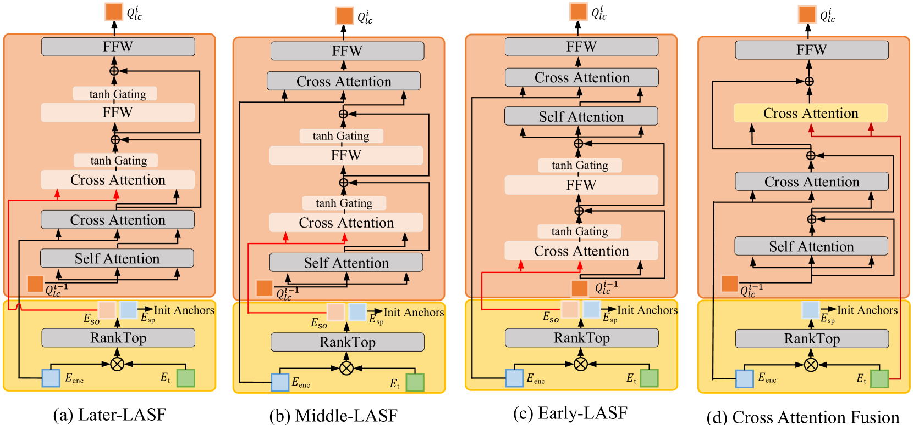
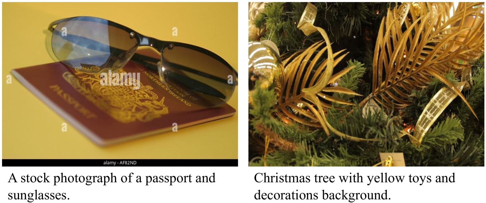

# OV-DINO：结合语言感知选择性融合的统一开放词汇检测技术

发布时间：2024年07月10日

`LLM应用` `计算机视觉` `机器学习`

> OV-DINO: Unified Open-Vocabulary Detection with Language-Aware Selective Fusion

# 摘要

> 开放词汇检测因其需根据类别名称识别未见过的物体而颇具挑战。现有技术虽通过广泛预训练展现零-shot检测实力，但仍需克服两大难题：整合多元数据源进行端到端训练，以及运用语言感知力深化区域级跨模态理解。为此，我们创新推出OV-DINO方法，通过语言感知融合在统一框架下预训练于多样大数据集。我们设计了UniDI流水线，实现数据源整合，净化伪标签噪声，聚焦检测核心。同时，LASF模块通过语言感知查询与融合，强化模型语言理解力。OV-DINO在COCO与LVIS数据集上以零-shot模式创下佳绩，彰显其卓越泛化性。微调后，其在COCO上更以58.4%的AP超越众多同类方法。OV-DINO代码即将在\href{https://github.com/wanghao9610/OV-DINO}{GitHub}发布。

> Open-vocabulary detection is a challenging task due to the requirement of detecting objects based on class names, including those not encountered during training. Existing methods have shown strong zero-shot detection capabilities through pre-training on diverse large-scale datasets. However, these approaches still face two primary challenges: (i) how to universally integrate diverse data sources for end-to-end training, and (ii) how to effectively leverage the language-aware capability for region-level cross-modality understanding. To address these challenges, we propose a novel unified open-vocabulary detection method called OV-DINO, which pre-trains on diverse large-scale datasets with language-aware selective fusion in a unified framework. Specifically, we introduce a Unified Data Integration (UniDI) pipeline to enable end-to-end training and eliminate noise from pseudo-label generation by unifying different data sources into detection-centric data. In addition, we propose a Language-Aware Selective Fusion (LASF) module to enable the language-aware ability of the model through a language-aware query selection and fusion process. We evaluate the performance of the proposed OV-DINO on popular open-vocabulary detection benchmark datasets, achieving state-of-the-art results with an AP of 50.6\% on the COCO dataset and 40.0\% on the LVIS dataset in a zero-shot manner, demonstrating its strong generalization ability. Furthermore, the fine-tuned OV-DINO on COCO achieves 58.4\% AP, outperforming many existing methods with the same backbone. The code for OV-DINO will be available at \href{https://github.com/wanghao9610/OV-DINO}{https://github.com/wanghao9610/OV-DINO}.

[Arxiv](https://arxiv.org/abs/2407.07844)