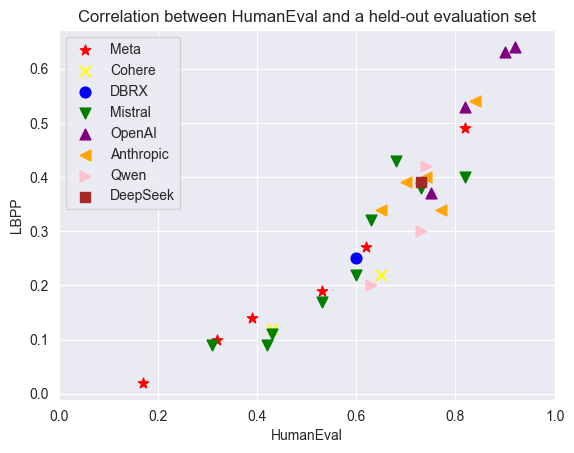
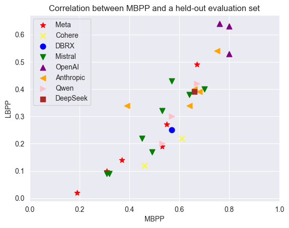
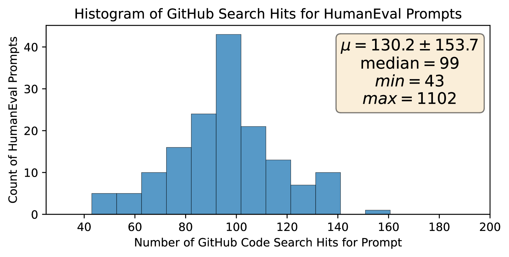
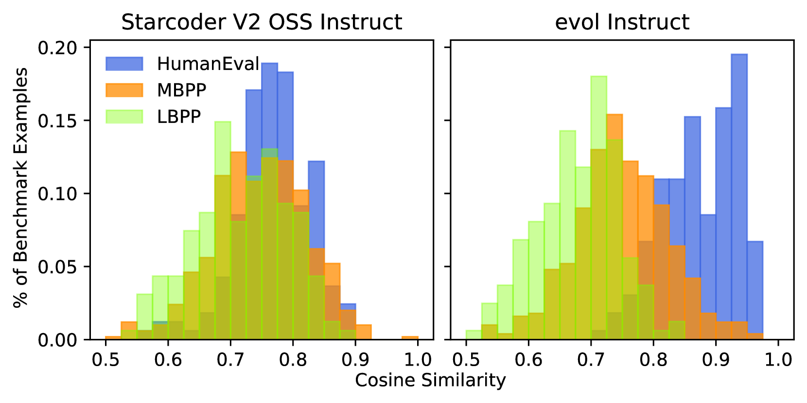

# 代码生成评估数据集的泄露问题

发布时间：2024年07月10日

`LLM应用` `软件开发` `人工智能`

> On Leakage of Code Generation Evaluation Datasets

# 摘要

> 本文探讨了代码生成测试集在现代大型语言模型中的污染问题，并揭示了三种污染源：直接数据泄露、合成数据引发的间接泄露及模型选择时的评估集过度拟合。核心发现基于一个新发布的包含161个编程问题及其Python解答的数据集，详情可访问https://huggingface.co/datasets/CohereForAI/lbpp。

> In this paper we consider contamination by code generation test sets, in particular in their use in modern large language models. We discuss three possible sources of such contamination and show findings supporting each of them: (i) direct data leakage, (ii) indirect data leakage through the use of synthetic data and (iii) overfitting to evaluation sets during model selection.
  Key to our findings is a new dataset of 161 prompts with their associated python solutions, dataset which is released at https://huggingface.co/datasets/CohereForAI/lbpp .

[Arxiv](https://arxiv.org/abs/2407.07565)