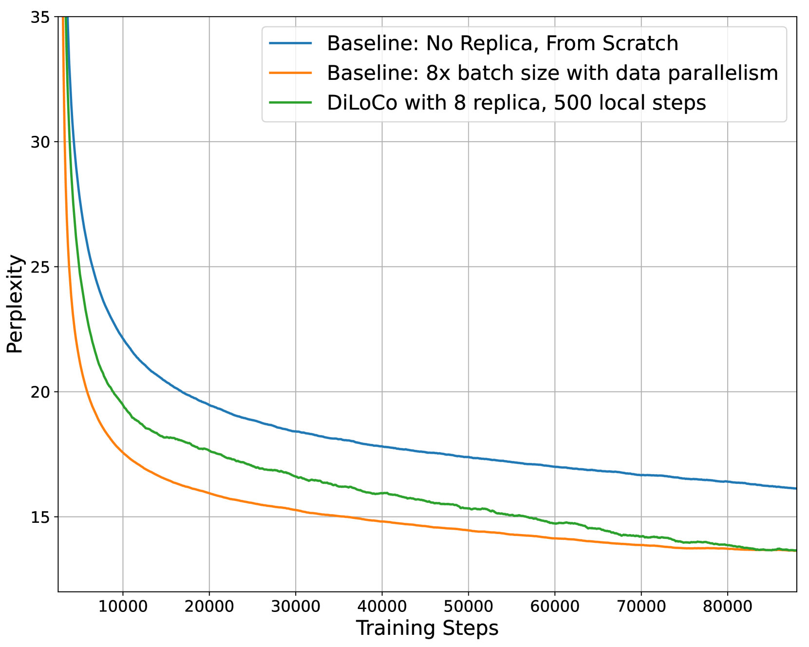
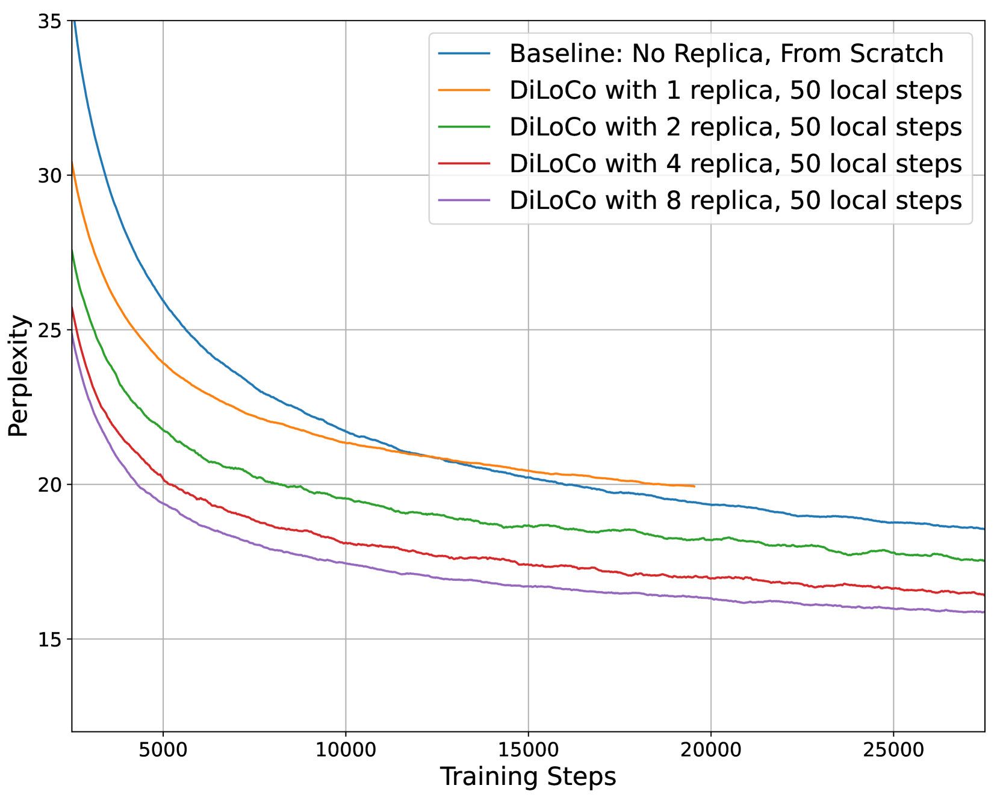
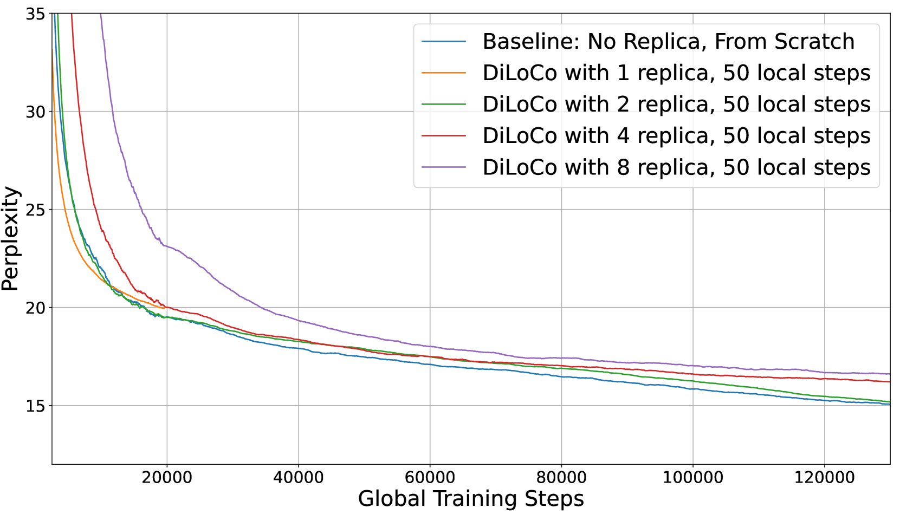
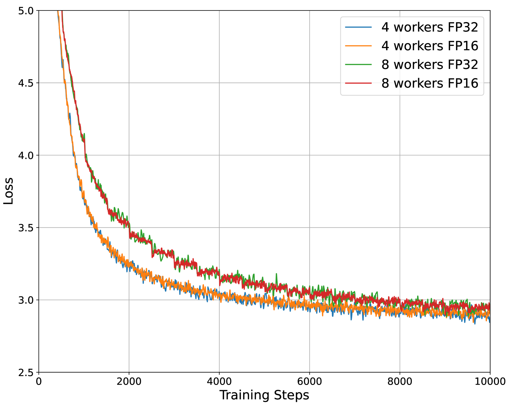
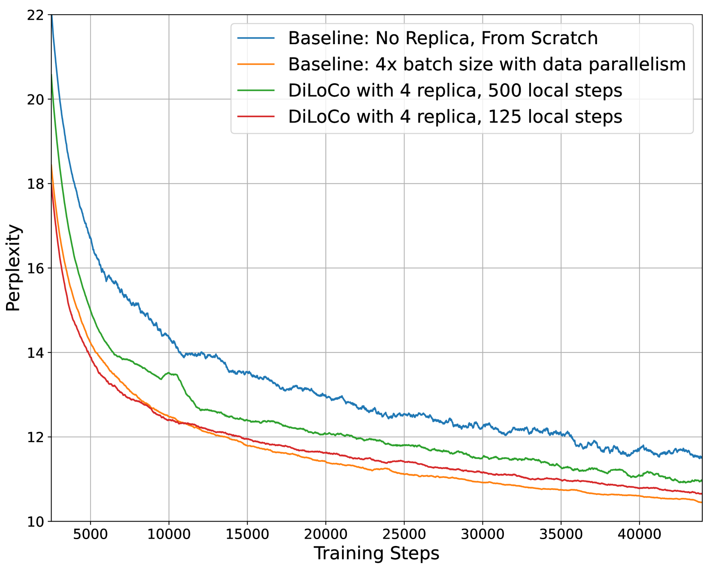
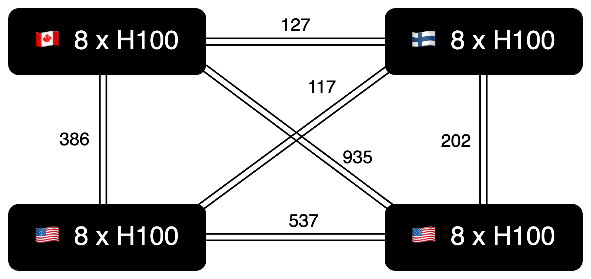

# OpenDiLoCo：一款开源框架，专为全球分布式低通信训练设计。

发布时间：2024年07月10日

`LLM应用` `人工智能` `开源项目`

> OpenDiLoCo: An Open-Source Framework for Globally Distributed Low-Communication Training

# 摘要

> OpenDiLoCo 是一个开源项目，旨在实现和复现用于大型语言模型的 Distributed Low-Communication (DiLoCo) 训练方法。我们提供了一个基于 Hivemind 库的可扩展、去中心化训练框架中的 DiLoCo 实验可复现实现。通过在跨越两大洲和三国的环境中训练模型，并保持高达 95% 的计算利用率，我们验证了其高效性。此外，我们的消融研究深入探讨了算法的计算效率和工作者的可扩展性，并证实了使用 FP16 进行梯度全减少的可行性，不会影响性能。最后，我们将 OpenDiLoCo 规模扩大至原始工作的三倍，充分展示了其对处理十亿参数模型的能力。

> OpenDiLoCo is an open-source implementation and replication of the Distributed Low-Communication (DiLoCo) training method for large language models. We provide a reproducible implementation of the DiLoCo experiments, offering it within a scalable, decentralized training framework using the Hivemind library. We demonstrate its effectiveness by training a model across two continents and three countries, while maintaining 90-95% compute utilization. Additionally, we conduct ablations studies focusing on the algorithm's compute efficiency, scalability in the number of workers and show that its gradients can be all-reduced using FP16 without any performance degradation. Furthermore, we scale OpenDiLoCo to 3x the size of the original work, demonstrating its effectiveness for billion parameter models.

[Arxiv](https://arxiv.org/abs/2407.07852)