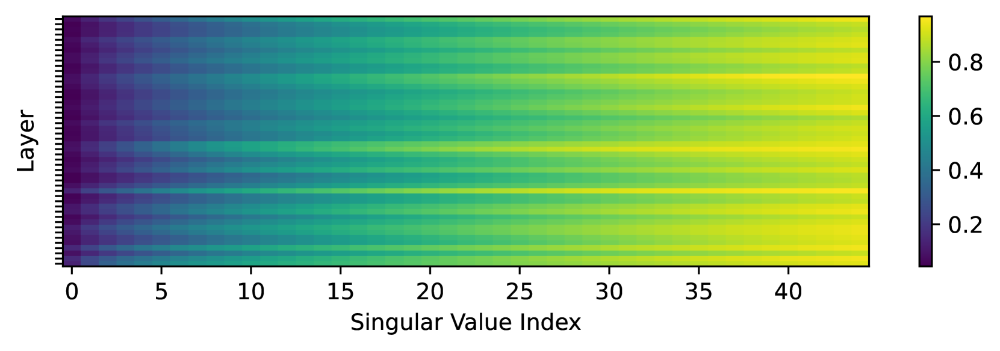

# ROSA：通过随机子空间适应实现高效微调

发布时间：2024年07月10日

`LLM理论` `机器学习`

> ROSA: Random Subspace Adaptation for Efficient Fine-Tuning

# 摘要

> 模型训练所需的内存远超推理。参数高效微调（PEFT）方法通过减少内存使用，帮助大型模型适应下游任务。然而，现有方法如适配器、提示调优或低秩适应（LoRA）要么在推理时增加延迟，要么在性能上不及全量微调。我们提出的随机子空间适应（ROSA）方法，不仅在性能上大幅超越以往PEFT方法，且在推理时无额外延迟。ROSA能适应任意大小的子空间，更接近全量微调的效果。理论与实验均证明，ROSA在运行时无需额外内存，表达力却强于LoRA。在自然语言处理领域，全量微调成本高昂，我们在NLG和NLU任务中使用GPT-2和RoBERTa评估ROSA，结果显示ROSA在GLUE任务和NLG任务中均显著优于LoRA。代码已公开在https://github.com/rosa-paper/rosa。

> Model training requires significantly more memory, compared with inference. Parameter efficient fine-tuning (PEFT) methods provide a means of adapting large models to downstream tasks using less memory. However, existing methods such as adapters, prompt tuning or low-rank adaptation (LoRA) either introduce latency overhead at inference time or achieve subpar downstream performance compared with full fine-tuning. In this work we propose Random Subspace Adaptation (ROSA), a method that outperforms previous PEFT methods by a significant margin, while maintaining a zero latency overhead during inference time. In contrast to previous methods, ROSA is able to adapt subspaces of arbitrarily large dimension, better approximating full-finetuning. We demonstrate both theoretically and experimentally that this makes ROSA strictly more expressive than LoRA, without consuming additional memory during runtime. As PEFT methods are especially useful in the natural language processing domain, where models operate on scales that make full fine-tuning very expensive, we evaluate ROSA in two common NLP scenarios: natural language generation (NLG) and natural language understanding (NLU) with GPT-2 and RoBERTa, respectively. We show that on almost every GLUE task ROSA outperforms LoRA by a significant margin, while also outperforming LoRA on NLG tasks. Our code is available at https://github.com/rosa-paper/rosa

[Arxiv](https://arxiv.org/abs/2407.07802)