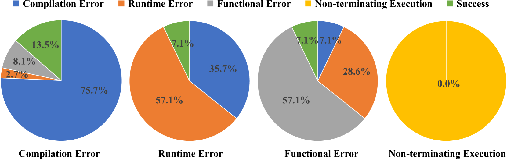

# Rectifier：利用 LLM 实现代码翻译与校正

发布时间：2024年07月10日

`LLM应用` `软件开发` `人工智能`

> Rectifier: Code Translation with Corrector via LLMs

# 摘要

> 随着软件与社会的进步，软件迁移日益受到重视。早期研究多依赖手工规则进行语言间的代码转换，这一过程既易错又耗时。近年来，研究者开始尝试利用预训练的大型语言模型（LLM）进行代码翻译，但此复杂任务中LLM常犯的错误包括编译、运行时、功能性及非终止执行错误。这些错误的根源相似，如包导入失败、循环边界失误、操作符错误等。为此，我们提出了通用校正器Rectifier，一个微型且普适的错误修复模型，它能从LLM的错误中学习，并广泛应用于纠正各类LLM的翻译错误。实验表明，Rectifier在C++、Java与Python间的代码翻译中展现了出色的修复能力，交叉实验亦证实了其方法的稳健性。

> Software migration is garnering increasing attention with the evolution of software and society. Early studies mainly relied on handcrafted translation rules to translate between two languages, the translation process is error-prone and time-consuming. In recent years, researchers have begun to explore the use of pre-trained large language models (LLMs) in code translation. However, code translation is a complex task that LLMs would generate mistakes during code translation, they all produce certain types of errors when performing code translation tasks, which include (1) compilation error, (2) runtime error, (3) functional error, and (4) non-terminating execution. We found that the root causes of these errors are very similar (e.g. failure to import packages, errors in loop boundaries, operator errors, and more). In this paper, we propose a general corrector, namely Rectifier, which is a micro and universal model for repairing translation errors. It learns from errors generated by existing LLMs and can be widely applied to correct errors generated by any LLM. The experimental results on translation tasks between C++, Java, and Python show that our model has effective repair ability, and cross experiments also demonstrate the robustness of our method.

[Arxiv](https://arxiv.org/abs/2407.07472)