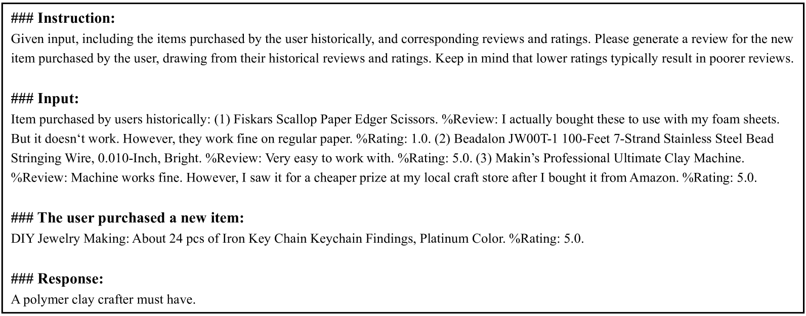
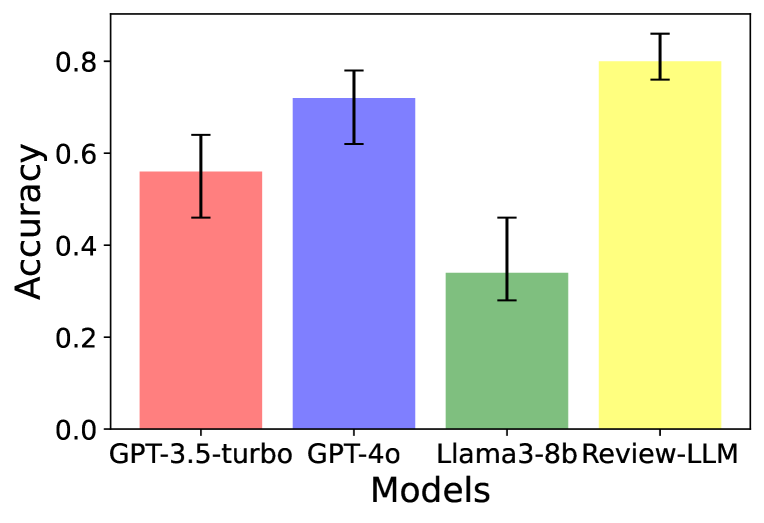
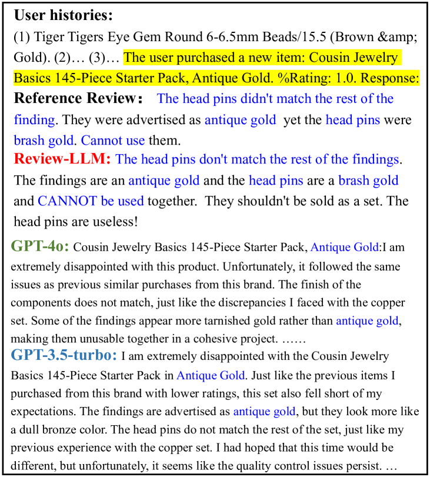

# Review-LLM：借助大型语言模型，打造个性化评论生成工具

发布时间：2024年07月10日

`LLM应用` `推荐系统` `电子商务`

> Review-LLM: Harnessing Large Language Models for Personalized Review Generation

# 摘要

> 产品评论生成在推荐系统中至关重要，能为推荐增添解释与说服力。近期，大型语言模型如ChatGPT展现了出色的文本建模与生成能力，有望应用于评论生成领域。然而，直接利用这些模型可能因“礼貌”现象而难以产出个性化评论，如负面评价。为此，我们提出Review-LLM，专为个性化评论生成定制。首先，通过整合用户历史行为（含项目标题与评论）构建输入提示，助模型捕捉用户兴趣与评论风格。其次，引入评分作为满意度指标，深化模型对用户偏好的理解及评论情感控制。最终，借助监督微调，使模型针对特定用户与项目生成个性化评论。实验表明，我们的模型在真实数据集上表现优于现有闭源LLMs，评论生成效果更佳。

> Product review generation is an important task in recommender systems, which could provide explanation and persuasiveness for the recommendation. Recently, Large Language Models (LLMs, e.g., ChatGPT) have shown superior text modeling and generating ability, which could be applied in review generation. However, directly applying the LLMs for generating reviews might be troubled by the ``polite'' phenomenon of the LLMs and could not generate personalized reviews (e.g., negative reviews). In this paper, we propose Review-LLM that customizes LLMs for personalized review generation. Firstly, we construct the prompt input by aggregating user historical behaviors, which include corresponding item titles and reviews. This enables the LLMs to capture user interest features and review writing style. Secondly, we incorporate ratings as indicators of satisfaction into the prompt, which could further improve the model's understanding of user preferences and the sentiment tendency control of generated reviews. Finally, we feed the prompt text into LLMs, and use Supervised Fine-Tuning (SFT) to make the model generate personalized reviews for the given user and target item. Experimental results on the real-world dataset show that our fine-tuned model could achieve better review generation performance than existing close-source LLMs.

[Arxiv](https://arxiv.org/abs/2407.07487)