# RoLoRA：通过微调无异常值的旋转 LLM，实现高效的权重-激活量化。

发布时间：2024年07月10日

`LLM理论` `人工智能` `机器学习`

> RoLoRA: Fine-tuning Rotated Outlier-free LLMs for Effective Weight-Activation Quantization

# 摘要

> LoRA 通过仅调整 LLM 中少量权重，显著提升训练效率，而近期仅权重量化技术也被用于减少 LoRA 微调的内存需求。然而，权重-激活量化在 LoRA 中的应用尚浅，主要因激活异常值导致性能下降。为此，我们提出 RoLoRA，首个基于 LoRA 的权重-激活量化方案，通过旋转消除异常值并进行旋转感知微调，保持旋转后 LLM 的无异常值特性。实验表明，RoLoRA 在低比特设置下稳定提升 LoRA 收敛及量化鲁棒性。在 LLaMA2-7B/13B 和 LLaMA3-8B 模型上，RoLoRA 在常识推理任务中较 LoRA 基线提升高达 29.5% 的精度。此外，其在大型多模态模型 LLaVA-1.5-7B 上也表现出色。代码已公开于 https://github.com/HuangOwen/RoLoRA。

> Low-Rank Adaptation (LoRA), as a representative Parameter-Efficient Fine-Tuning (PEFT)method, significantly enhances the training efficiency by updating only a small portion of the weights in Large Language Models (LLMs). Recently, weight-only quantization techniques have also been applied to LoRA methods to reduce the memory footprint of fine-tuning. However, applying weight-activation quantization to the LoRA pipeline is under-explored, and we observe substantial performance degradation primarily due to the presence of activation outliers. In this work, we propose RoLoRA, the first LoRA-based scheme for effective weight-activation quantization. RoLoRA utilizes rotation for outlier elimination and proposes rotation-aware fine-tuning to preserve the outlier-free characteristics in rotated LLMs. Experimental results show RoLoRA consistently improves low-bit LoRA convergence and post-training quantization robustness in weight-activation settings. We evaluate RoLoRA across LLaMA2-7B/13B, LLaMA3-8B models, achieving up to 29.5% absolute accuracy gain of 4-bit weight-activation quantized LLaMA2- 13B on commonsense reasoning tasks compared to LoRA baseline. We further demonstrate its effectiveness on Large Multimodal Models (LLaVA-1.5-7B). Codes are available at https://github.com/HuangOwen/RoLoRA

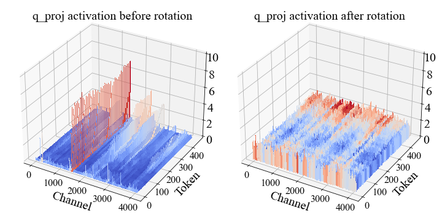

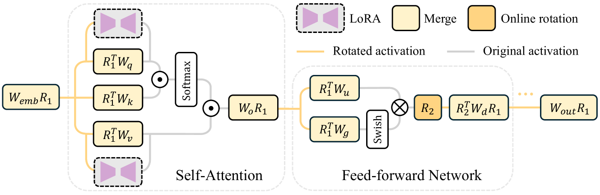

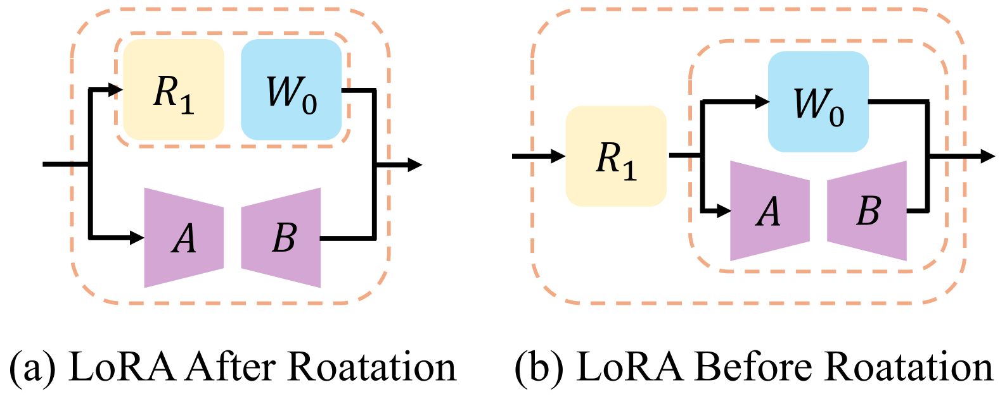

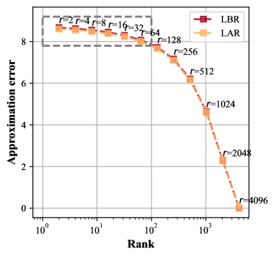

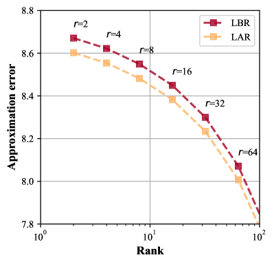

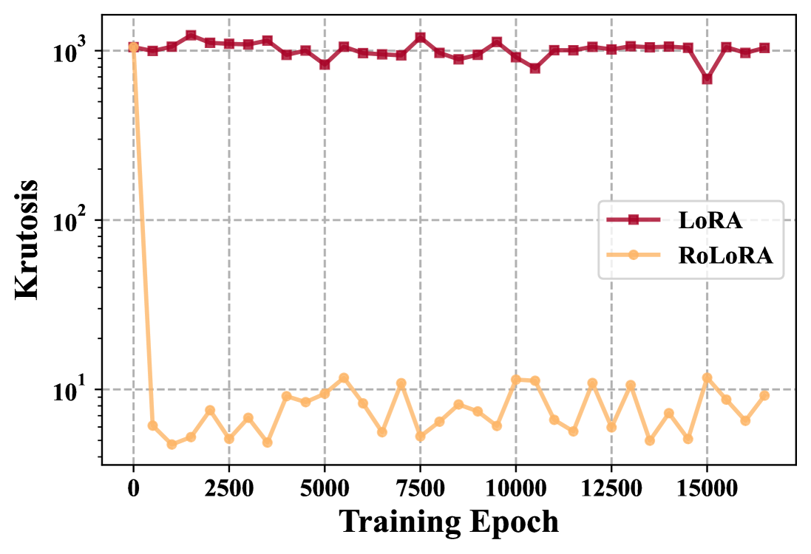

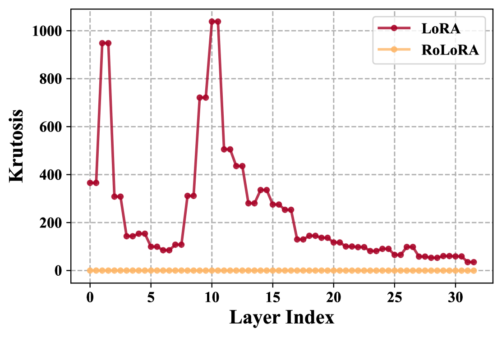

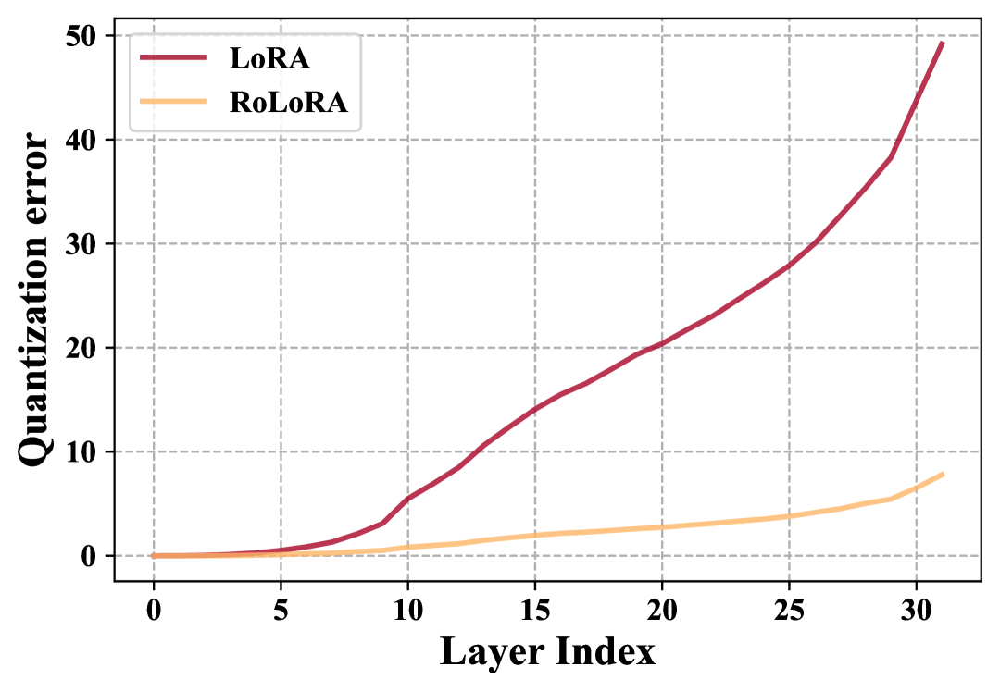

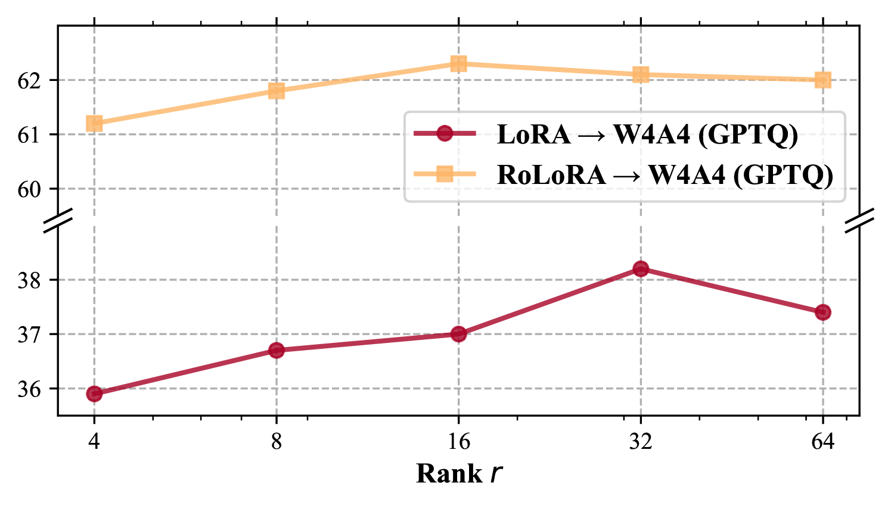

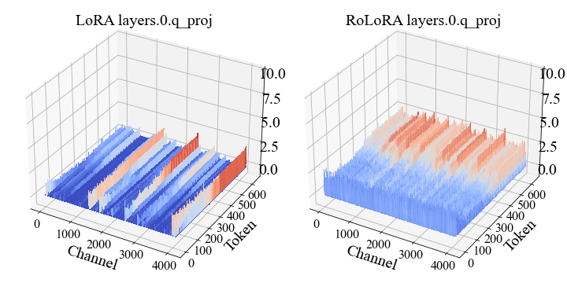

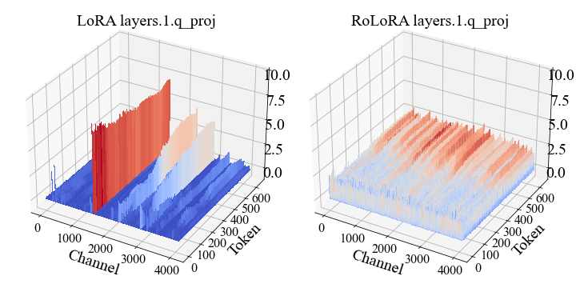

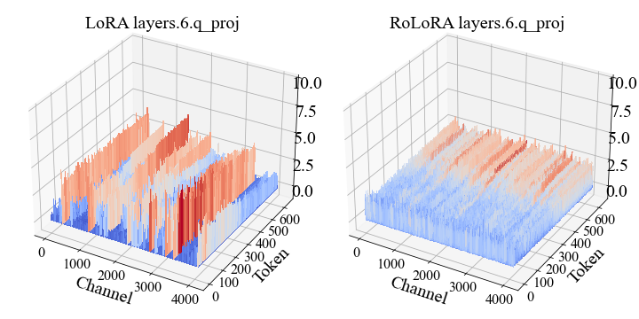

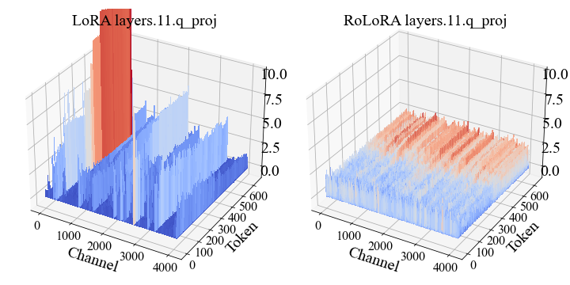

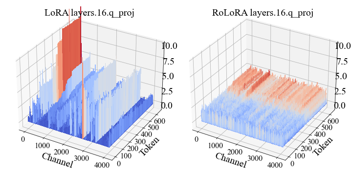

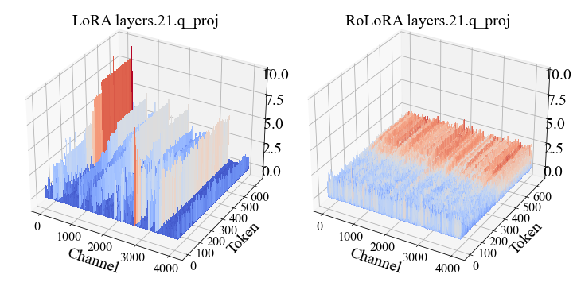

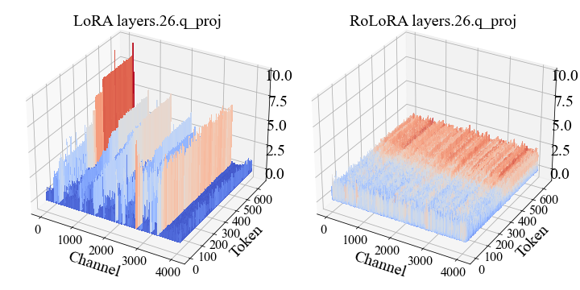

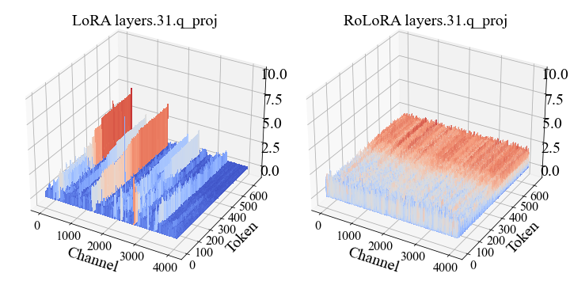

[Arxiv](https://arxiv.org/abs/2407.08044)