# SHERL：针对资源受限的迁移学习，实现高准确度与内存效率的合成

发布时间：2024年07月10日

`LLM应用` `人工智能` `机器学习`

> SHERL: Synthesizing High Accuracy and Efficient Memory for Resource-Limited Transfer Learning

# 摘要

> 参数高效的迁移学习（PETL）领域正蓬勃发展，旨在将大型预训练模型适应到下游任务，同时减少可训练参数并应对微调中的内存挑战。为解决这一难题，我们提出了创新的METL策略SHERL，特别适用于资源有限场景。SHERL将适应过程分为两个互补阶段：首先，通过反冗余操作优化中间输出，提升其后续交互的兼容性；随后，利用少量后期预训练层，有效减轻内存压力，并将灵活特征转化为对新领域更具适应性的强大表示。实验证明，SHERL在视觉与语言及仅语言任务中，以较低内存开销实现了与传统PETL方法相当或更优的性能。代码已公开发布于：https://github.com/Paranioar/SHERL。

> Parameter-efficient transfer learning (PETL) has emerged as a flourishing research field for adapting large pre-trained models to downstream tasks, greatly reducing trainable parameters while grappling with memory challenges during fine-tuning. To address it, memory-efficient series (METL) avoid backpropagating gradients through the large backbone. However, they compromise by exclusively relying on frozen intermediate outputs and limiting the exhaustive exploration of prior knowledge from pre-trained models. Moreover, the dependency and redundancy between cross-layer features are frequently overlooked, thereby submerging more discriminative representations and causing an inherent performance gap (vs. conventional PETL methods). Hence, we propose an innovative METL strategy called SHERL for resource-limited scenarios to decouple the entire adaptation into two successive and complementary processes. In the early route, intermediate outputs are consolidated via an anti-redundancy operation, enhancing their compatibility for subsequent interactions; thereby in the late route, utilizing minimal late pre-trained layers could alleviate the peak demand on memory overhead and regulate these fairly flexible features into more adaptive and powerful representations for new domains. Extensive ablations on vision-and-language and language-only tasks show that SHERL combines the strengths of both parameter and memory-efficient techniques, performing on-par or better across diverse architectures with lower memory during fine-tuning. Our code is publicly available at: https://github.com/Paranioar/SHERL.

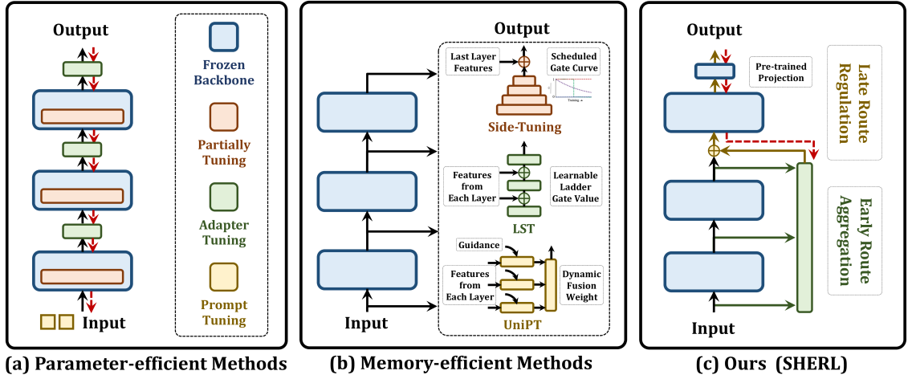

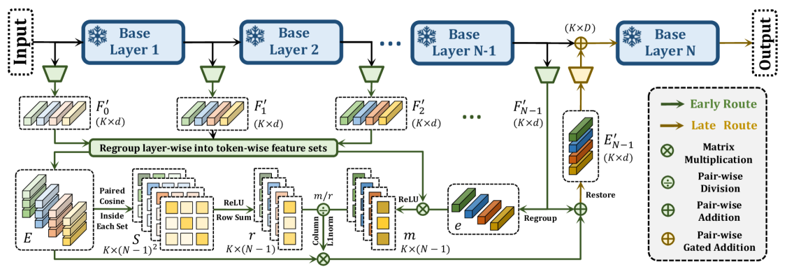

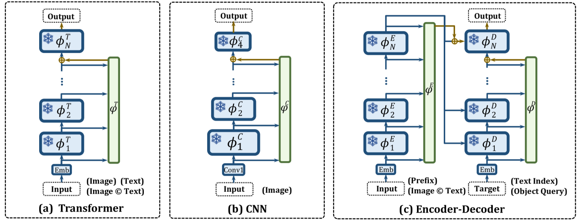

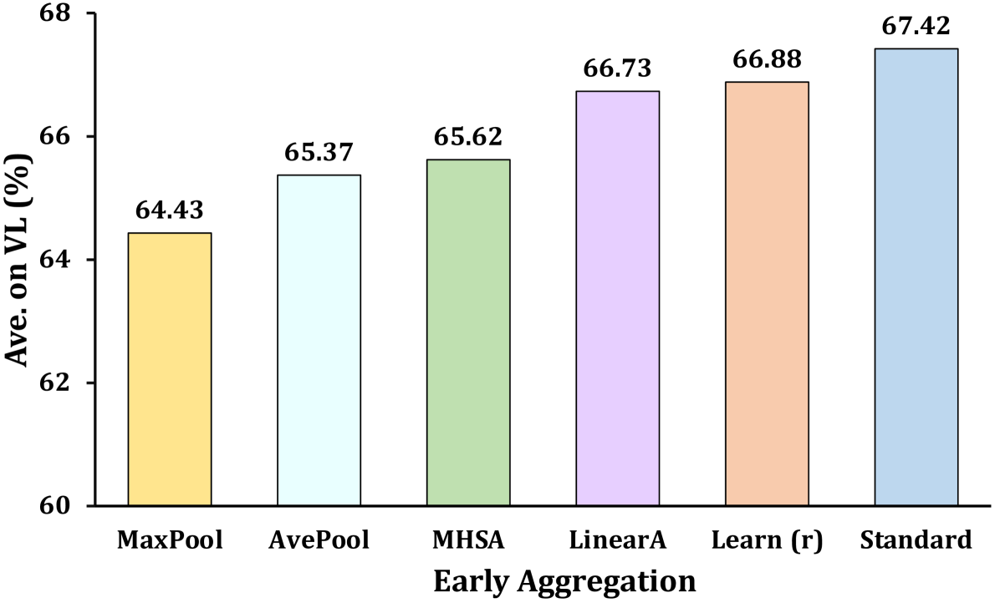

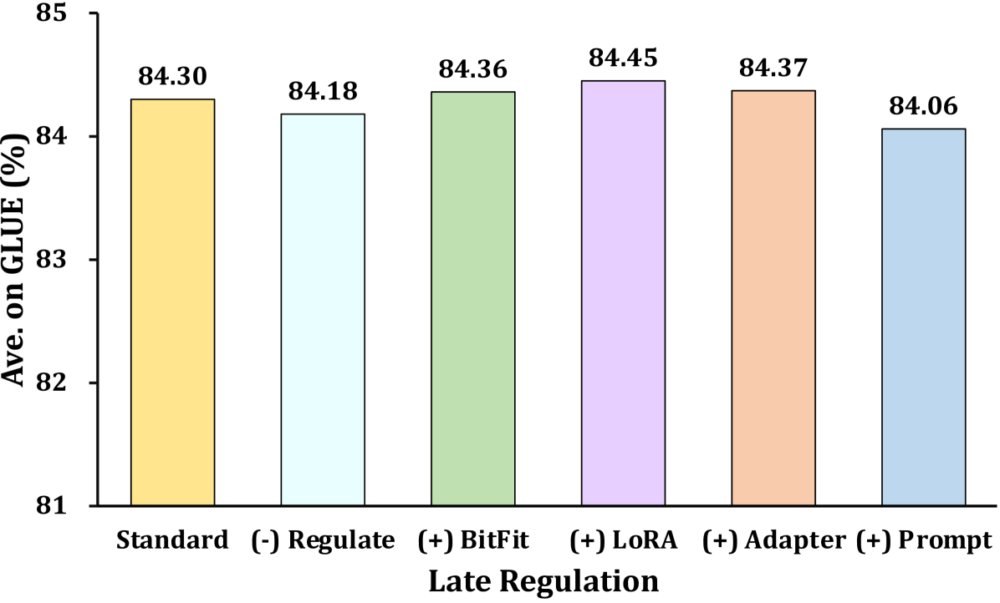

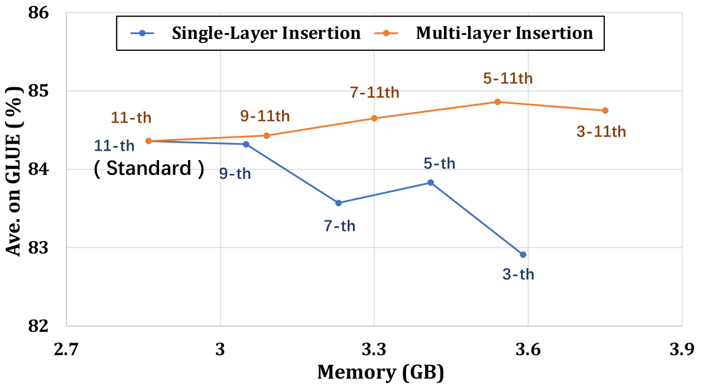

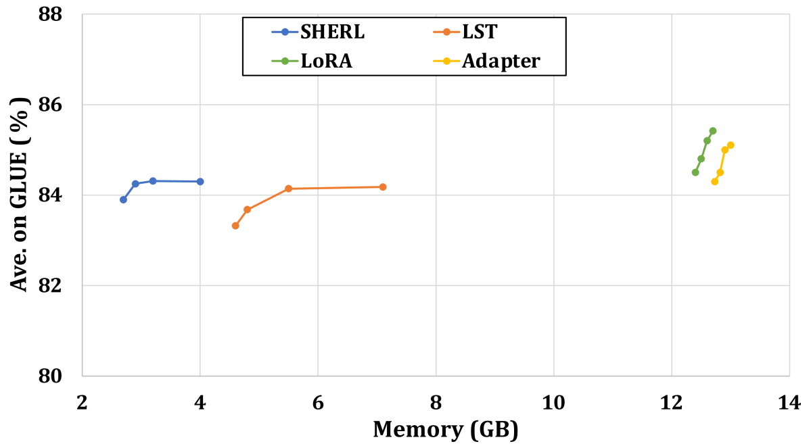

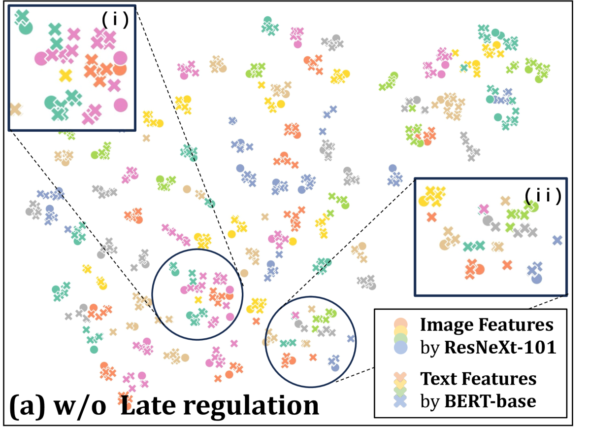

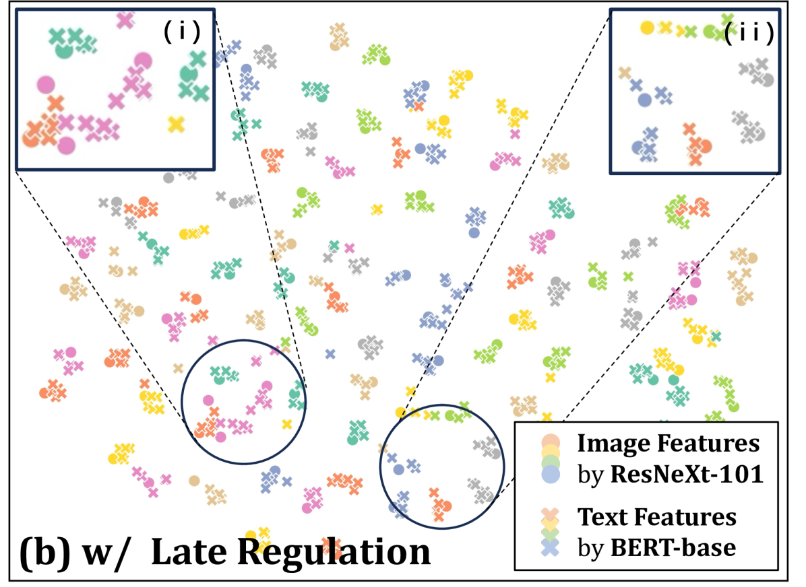

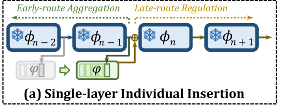

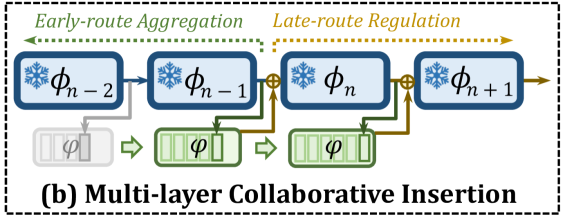

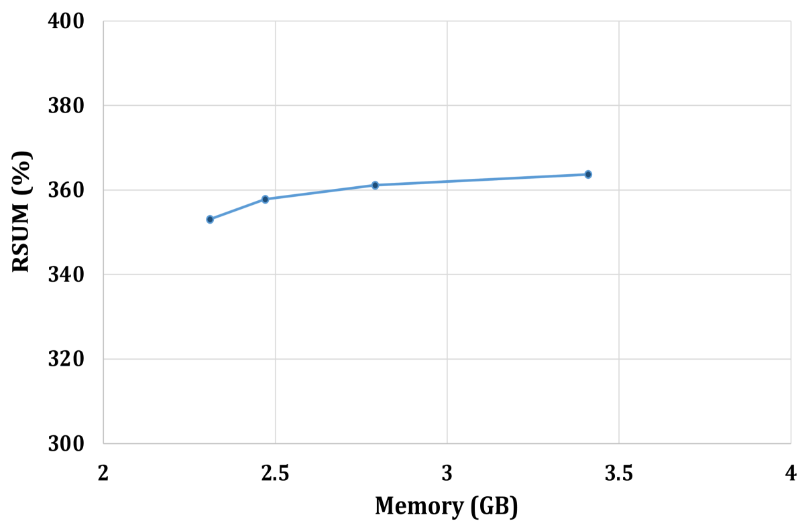

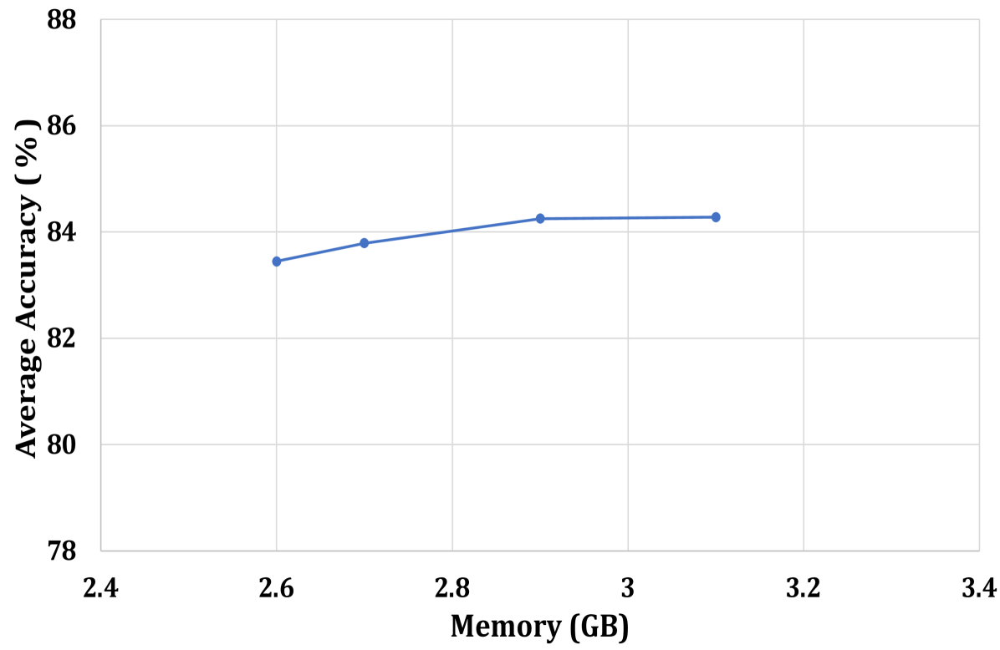

[Arxiv](https://arxiv.org/abs/2407.07523)