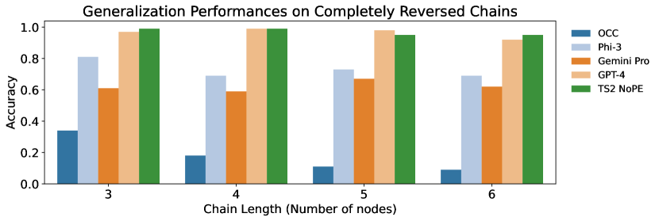

# 通过公理化训练，引导 Transformer 掌握因果推理的艺术。

发布时间：2024年07月10日

`Agent` `人工智能` `因果推理`

> Teaching Transformers Causal Reasoning through Axiomatic Training

# 摘要

> 在现实世界中，基于文本的AI系统需要具备因果推理能力。由于生成干预性数据成本高昂，我们探讨了AI代理从被动数据中学习因果推理的潜力。我们采用了一种公理化训练方法，让代理通过观察因果公理的多个实例来学习，而非直接将公理融入模型或从数据中推断。我们的核心问题是，代理能否将这些公理实例泛化应用到新情境中。例如，若一个transformer模型在小型图上学习了因果传递性公理，它能否在大型图上同样适用？我们的研究表明，这种泛化是可行的。我们关注的是在给定因果图结构下，判断变量间的因果关系。实验显示，一个6700万参数的transformer模型，经过线性因果链及相关变体的训练后，能有效泛化至更复杂图结构，包括长链、逆序链及分支图，即便未针对这些情况专门训练。该模型性能与GPT-4、Gemini Pro和Phi-3等大型语言模型不相上下，甚至更优。这一公理化训练框架为从被动数据中学习因果推理开辟了新途径，只要能提供充足的公理实例，即可应用于任意公理的学习。

> For text-based AI systems to interact in the real world, causal reasoning is an essential skill. Since interventional data is costly to generate, we study to what extent an agent can learn causal reasoning from passive data. Specifically, we consider an axiomatic training setup where an agent learns from multiple demonstrations of a causal axiom (or rule), rather than incorporating the axiom as an inductive bias or inferring it from data values. A key question is whether the agent would learn to generalize from the axiom demonstrations to new scenarios. For example, if a transformer model is trained on demonstrations of the causal transitivity axiom over small graphs, would it generalize to applying the transitivity axiom over large graphs? Our results, based on a novel axiomatic training scheme, indicate that such generalization is possible. We consider the task of inferring whether a variable causes another variable, given a causal graph structure. We find that a 67 million parameter transformer model, when trained on linear causal chains (along with some noisy variations) can generalize well to new kinds of graphs, including longer causal chains, causal chains with reversed order, and graphs with branching; even when it is not explicitly trained for such settings. Our model performs at par (or even better) than many larger language models such as GPT-4, Gemini Pro, and Phi-3. Overall, our axiomatic training framework provides a new paradigm of learning causal reasoning from passive data that can be used to learn arbitrary axioms, as long as sufficient demonstrations can be generated.

[Arxiv](https://arxiv.org/abs/2407.07612)