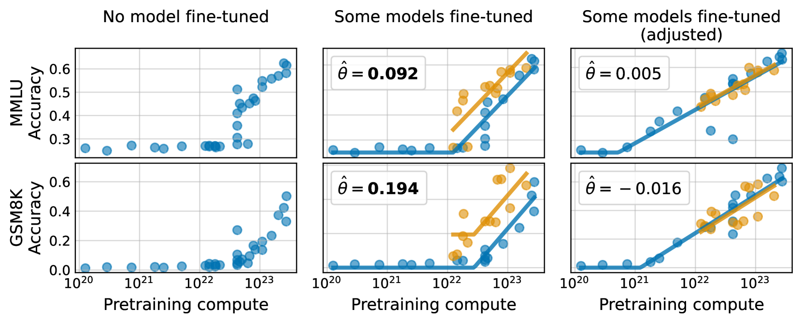

# 在测试任务上训练，评估与结果的混淆随之而来。

发布时间：2024年07月10日

`LLM理论` `人工智能` `软件工程`

> Training on the Test Task Confounds Evaluation and Emergence

# 摘要

> 我们探讨了一个大型语言模型评估中的核心问题——“测试任务训练”。这一概念并非指不当行为，而是描述了在预训练阶段融入任务相关数据的一系列技术。我们发现，这种做法可能扭曲模型间的相对评估和涌现能力的判断。为此，我们提出了一种方法，通过在相同任务数据上微调模型，以校正“测试任务训练”的影响。结果显示，调整后，许多所谓的涌现行为现象显著减少，甚至包括那些无法仅通过评估指标解释的情况。我们的研究为大型语言模型的评估带来了新的视角，对基准制定和涌现能力研究具有深远影响。

> We study a fundamental problem in the evaluation of large language models that we call training on the test task. Unlike wrongful practices like training on the test data, leakage, or data contamination, training on the test task is not a malpractice. Rather, the term describes a growing set of techniques to include task-relevant data in the pretraining stage of a language model. We demonstrate that training on the test task confounds both relative model evaluations and claims about emergent capabilities. We argue that the seeming superiority of one model family over another may be explained by a different degree of training on the test task. To this end, we propose an effective method to adjust for training on the test task by fine-tuning each model under comparison on the same task-relevant data before evaluation. We then show that instances of emergent behavior largely vanish once we adjust for training on the test task. This also applies to reported instances of emergent behavior that cannot be explained by the choice of evaluation metric. Our work promotes a new perspective on the evaluation of large language models with broad implications for benchmarking and the study of emergent capabilities.

[Arxiv](https://arxiv.org/abs/2407.07890)