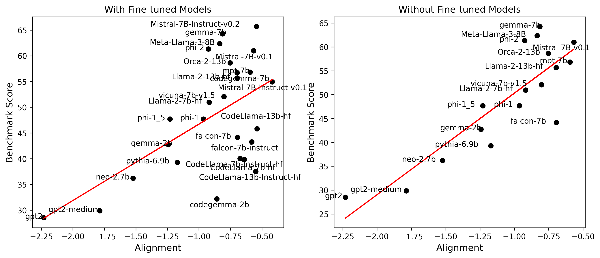
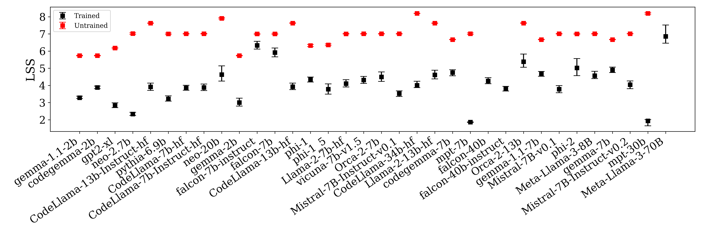
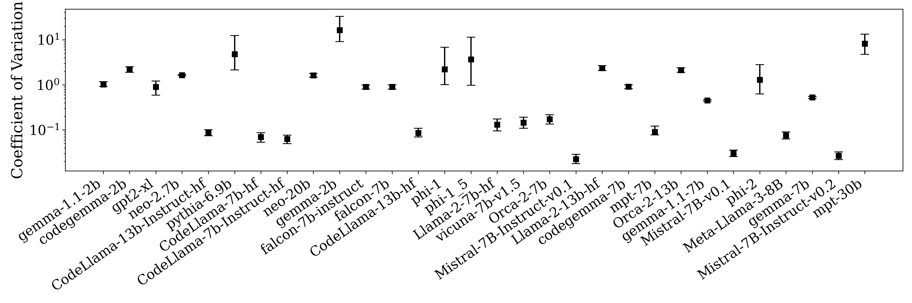
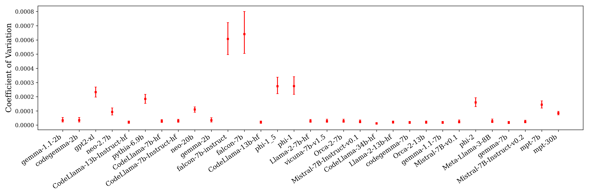

# 大规模语言模型中的 Transformer 对齐

发布时间：2024年07月10日

`LLM理论` `机器学习`

> Transformer Alignment in Large Language Models

# 摘要

> 大型语言模型 (LLMs) 在自然语言处理领域取得了显著成就，深入理解其内部运作机制至关重要。我们将 LLMs 视为高维离散、耦合、非线性动力学系统中的嵌入转换。这一视角促使我们追踪单个令牌在通过转换器块时的轨迹，并通过雅可比矩阵沿这些轨迹线性化系统。通过对 38 个公开可用的 LLMs 的分析，我们发现了残差雅可比矩阵的左上和右上奇异向量的对齐，以及线性和层级指数增长的涌现。特别地，我们发现对齐程度的增加与模型性能呈正相关。训练后评估的指标显示，与随机初始化权重相比，有显著提升，凸显了训练在转换器中的重要影响。这些发现揭示了一个先前被忽视的显著规律性，强化了动力学解释，并为更深入理解和优化 LLM 架构开辟了道路。

> Large Language Models (LLMs) have made significant strides in natural language processing, and a precise understanding of the internal mechanisms driving their success is essential. We regard LLMs as transforming embeddings via a discrete, coupled, nonlinear, dynamical system in high dimensions. This perspective motivates tracing the trajectories of individual tokens as they pass through transformer blocks, and linearizing the system along these trajectories through their Jacobian matrices. In our analysis of 38 openly available LLMs, we uncover the alignment of top left and right singular vectors of Residual Jacobians, as well as the emergence of linearity and layer-wise exponential growth. Notably, we discover that increased alignment $\textit{positively correlates}$ with model performance. Metrics evaluated post-training show significant improvement in comparison to measurements made with randomly initialized weights, highlighting the significant effects of training in transformers. These findings reveal a remarkable level of regularity that has previously been overlooked, reinforcing the dynamical interpretation and paving the way for deeper understanding and optimization of LLM architectures.

[Arxiv](https://arxiv.org/abs/2407.07810)