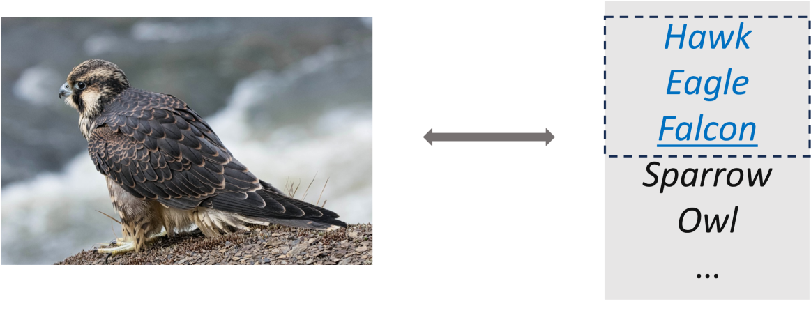
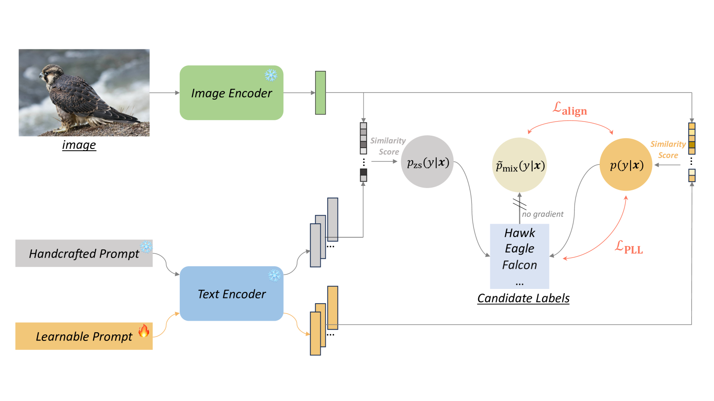
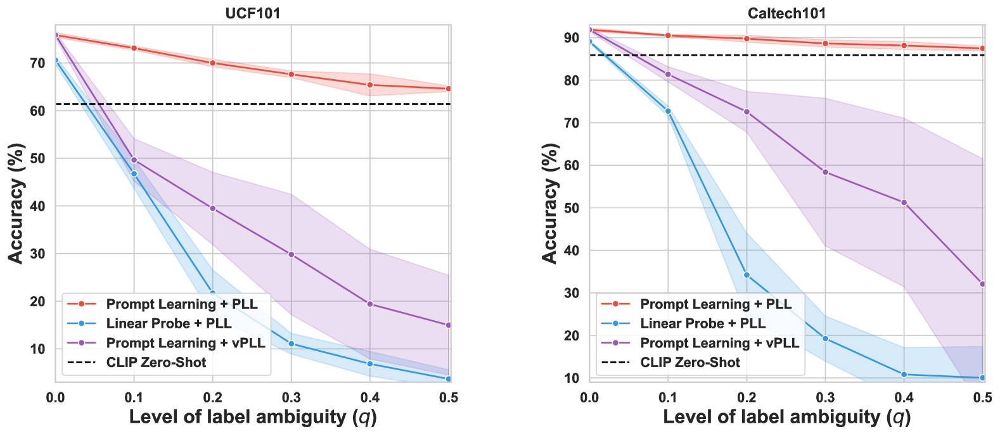
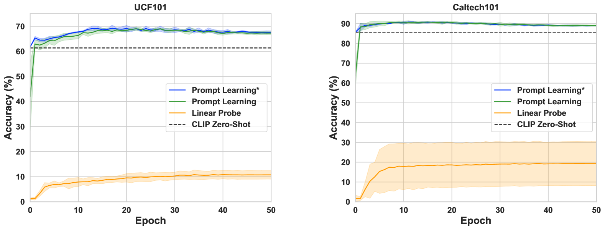

# 通过提示对齐优化候选标签的视觉-语言模型

发布时间：2024年07月10日

`LLM应用` `计算机视觉`

> Tuning Vision-Language Models with Candidate Labels by Prompt Alignment

# 摘要

> 视觉-语言模型 (VLMs) 能从海量图像-文本对中提炼出高质量表示。提示学习，作为微调 VLM 以适应特定任务的热门手段，虽表现出色，却受限于对标注数据的依赖。现实中，数据隐私或敏感性常使我们仅能触及候选标签而非真实标签。本文首开先河，探讨了 VLMs 在候选标签下的提示学习。实证显示，面对候选标签，提示学习优于其他微调策略，但标签歧义加剧时性能下滑。为此，我们设计了一个简洁高效的框架，巧妙运用 VLMs 的先验知识，以候选标签引领学习之旅。该框架通过模型输出与混合类别后验的精准对齐，消解标签歧义，并兼容多样化的训练目标，助力候选标签学习，进一步提升性能。实验广泛验证了这一框架的卓越成效。

> Vision-language models (VLMs) can learn high-quality representations from a large-scale training dataset of image-text pairs. Prompt learning is a popular approach to fine-tuning VLM to adapt them to downstream tasks. Despite the satisfying performance, a major limitation of prompt learning is the demand for labelled data. In real-world scenarios, we may only obtain candidate labels (where the true label is included) instead of the true labels due to data privacy or sensitivity issues. In this paper, we provide the first study on prompt learning with candidate labels for VLMs. We empirically demonstrate that prompt learning is more advantageous than other fine-tuning methods, for handling candidate labels. Nonetheless, its performance drops when the label ambiguity increases. In order to improve its robustness, we propose a simple yet effective framework that better leverages the prior knowledge of VLMs to guide the learning process with candidate labels. Specifically, our framework disambiguates candidate labels by aligning the model output with the mixed class posterior jointly predicted by both the learnable and the handcrafted prompt. Besides, our framework can be equipped with various off-the-shelf training objectives for learning with candidate labels to further improve their performance. Extensive experiments demonstrate the effectiveness of our proposed framework.

[Arxiv](https://arxiv.org/abs/2407.07638)