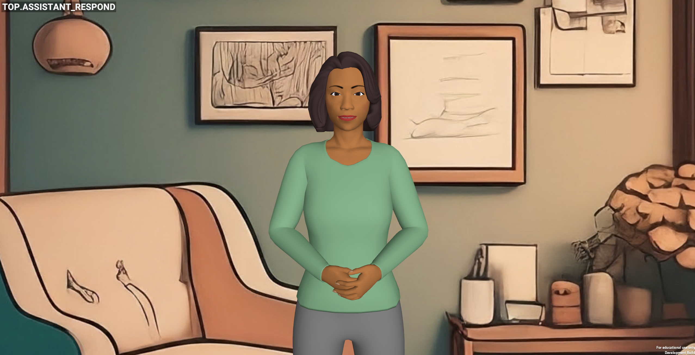
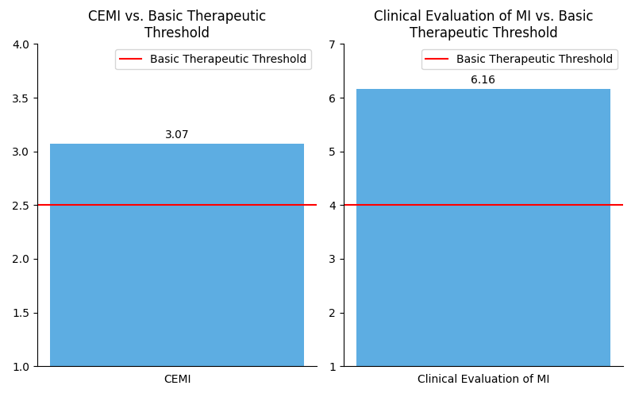

# 探索由 LLM 驱动的虚拟代理在酒精使用咨询中的动机性访谈应用。

发布时间：2024年07月10日

`Agent` `心理健康`

> Virtual Agents for Alcohol Use Counseling: Exploring LLM-Powered Motivational Interviewing

# 摘要

> 我们创新性地运用大型语言模型 (LLM) 开发了一款虚拟顾问，专为酒精使用咨询中的动机性访谈 (MI) 设计。面对物质滥用领域有效咨询的稀缺，虚拟代理凭借 LLM 的强大能力，模拟 MI 中的精细沟通技巧，展现出解决问题的潜力。我们的方法融合了提示工程与用户友好平台的集成，旨在实现真实且富有同理心的交流。通过一系列研究，我们专注于复制 MI 技巧及人类顾问的对话，评估虚拟代理的有效性。初步结果显示，该 LLM 驱动的虚拟代理在同理心与对话适应性上媲美人类顾问，为虚拟健康咨询领域带来突破，并深入探讨了基于 LLM 的治疗互动的设计与实施。

> We introduce a novel application of large language models (LLMs) in developing a virtual counselor capable of conducting motivational interviewing (MI) for alcohol use counseling. Access to effective counseling remains limited, particularly for substance abuse, and virtual agents offer a promising solution by leveraging LLM capabilities to simulate nuanced communication techniques inherent in MI. Our approach combines prompt engineering and integration into a user-friendly virtual platform to facilitate realistic, empathetic interactions. We evaluate the effectiveness of our virtual agent through a series of studies focusing on replicating MI techniques and human counselor dialog. Initial findings suggest that our LLM-powered virtual agent matches human counselors' empathetic and adaptive conversational skills, presenting a significant step forward in virtual health counseling and providing insights into the design and implementation of LLM-based therapeutic interactions.

[Arxiv](https://arxiv.org/abs/2407.08095)