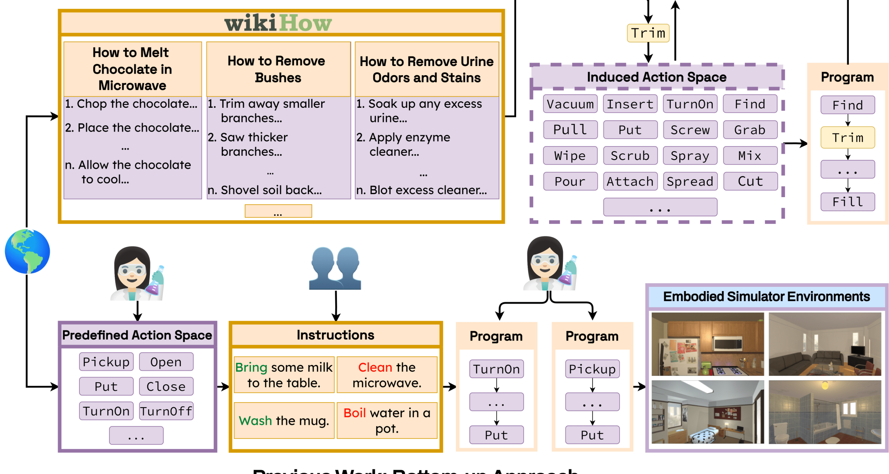
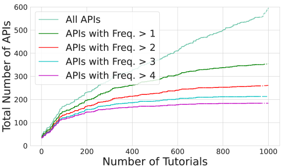
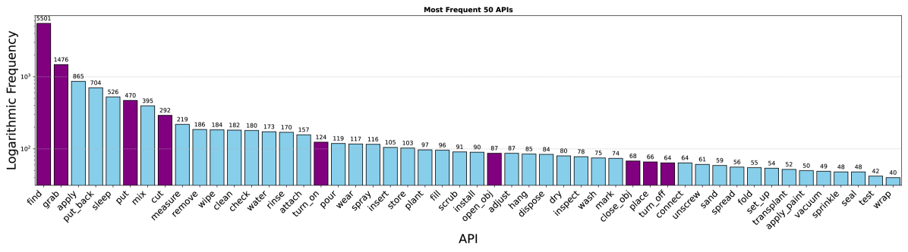
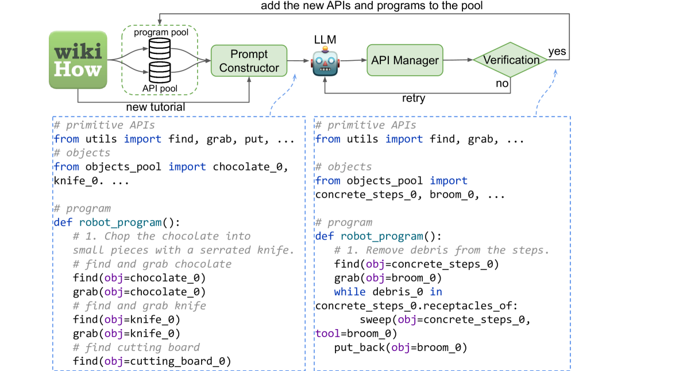
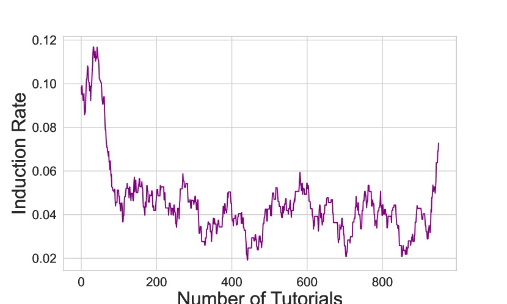

# WorldAPIs：探寻世界的API价值，一场思想实验之旅

发布时间：2024年07月10日

`Agent` `人工智能` `软件开发`

> WorldAPIs: The World Is Worth How Many APIs? A Thought Experiment

# 摘要

> AI系统通过API调用的基本动作在现实世界中做决策。然而，现有模拟器提供的API有限，引发了一个问题：多功能代理需要多少API？我们通过思想实验探讨：假设wikiHow涵盖广泛任务，所需的API空间是什么？我们提出框架，通过结合wikiHow指令与代理策略，迭代生成新API。借鉴LLM的成功，我们用少样本提示引导GPT-4生成Python程序，通过重用种子API和必要时创建新API，构建API宇宙。实验重点在于定义API而非执行。我们应用此流程于wikiHow指令，发现0.5%教程需300+API。分析显示，流程有效重用和创建API。审查表明，现有模拟器仅支持部分诱导API，推动了开发丰富动作的具身环境。

> AI systems make decisions in physical environments through primitive actions or affordances that are accessed via API calls. While deploying AI agents in the real world involves numerous high-level actions, existing embodied simulators offer a limited set of domain-salient APIs. This naturally brings up the questions: how many primitive actions (APIs) are needed for a versatile embodied agent, and what should they look like? We explore this via a thought experiment: assuming that wikiHow tutorials cover a wide variety of human-written tasks, what is the space of APIs needed to cover these instructions? We propose a framework to iteratively induce new APIs by grounding wikiHow instruction to situated agent policies. Inspired by recent successes in large language models (LLMs) for embodied planning, we propose a few-shot prompting to steer GPT-4 to generate Pythonic programs as agent policies and bootstrap a universe of APIs by 1) reusing a seed set of APIs; and then 2) fabricate new API calls when necessary. The focus of this thought experiment is on defining these APIs rather than their executability. We apply the proposed pipeline on instructions from wikiHow tutorials. On a small fraction (0.5%) of tutorials, we induce an action space of 300+ APIs necessary for capturing the rich variety of tasks in the physical world. A detailed automatic and human analysis of the induction output reveals that the proposed pipeline enables effective reuse and creation of APIs. Moreover, a manual review revealed that existing simulators support only a small subset of the induced APIs (9 of the top 50 frequent APIs), motivating the development of action-rich embodied environments.

[Arxiv](https://arxiv.org/abs/2407.07778)