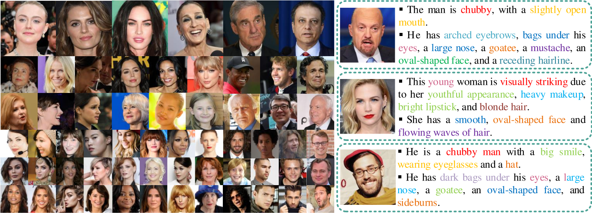
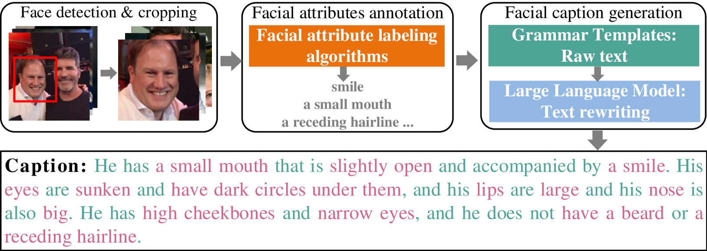
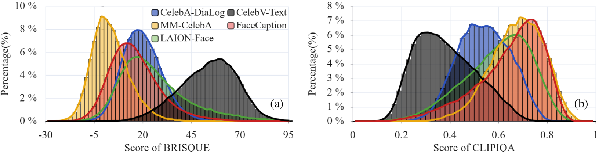
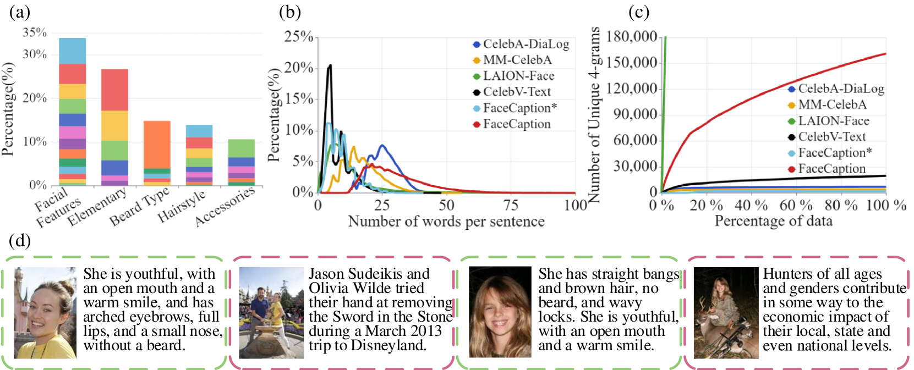
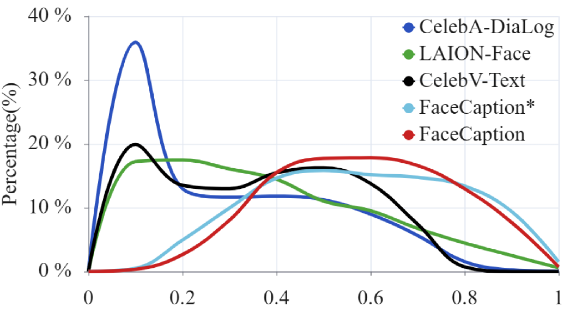
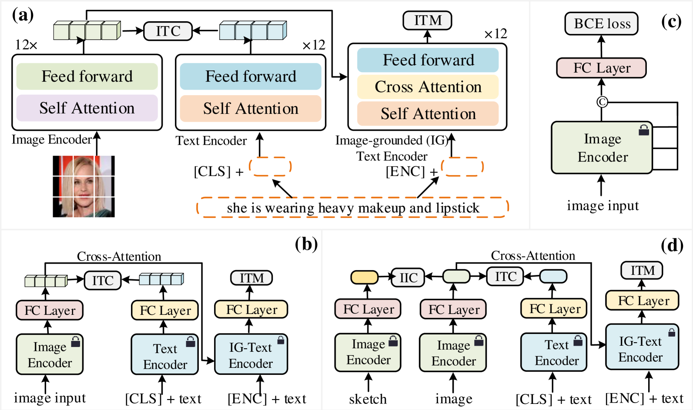
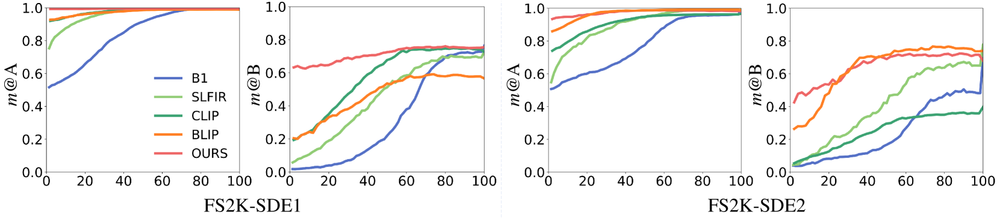
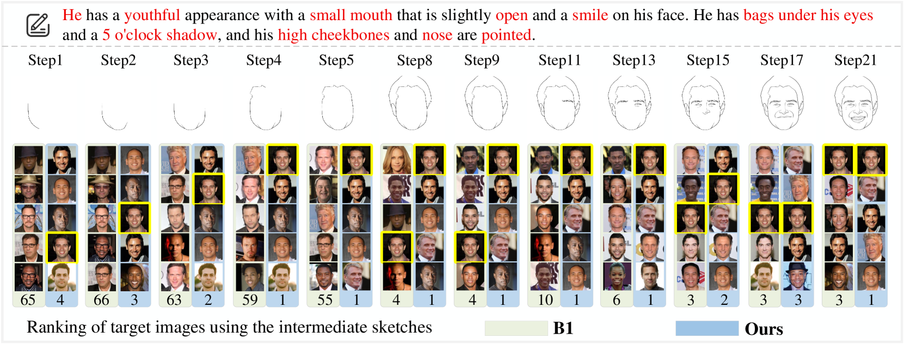

# 1500万面部图像与文本多模态数据集

发布时间：2024年07月11日

`LLM应用

解释：这篇论文主要介绍了FaceCaption-15M数据集的开发和应用，这是一个用于面部图像与自然语言描述匹配的大规模数据集。论文中提到的FLIP模型是基于这个数据集训练的预训练模型，用于面部图像与文本的对齐。虽然论文涉及到了多模态深度学习模型，但其核心关注点在于应用层面，即如何利用这些模型和数据集来提升面部相关任务的性能。因此，这篇论文更适合归类于LLM应用，而不是专注于理论探讨或代理技术（Agent）和检索增强生成（RAG）技术。` `人工智能` `面部识别`

> 15M Multimodal Facial Image-Text Dataset

# 摘要

> 当前，图像与文本结合的多模态深度学习模型在多个领域展现出显著潜力，特别是在面部图像相关的任务中，其应用前景广阔。本文推出的 **FaceCaption-15M** 数据集，集大规模、多样性与高质量于一体，为面部图像匹配自然语言描述，旨在推动面部相关任务的研究。该数据集包含超过 1500 万对面部图像与描述，规模空前。通过深入分析图像质量、文本自然度、复杂度及与图像的相关性，FaceCaption-15M 的优越性得以彰显。为验证其效能，我们训练了面部图像与文本对齐的预训练模型 FLIP，并在此基础上，通过图像与文本编码器的协同及线性层的微调，在两项面部任务中刷新了性能纪录。我们公开了所有资源，以期推动面部任务研究的进一步发展。详情请访问：https://huggingface.co/datasets/OpenFace-CQUPT/FaceCaption-15M

> Currently, image-text-driven multi-modal deep learning models have demonstrated their outstanding potential in many fields. In practice, tasks centered around facial images have broad application prospects. This paper presents \textbf{FaceCaption-15M}, a large-scale, diverse, and high-quality dataset of facial images accompanied by their natural language descriptions (facial image-to-text). This dataset aims to facilitate a study on face-centered tasks. FaceCaption-15M comprises over 15 million pairs of facial images and their corresponding natural language descriptions of facial features, making it the largest facial image-caption dataset to date. We conducted a comprehensive analysis of image quality, text naturalness, text complexity, and text-image relevance to demonstrate the superiority of FaceCaption-15M. To validate the effectiveness of FaceCaption-15M, we first trained a facial language-image pre-training model (FLIP, similar to CLIP) to align facial image with its corresponding captions in feature space. Subsequently, using both image and text encoders and fine-tuning only the linear layer, our FLIP-based models achieved state-of-the-art results on two challenging face-centered tasks. The purpose is to promote research in the field of face-related tasks through the availability of the proposed FaceCaption-15M dataset. All data, codes, and models are publicly available. https://huggingface.co/datasets/OpenFace-CQUPT/FaceCaption-15M

[Arxiv](https://arxiv.org/abs/2407.08515)