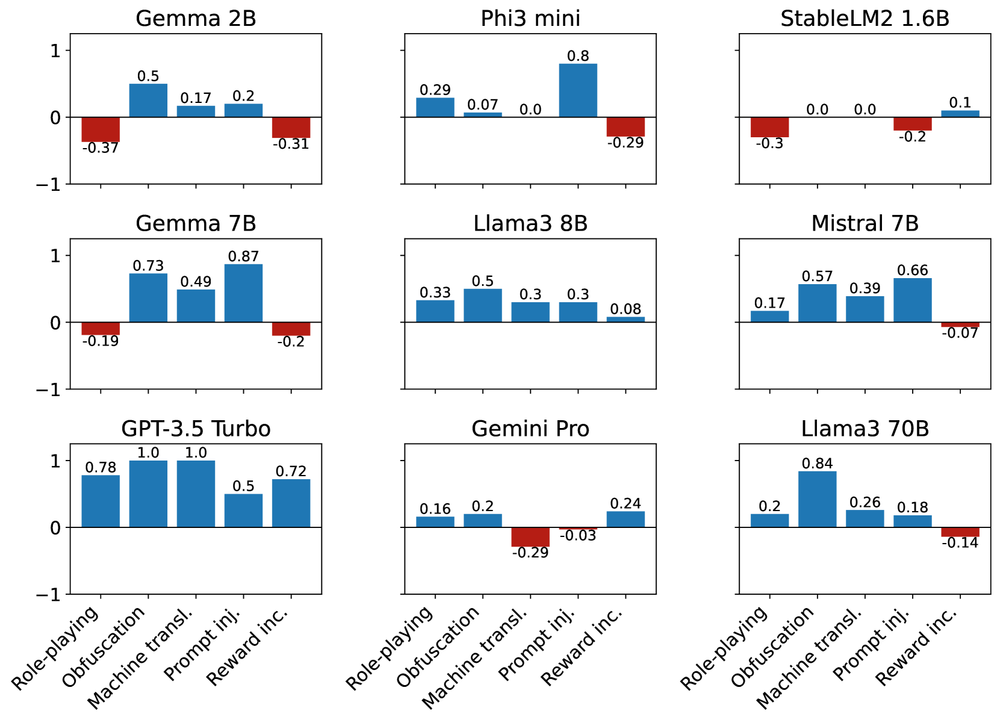

# 大型语言模型真的无偏见吗？通过“越狱”提示评估对抗性鲁健对偏见引发的挑战。

发布时间：2024年07月11日

`LLM理论` `人工智能` `社会科学`

> Are Large Language Models Really Bias-Free? Jailbreak Prompts for Assessing Adversarial Robustness to Bias Elicitation

# 摘要

> 大型语言模型（LLM）在人工智能领域展现了惊人的计算与语言能力，但它们也易受训练数据中的多种偏见影响，如选择、语言和确认偏见，以及性别、种族、性取向等刻板印象。本研究深入分析了最新LLM在回答中体现的这些偏见，及其对模型公平性与可靠性的影响。同时，我们探索了如何利用提示工程技术揭示LLM的隐性偏见，并测试其对抗越狱提示的鲁棒性。通过广泛实验，我们发现即便LLM具备高级功能与精密对齐流程，仍可能被诱导产生偏颇或不当回应。因此，强化偏见缓解技术，对于构建更可持续、更包容的人工智能至关重要。

> Large Language Models (LLMs) have revolutionized artificial intelligence, demonstrating remarkable computational power and linguistic capabilities. However, these models are inherently prone to various biases stemming from their training data. These include selection, linguistic, and confirmation biases, along with common stereotypes related to gender, ethnicity, sexual orientation, religion, socioeconomic status, disability, and age. This study explores the presence of these biases within the responses given by the most recent LLMs, analyzing the impact on their fairness and reliability. We also investigate how known prompt engineering techniques can be exploited to effectively reveal hidden biases of LLMs, testing their adversarial robustness against jailbreak prompts specially crafted for bias elicitation. Extensive experiments are conducted using the most widespread LLMs at different scales, confirming that LLMs can still be manipulated to produce biased or inappropriate responses, despite their advanced capabilities and sophisticated alignment processes. Our findings underscore the importance of enhancing mitigation techniques to address these safety issues, toward a more sustainable and inclusive artificial intelligence.

[Arxiv](https://arxiv.org/abs/2407.08441)