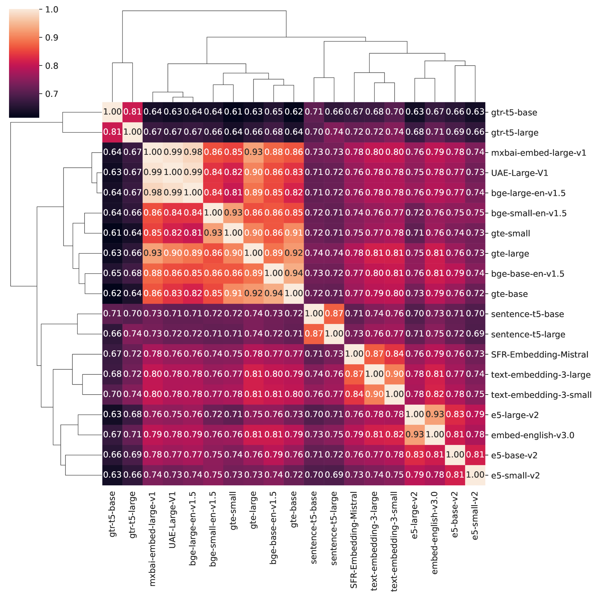
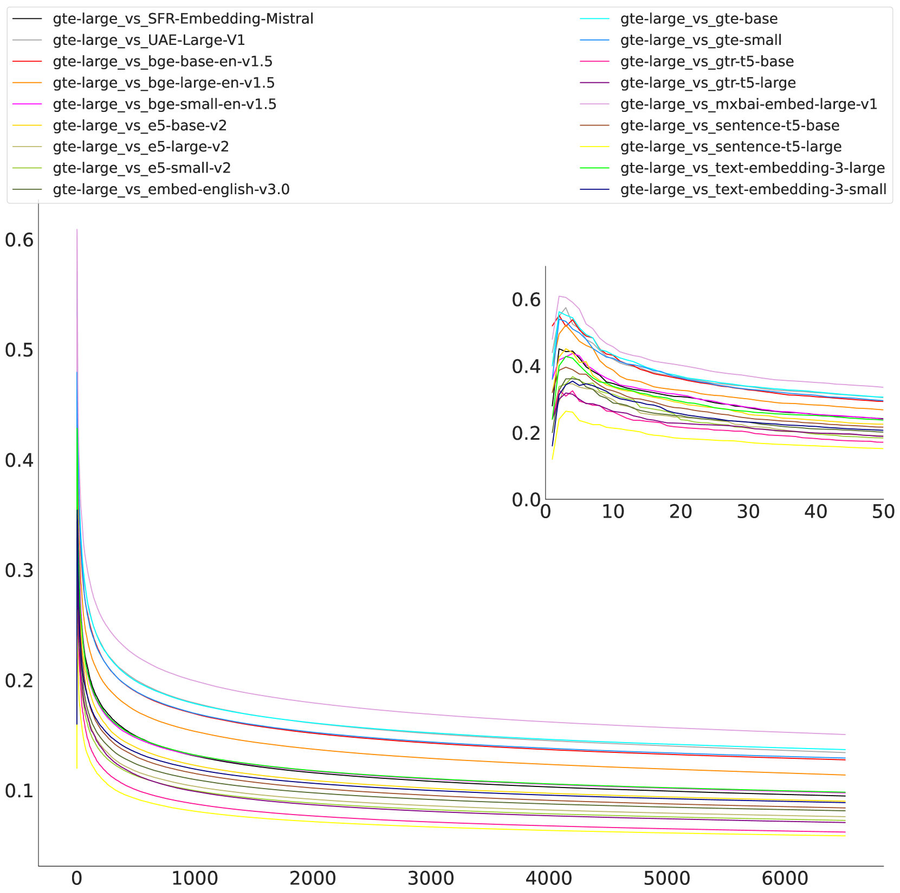
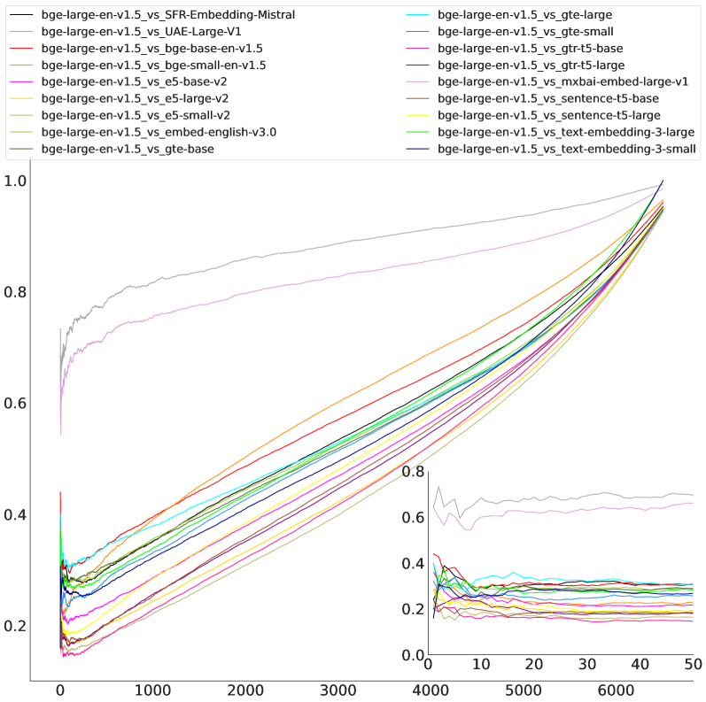
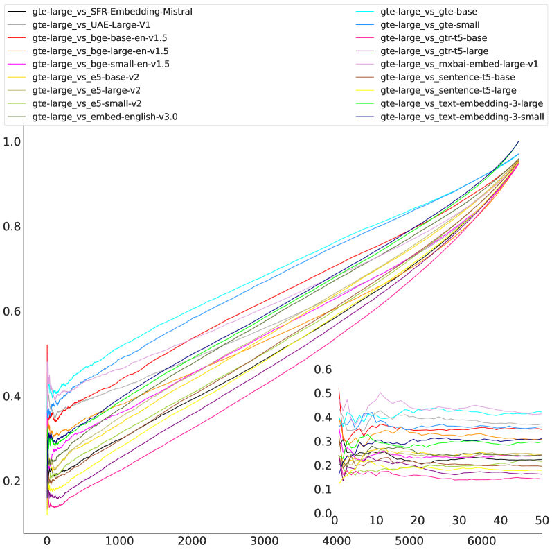
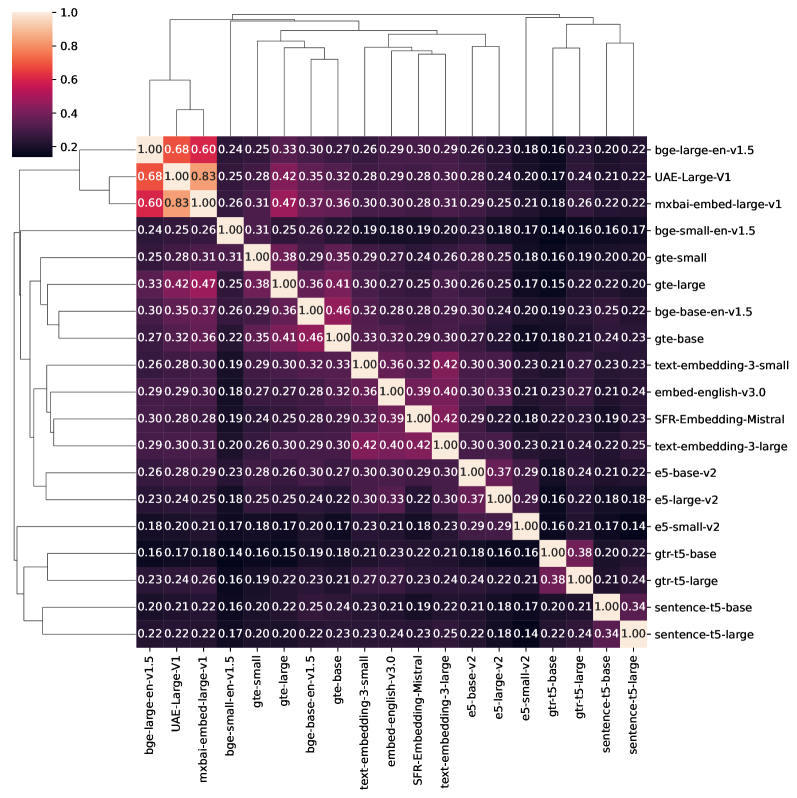
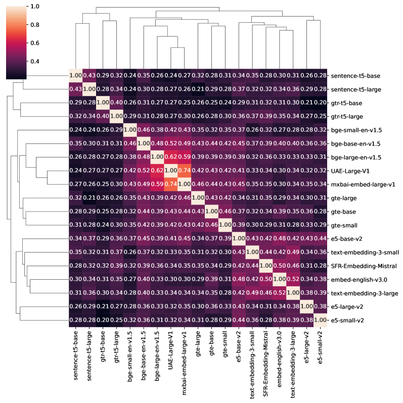
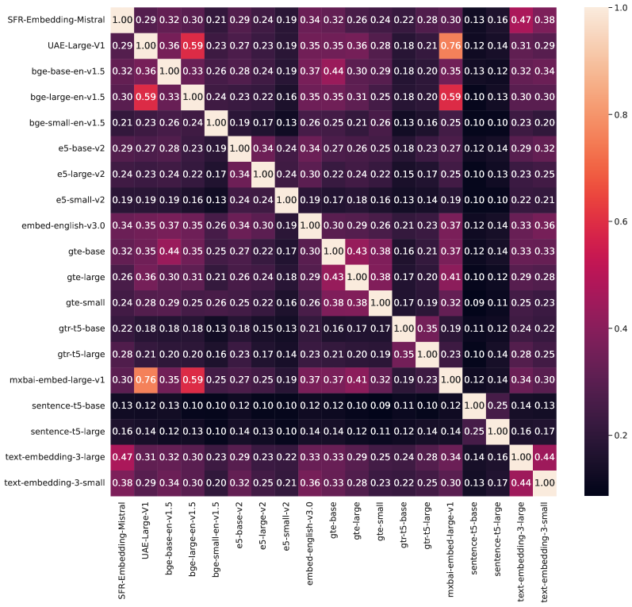
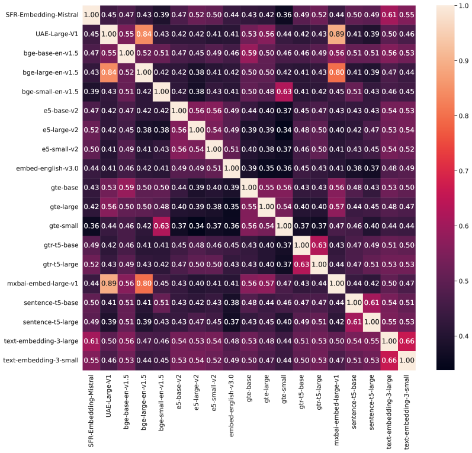
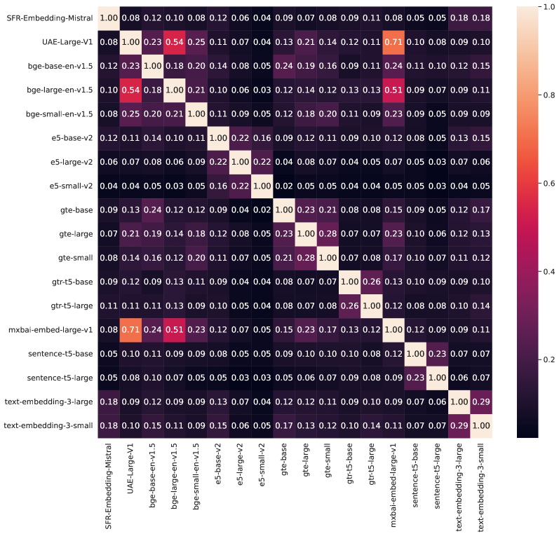

# 不仅仅是基准测试：探讨增强检索生成系统中嵌入模型相似性的评估方法

发布时间：2024年07月11日

`RAG` `信息技术` `数据检索`

> Beyond Benchmarks: Evaluating Embedding Model Similarity for Retrieval Augmented Generation Systems

# 摘要

> 在设计检索增强生成（RAG）系统时，选择嵌入模型至关重要。面对众多选项，识别相似模型集群有助于简化选择过程。仅依赖基准分数难以全面评估模型相似性。因此，本研究从两个角度评估RAG系统中嵌入模型的相似性：首先，通过中心核对齐在成对级别上比较嵌入；其次，利用Jaccard和排名相似性评估检索结果的相似性。我们对比了包括专有模型在内的不同系列模型，涉及五个BEIR数据集。实验发现，模型集群不仅限于同一家族，还存在跨家族集群。此外，top-k检索相似性分析显示低k值时的高方差。研究还揭示了Mistral作为OpenAI模型的开源替代品的潜力。

> The choice of embedding model is a crucial step in the design of Retrieval Augmented Generation (RAG) systems. Given the sheer volume of available options, identifying clusters of similar models streamlines this model selection process. Relying solely on benchmark performance scores only allows for a weak assessment of model similarity. Thus, in this study, we evaluate the similarity of embedding models within the context of RAG systems. Our assessment is two-fold: We use Centered Kernel Alignment to compare embeddings on a pair-wise level. Additionally, as it is especially pertinent to RAG systems, we evaluate the similarity of retrieval results between these models using Jaccard and rank similarity. We compare different families of embedding models, including proprietary ones, across five datasets from the popular Benchmark Information Retrieval (BEIR). Through our experiments we identify clusters of models corresponding to model families, but interestingly, also some inter-family clusters. Furthermore, our analysis of top-k retrieval similarity reveals high-variance at low k values. We also identify possible open-source alternatives to proprietary models, with Mistral exhibiting the highest similarity to OpenAI models.

[Arxiv](https://arxiv.org/abs/2407.08275)