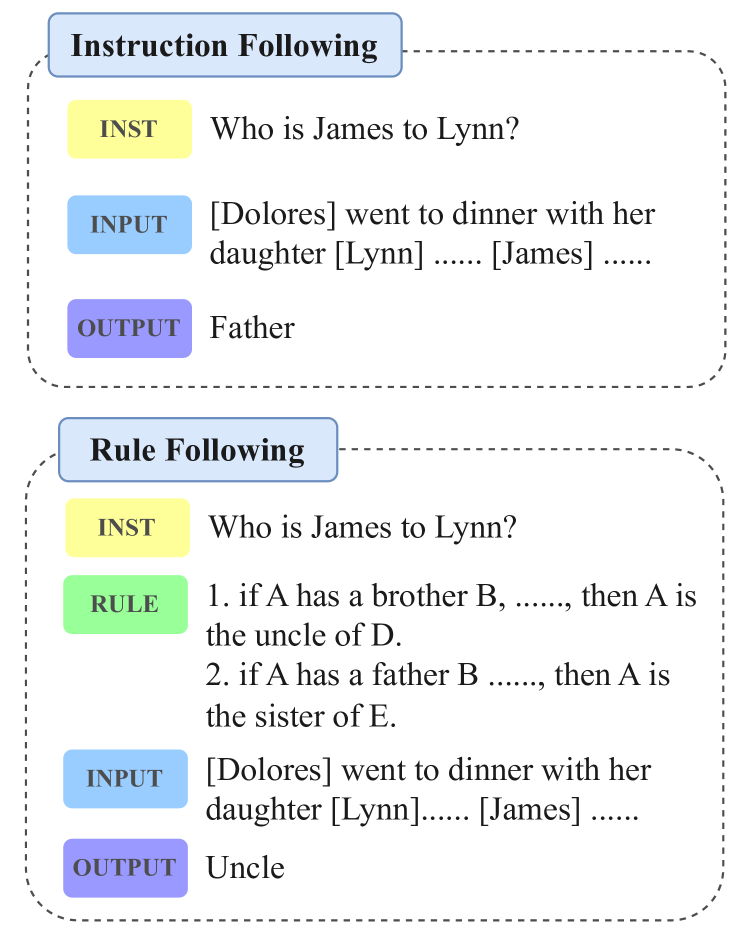
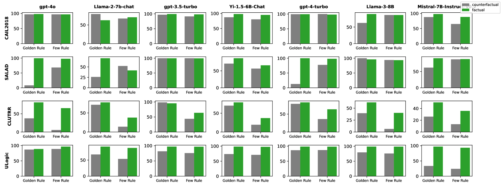

# 探究大型语言模型在遵循规则方面的表现，超越了简单的指令执行。

发布时间：2024年07月11日

`LLM应用` `人工智能` `软件开发`

> Beyond Instruction Following: Evaluating Rule Following of Large Language Models

# 摘要

> 尽管 LLMs 在遵循指令方面表现出色，但在现实应用中，它们还需通过规则来确保安全和响应的准确性。然而，目前对 LLMs 规则遵循能力的评估尚不充分，且未能明确区分规则与指令遵循的场景。为此，本文首先明确了规则遵循的概念，并创建了全面基准 RuleBench，以评估 LLMs 在多种规则遵循任务中的表现。实验表明，LLMs 在规则遵循方面仍有提升空间。我们的深入分析为 LLMs 向更优秀的规则遵循智能代理的改进提供了方向。相关数据和代码已公开，详情请访问：https://anonymous.4open.science/r/llm-rule-following-B3E3/

> Although Large Language Models (LLMs) have demonstrated strong instruction-following ability to be helpful, they are further supposed to be controlled and guided by rules in real-world scenarios to be safe, and accurate in responses. This demands the possession of rule-following capability of LLMs. However, few works have made a clear evaluation of the rule-following capability of LLMs. Previous studies that try to evaluate the rule-following capability of LLMs fail to distinguish the rule-following scenarios from the instruction-following scenarios. Therefore, this paper first makes a clarification of the concept of rule-following, and curates a comprehensive benchmark, RuleBench, to evaluate a diversified range of rule-following abilities. Our experimental results on a variety of LLMs show that they are still limited in following rules. Our further analysis provides insights into the improvements for LLMs toward a better rule-following intelligent agent. The data and code can be found at: https://anonymous.4open.science/r/llm-rule-following-B3E3/

[Arxiv](https://arxiv.org/abs/2407.08440)