# CXR-Agent：结合视觉与语言模型，专为胸部X光解读设计，能生成包含不确定性信息的放射学报告。

发布时间：2024年07月11日

`Agent` `人工智能`

> CXR-Agent: Vision-language models for chest X-ray interpretation with uncertainty aware radiology reporting

# 摘要

> 近期，大型视觉-语言模型在解析复杂图像并运用高级推理生成自然语言描述方面展现出潜力。医学领域天然融合了扫描图像与文本病史，撰写报告的过程使其成为AI技术进步的理想受益者。我们评估了当前最先进的公开可用基础视觉-语言模型在多个胸部X射线数据集上的表现。通过线性探针测试，CheXagent的视觉变换器和Q-former等组件在众多数据集上超越了业界标杆Torch X-ray Vision模型，显示出卓越的泛化能力。然而，我们发现这些模型有时会自信地生成不实信息，影响临床解读速度。为此，我们采用基于代理的视觉-语言方法，结合CheXagent的线性探针与BioViL-T的短语定位工具，旨在产出包含病理位置及概率描述的、具备不确定性意识的放射报告。我们通过构建评估平台，综合运用NLP指标、胸部X射线基准及临床专家评估，对视觉-语言代理进行了全面测试。结果表明，AI生成的报告在准确性、可解释性与安全性上均有显著提升。我们强调，应分别评估正常与异常扫描结果。同时，呼吁扩充配对数据集并实施数据增强策略，以应对大型视觉-语言模型中的过拟合挑战。

> Recently large vision-language models have shown potential when interpreting complex images and generating natural language descriptions using advanced reasoning. Medicine's inherently multimodal nature incorporating scans and text-based medical histories to write reports makes it conducive to benefit from these leaps in AI capabilities. We evaluate the publicly available, state of the art, foundational vision-language models for chest X-ray interpretation across several datasets and benchmarks. We use linear probes to evaluate the performance of various components including CheXagent's vision transformer and Q-former, which outperform the industry-standard Torch X-ray Vision models across many different datasets showing robust generalisation capabilities. Importantly, we find that vision-language models often hallucinate with confident language, which slows down clinical interpretation. Based on these findings, we develop an agent-based vision-language approach for report generation using CheXagent's linear probes and BioViL-T's phrase grounding tools to generate uncertainty-aware radiology reports with pathologies localised and described based on their likelihood. We thoroughly evaluate our vision-language agents using NLP metrics, chest X-ray benchmarks and clinical evaluations by developing an evaluation platform to perform a user study with respiratory specialists. Our results show considerable improvements in accuracy, interpretability and safety of the AI-generated reports. We stress the importance of analysing results for normal and abnormal scans separately. Finally, we emphasise the need for larger paired (scan and report) datasets alongside data augmentation to tackle overfitting seen in these large vision-language models.

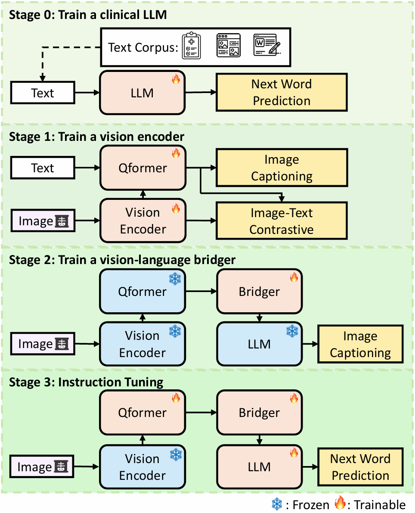

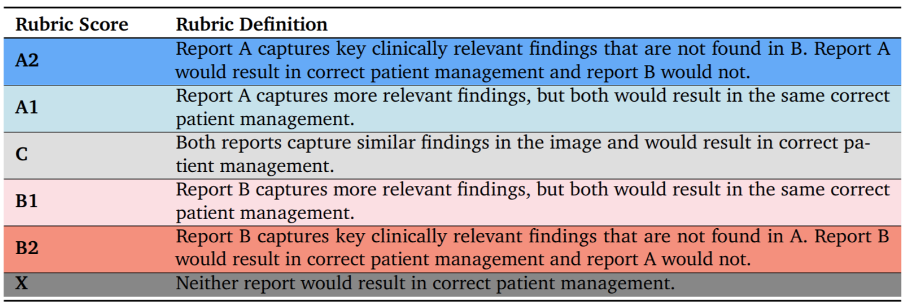

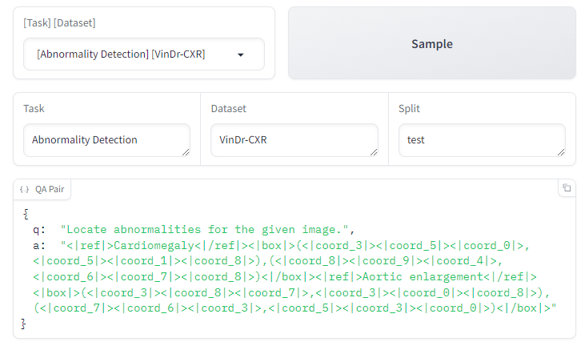

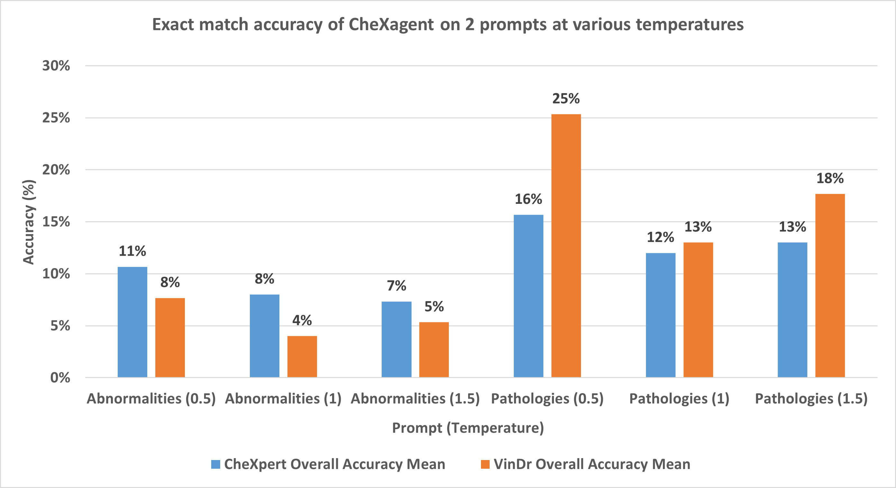

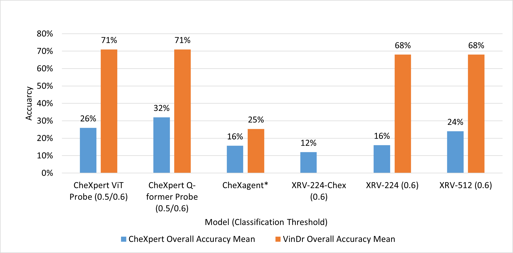

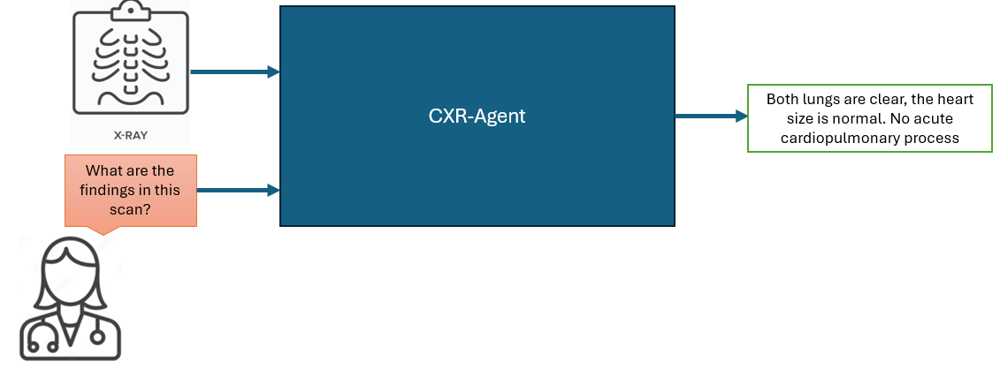

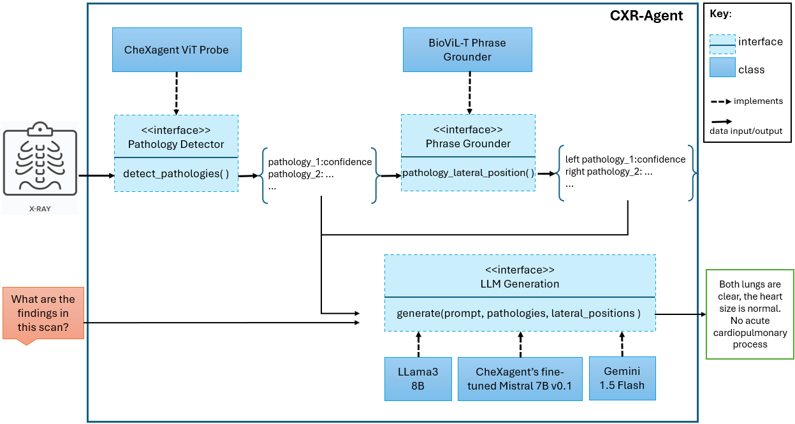

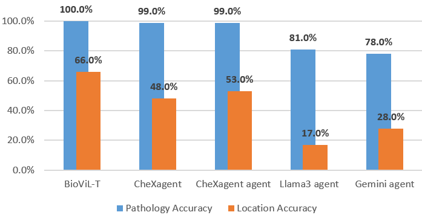

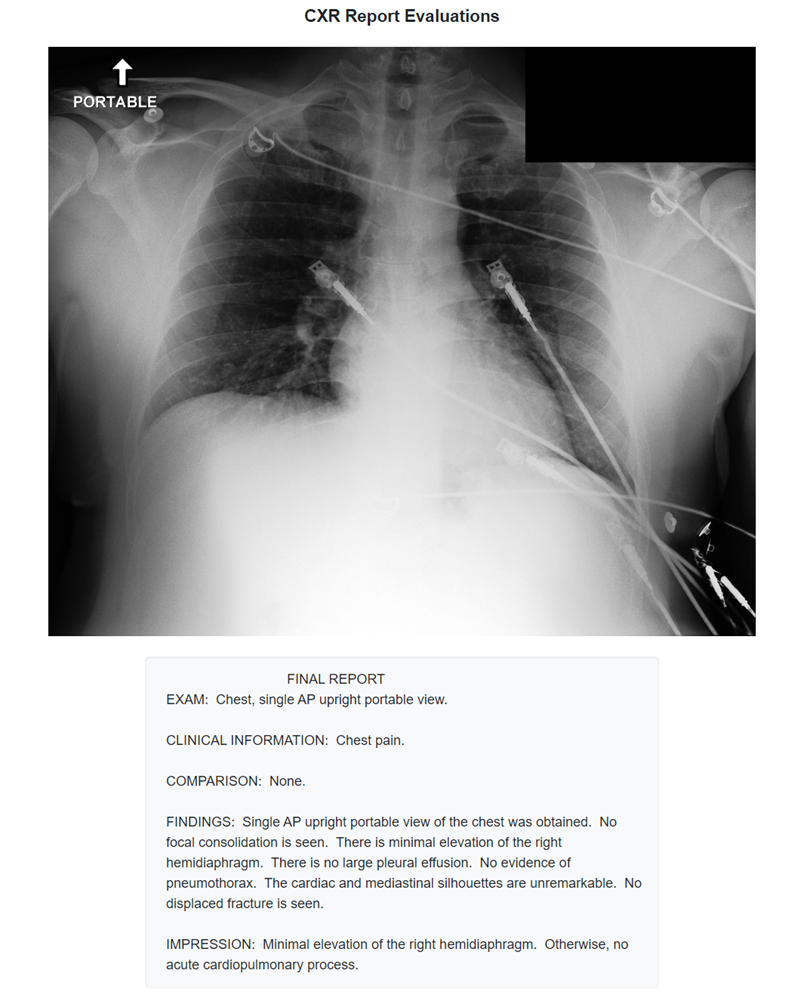

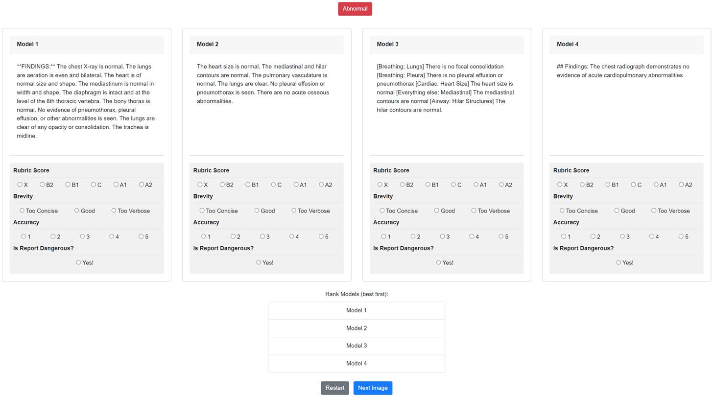

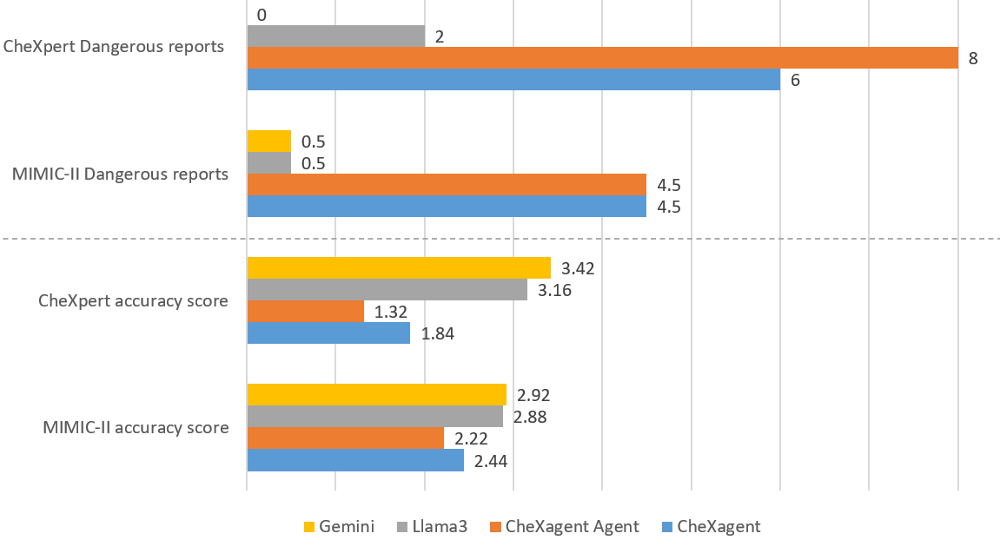

[Arxiv](https://arxiv.org/abs/2407.08811)