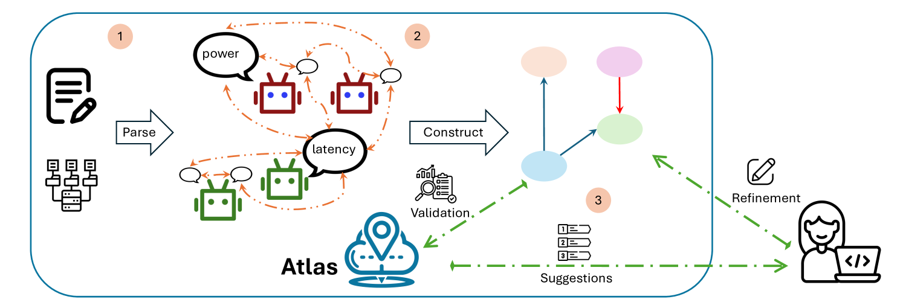
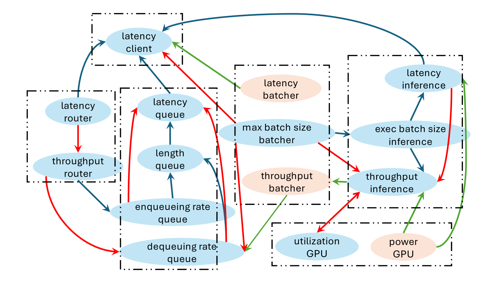
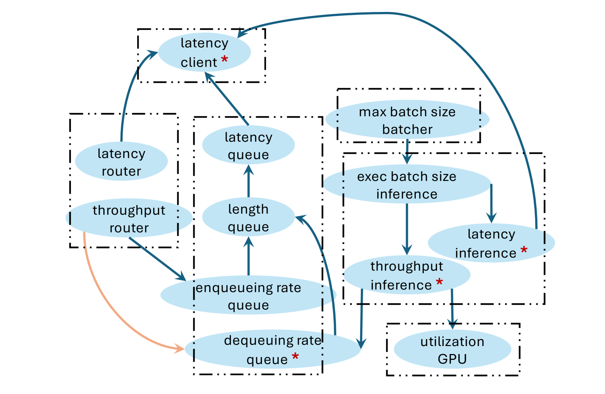
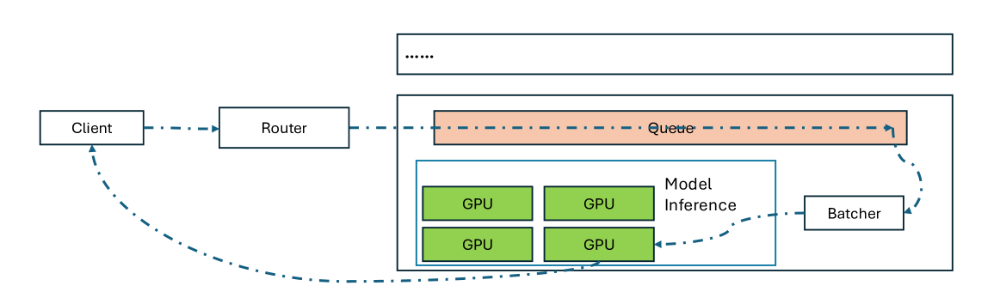
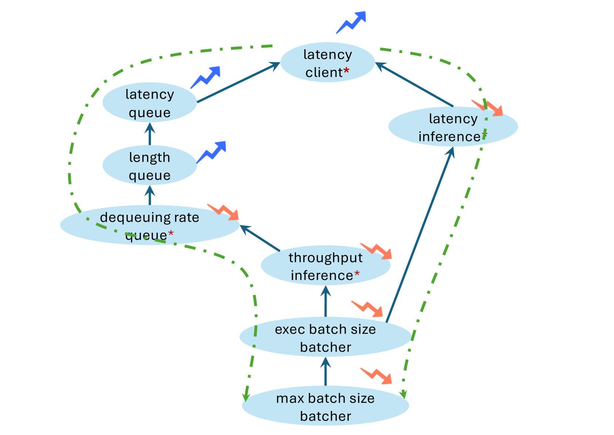
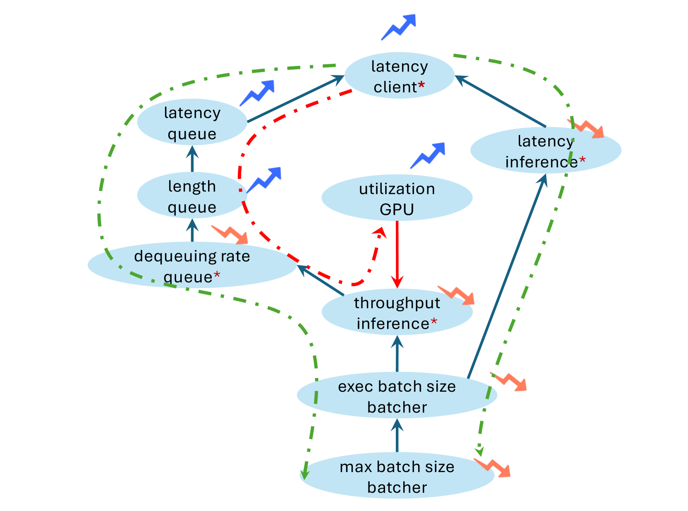
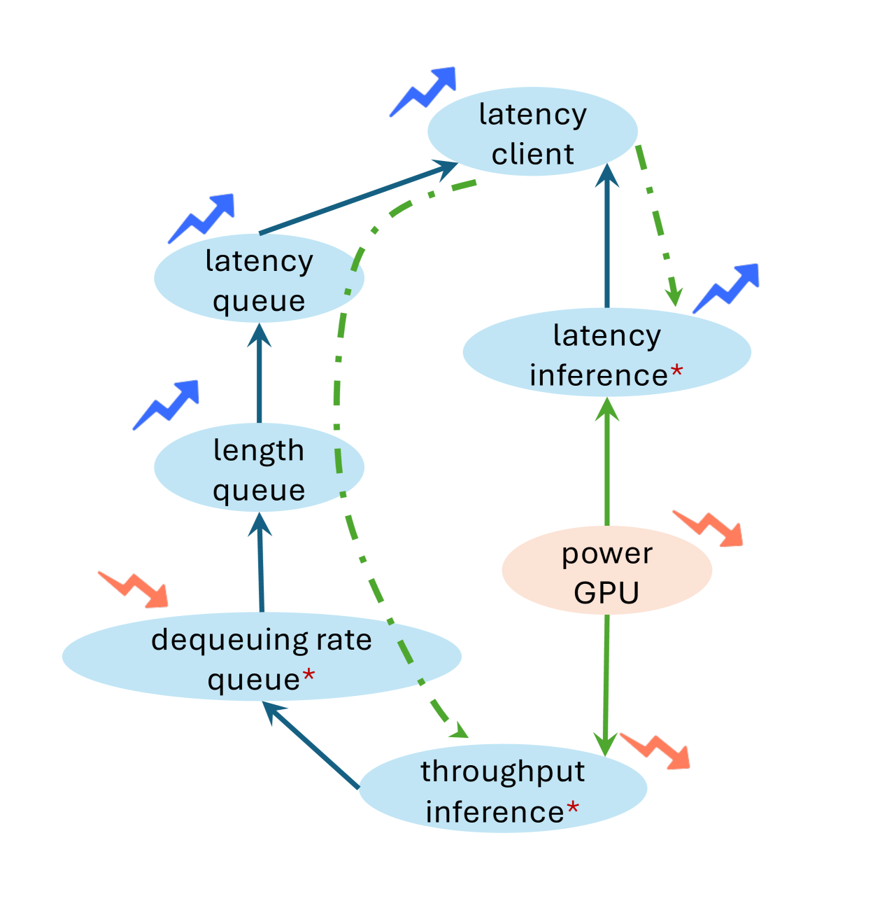

# 云图：结合语言模型与因果洞察，实现云系统故障的精准定位。

发布时间：2024年07月11日

`LLM应用` `云计算` `故障诊断`

> Cloud Atlas: Efficient Fault Localization for Cloud Systems using Language Models and Causal Insight

# 摘要

> 在现代云系统中，运行时故障和性能下降屡见不鲜。云服务提供商急需自动定位故障根源，以确保系统的高可靠性和可用性。近期研究提出使用因果图进行因果推理，以揭示性能指标间的关联。然而，构建准确的因果图既耗时又具挑战性，尤其在大规模动态系统中，且需专业知识。同时，数据驱动方法因事件罕见而效果有限。为此，我们推出Atlas，一种自动合成因果图的新方法。Atlas借助大型语言模型，整合系统文档、遥测及部署反馈，生成因果图。它与数据驱动技术相辅相成，并通过数据验证进一步强化。实证表明，Atlas在多种故障定位场景中表现卓越，生成的因果图不仅可扩展且泛化性强，性能远超传统算法，与真实基准相媲美。

> Runtime failure and performance degradation is commonplace in modern cloud systems. For cloud providers, automatically determining the root cause of incidents is paramount to ensuring high reliability and availability as prompt fault localization can enable faster diagnosis and triage for timely resolution. A compelling solution explored in recent work is causal reasoning using causal graphs to capture relationships between varied cloud system performance metrics. To be effective, however, systems developers must correctly define the causal graph of their system, which is a time-consuming, brittle, and challenging task that increases in difficulty for large and dynamic systems and requires domain expertise. Alternatively, automated data-driven approaches have limited efficacy for cloud systems due to the inherent rarity of incidents. In this work, we present Atlas, a novel approach to automatically synthesizing causal graphs for cloud systems. Atlas leverages large language models (LLMs) to generate causal graphs using system documentation, telemetry, and deployment feedback. Atlas is complementary to data-driven causal discovery techniques, and we further enhance Atlas with a data-driven validation step. We evaluate Atlas across a range of fault localization scenarios and demonstrate that Atlas is capable of generating causal graphs in a scalable and generalizable manner, with performance that far surpasses that of data-driven algorithms and is commensurate to the ground-truth baseline.

[Arxiv](https://arxiv.org/abs/2407.08694)