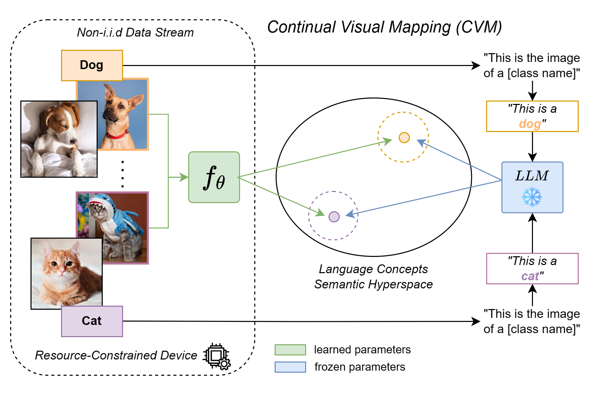
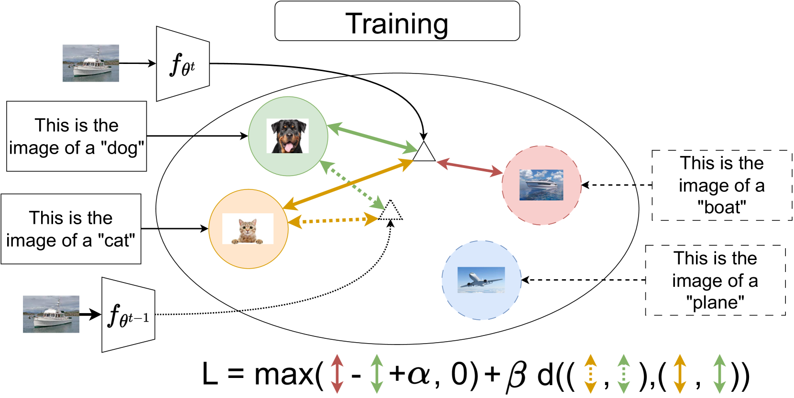
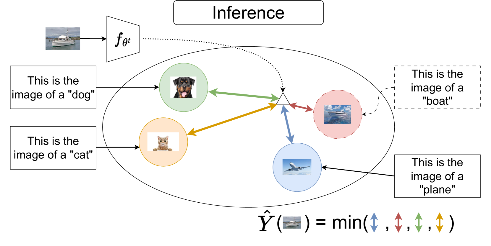
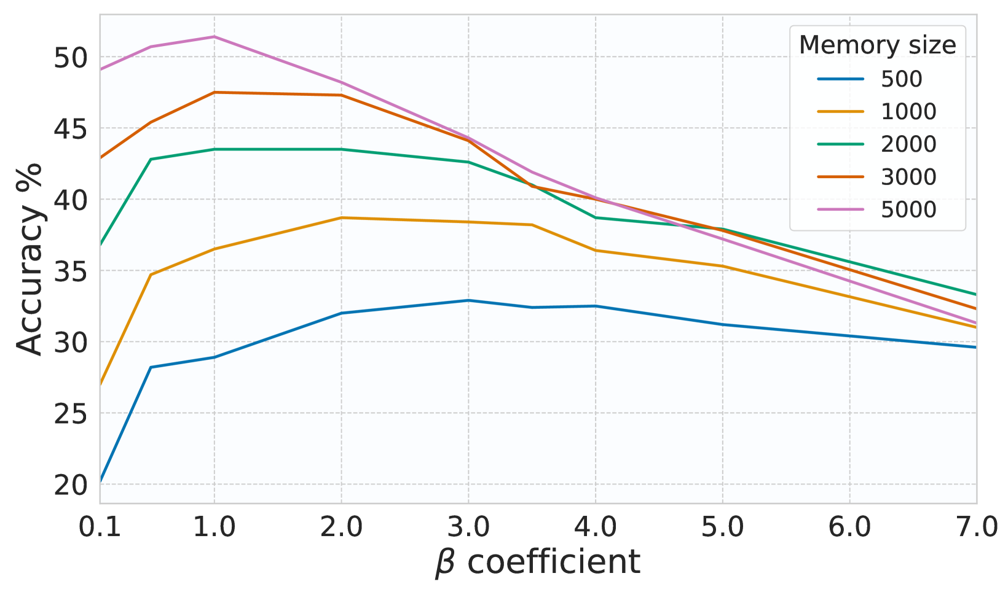
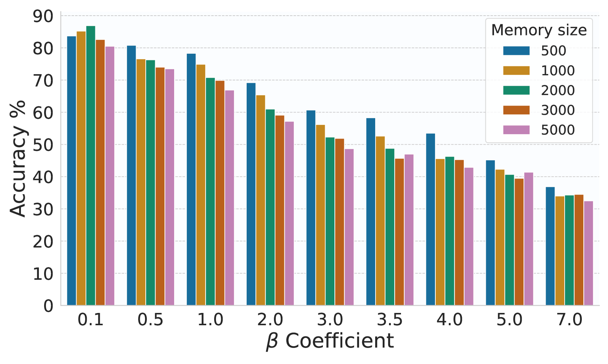
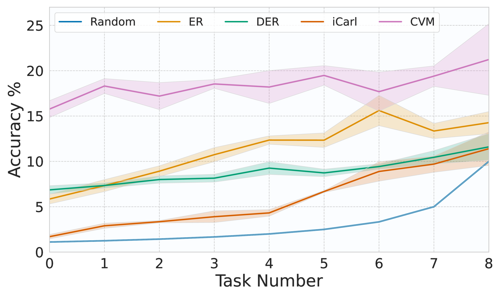
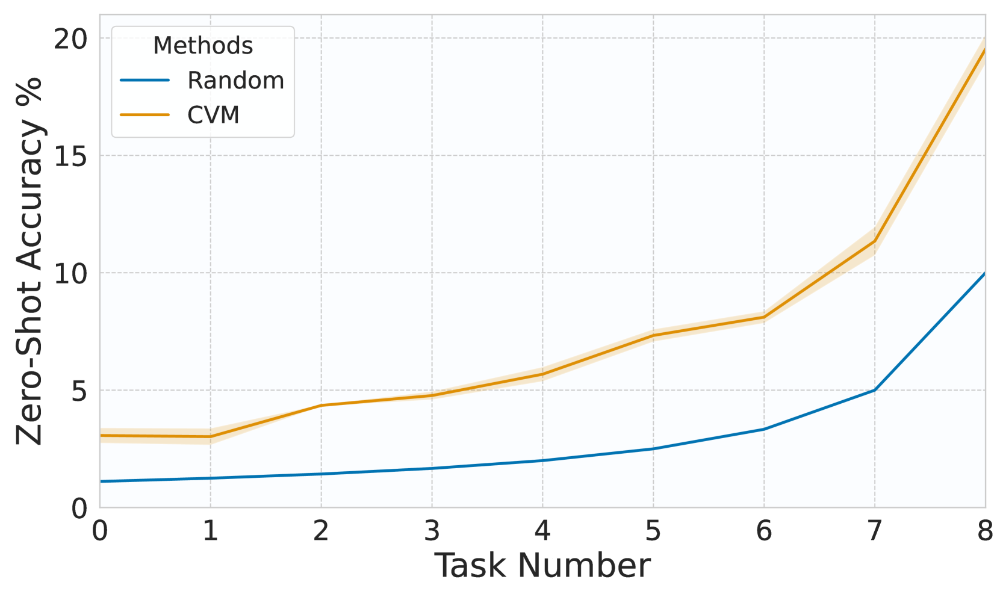

# 在资源有限的环境下，持续探索将视觉概念与大型语言模型相连接的学习之道。

发布时间：2024年07月11日

`LLM应用` `嵌入式设备` `计算机视觉`

> Continually Learn to Map Visual Concepts to Large Language Models in Resource-constrained Environments

# 摘要

> 在深度学习领域，从非独立同分布数据流中持续学习是一大难题，尤其在资源受限的嵌入式设备中更为严峻。传统的视觉模型通过监督学习更新时，常面临过拟合、灾难性遗忘和偏见表示的问题。相比之下，大型语言模型因其包含的多概念及其关系，能促进更稳健的学习过程。本研究提出持续视觉映射（CVM），通过将视觉表示与固定语言模型提取的知识空间对接，不断训练小而高效的视觉模型。CVM不仅在五个基准测试中超越现有方法，更为计算受限设备中的持续学习泛化问题提供了新思路。

> Learning continually from a stream of non-i.i.d. data is an open challenge in deep learning, even more so when working in resource-constrained environments such as embedded devices. Visual models that are continually updated through supervised learning are often prone to overfitting, catastrophic forgetting, and biased representations. On the other hand, large language models contain knowledge about multiple concepts and their relations, which can foster a more robust, informed and coherent learning process. This work proposes Continual Visual Mapping (CVM), an approach that continually ground vision representations to a knowledge space extracted from a fixed Language model. Specifically, CVM continually trains a small and efficient visual model to map its representations into a conceptual space established by a fixed Large Language Model. Due to their smaller nature, CVM can be used when directly adapting large visual pre-trained models is unfeasible due to computational or data constraints. CVM overcome state-of-the-art continual learning methods on five benchmarks and offers a promising avenue for addressing generalization capabilities in continual learning, even in computationally constrained devices.

[Arxiv](https://arxiv.org/abs/2407.08279)